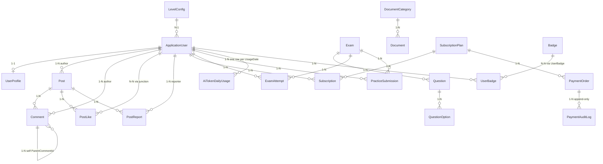

# SEHUB — Backend Architecture

> **Nền tảng học tập & cộng đồng sinh viên FPT**  
> Phiên bản **2.0** · **Giai đoạn 1 (MVP)** · Solution **`be`** (6 project)  
> Đối chiếu: [SEHUB_PhanTichNghiepVu.md](./SEHUB_PhanTichNghiepVu.md) · [ARCHITECTURE.md](./ARCHITECTURE.md)

---

## Tóm tắt điều hành

| Hạng mục | Quyết định |
| -------- | ---------- |
| Runtime | .NET 8 · ASP.NET Core Web API · EF Core **Code First** · PostgreSQL (Supabase) |
| Kiến trúc | Clean Architecture — `API` · `Application` · `Domain` · `Infrastructure` · `Contracts` · `Shared` |
| Auth | Identity Roles + JWT + **`PremiumAuthorizationHandler`** (đọc DB) |
| Contract FE | `ApiResponse<T>` + `PagedResult<T>` — khớp Redux `createAsyncThunk` |
| Scope G1 | Auth · Feed · Exam · Document · Premium (PayOS) · Admin · Practice GitHub **P0** |
| Không G1 | Chat SignalR · Chatbot · Heatmap · QuestionComment |

**Nguồn sự thật ánh xạ:** [Phụ lục D](#phụ-lục-d--ma-trận-ánh-xạ-master) · [Phụ lục E](#phụ-lục-e--checklist-triển-khai)

### Tiêu chí chất lượng tài liệu (10/10)

| # | Tiêu chí | § |
| - | -------- | - |
| 1 | Tech stack & nguyên tắc rõ | 1 |
| 2 | Solution 6 project + references + HTTP layers | 2 |
| 3 | ERD, soft delete, migrations, business rules | 3 |
| 4 | API đầy đủ + catalog + map FE từng route | 4, D |
| 5 | Contract envelope, pagination, error codes | 5 |
| 6 | Auth, Premium DB, PayOS, AI lazy, security | 6 |
| 7 | Config, test, deploy | 7–9 |
| 8 | Scope G1/G2, quyết định PM, checklist | 1.6, B, E |
| 9 | Đồng bộ BA & FE | 1.5, D.1, A |
| 10 | Không mâu thuẫn nội bộ (Practice P0 đã chốt) | 1.6 |

---

## Mục lục

1. [Tổng quan & Tech Stack](#1-tổng-quan--tech-stack)
2. [Kiến trúc thư mục](#2-kiến-trúc-thư-mục-project-structure)
3. [Thiết kế cơ sở dữ liệu](#3-thiết-kế-cơ-sở-dữ-liệu-domain-models)
4. [API Endpoints](#4-danh-sách-api-endpoints)
5. [API Contract](#5-định-dạng-dữ-liệu-giao-tiếp-api-contract)
6. [Cơ chế xử lý & tối ưu](#6-cơ-chế-xử-lý--tối-ưu)
7. [Cấu hình & môi trường](#7-cấu-hình--môi-trường)
8. [Kiểm thử](#8-kiểm-thử)
9. [Triển khai & CI/CD](#9-triển-khai--cicd)

**Phụ lục:** [A — Ánh xạ FE↔BE](#phụ-lục-a--ánh-xạ-fe--be) · [B — Scope G1](#phụ-lục-b--giai-đoạn-1-scope-tóm-tắt) · [C — Tài liệu liên quan](#phụ-lục-c--tài-liệu-liên-quan) · [D — Ma trận master](#phụ-lục-d--ma-trận-ánh-xạ-master) · [E — Checklist triển khai](#phụ-lục-e--checklist-triển-khai)

---

## 1. Tổng quan & Tech Stack

### 1.1 Mục tiêu kiến trúc

Backend SEHUB phục vụ React SPA (Redux Thunk + Axios + JWT). Thiết kế theo **Clean Architecture**, module hóa **1:1** với `src/features/` trên FE, tập trung **4 phân hệ P0** theo Mentor: **Auth · Feed · Exam (trắc nghiệm + thực hành GitHub) · Document · Premium (PayOS)**. **Chat real-time** và **Chatbot** được **cắt sang Giai đoạn 2** — không có controller/hub trong G1.

### 1.2 Tech stack bắt buộc

| Tầng | Công nghệ | Phiên bản / Ghi chú |
| ---- | --------- | ------------------- |
| Runtime | .NET | **8** (LTS) |
| API | ASP.NET Core Web API | REST, JSON, OpenAPI (Swagger) |
| Database | **PostgreSQL (Supabase)** | Dev/Prod: Supabase pooler connection string |
| ORM | **Entity Framework Core** | **Code First** — `Migrations/` là **single source of truth** cho schema |
| Identity | **ASP.NET Core Identity** | `ApplicationUser`, roles, password policy |
| Security | **JWT Bearer** | Khớp FE: `Authorization: Bearer <accessToken>` |

### 1.3 Thư viện phụ trợ (khuyến nghị)

| Thư viện | Vai trò |
| -------- | ------- |
| **FluentValidation** | Validate Request DTO; message lỗi field-level cho FE |
| **AutoMapper** | Map Entity ↔ Response DTO; che giấu navigation property |
| **Serilog** | Structured logging → Console / Application Insights |
| **Swashbuckle.AspNetCore** | Swagger UI + XML comments |
| **AspNetCoreRateLimit** | Rate limit OTP, login, AI explain |
| **Npgsql.EntityFrameworkCore.PostgreSQL** | Provider PostgreSQL (Supabase) |
| **Microsoft.AspNetCore.Authentication.JwtBearer** | JWT middleware |
| **Ardalis.GuardClauses** *(optional)* | Guard clause trong Application services |

**Lưu trữ file (hybrid — cập nhật 2026-06):**

| Abstraction | Implementation | Dùng cho |
| ----------- | -------------- | -------- |
| `ICloudFileStorageService` | `GoogleDriveStorageService` | Documents (PDF thư viện), `ExamAttachment` (PDF/ZIP/RAR/DOCX đề thi) |
| `IImageCdnStorageService` | `CloudinaryStorageService` | Avatar, ảnh Post, file đính kèm Chat |
| `IFileStorageService` | `LocalFileStorageService` | **Legacy fallback** — tài liệu/avatar/chat cũ còn `FilePath` local; dev-only migrate endpoint |

**Production:** upload mới **không** ghi vào `wwwroot/uploads` (trừ dev). Cấu hình `GoogleDrive:*` và `Cloudinary:*` qua secret manager. Endpoint legacy `POST /admin/exams/upload-asset` đã **gỡ** — dùng `POST /admin/exams/{id}/attachments` (Drive).

**Cũ (G1 doc):** `IFileStorageService` local hoặc Azure Blob — vẫn giữ interface cho đọc/xóa file legacy.

### 1.4 Nguyên tắc thiết kế

| # | Nguyên tắc |
| - | ---------- |
| 1 | **Thin Controller** — chỉ routing, auth attribute, gọi service |
| 2 | **Fat Application** — nghiệp vụ, phân quyền Free/Premium, gamification |
| 3 | **Domain thuần** — entity/enums không reference EF |
| 4 | **Global query filter** — `IsDeleted == false` cho Post, Comment, Document |
| 5 | **Không over-build G1** — Admin API tối thiểu; Chat/SignalR = **không triển khai** |

### 1.5 Ánh xạ Actor → Guard FE → Policy BE

| Actor (BA) | Điều kiện | FE Guard / UX | Policy BE | Ghi chú |
| ---------- | --------- | ------------- | --------- | ------- |
| **Guest** | Chưa đăng nhập | Không token | `AllowAnonymous` trên **đọc** Feed, Exam metadata, Pricing | Không like/comment/post; Documents → **401** |
| **Student (Free)** | JWT, chưa Premium | `PrivateRoute` (documents, profile…); Feed/Exam **không** bắt Private | `RequireAuthenticated` + không pass `RequirePremium` | Xem đề **không** đáp án; tài liệu ≤3 trang |
| **Student (Premium)** | JWT + subscription active | `PremiumRoute` (`/exams/:id/do`, result…) | `RequireAuthenticated` + **`RequirePremium`** (DB §1.7) | Làm bài, download, GitHub submit |
| **Moderator** | Role Mod | `AdminRoute` *(FE cần cho Mod vào moderation/exams)* | `RequireModerator` | Không payments/settings/permissions |
| **Admin** | Role Admin | `AdminRoute` | `RequireAdmin` | Toàn quyền §4.8 |

**Tách Role và Premium:** Identity Roles = `Student` \| `Moderator` \| `Admin`. Premium = `Subscriptions` active — claim JWT `isPremium` chỉ cho UI.

**Ánh xạ:** [Phụ lục A](#phụ-lục-a--ánh-xạ-fe--be) (theo feature) · [Phụ lục D](#phụ-lục-d--ma-trận-ánh-xạ-master) (theo route).

### 1.6 Quyết định scope & đối chiếu BA

| Hạng mục | BA Roadmap §5 | Quyết định BE G1 | Ghi chú |
| -------- | ------------- | ---------------- | ------- |
| Auth, Feed, Exam trắc nghiệm, Document | P0 | **P0** | Khớp Mentor |
| PayOS + webhook | P1 (nên có) | **P0** | Cần kích hoạt Premium; webhook + audit ngay G1 |
| Practice GitHub + Mod review | Cắt G2 (BA §5.1) | **P0 — đã chốt** | Submit URL + Mod review; không auto-grade (xem [Quyết định PM](#quyết-định-pm-practice-github)) |
| Admin 8 phân hệ | P0 (FE) | **P0** | Endpoint tối thiểu §4.8 (mở rộng) |
| Bình luận câu hỏi đề thi | Cắt P0 | **P2** | Entity `QuestionComment` — §4.9 |
| Chat, Heatmap, Chatbot | G2 | **Không triển khai** | — |

#### Quyết định PM — Practice GitHub

| Phương án | Quyết định G1 |
| --------- | ------------- |
| Cắt hoàn toàn (BA gốc) | ❌ Không chọn — luồng nghiệp vụ đứt |
| **P0 tối thiểu** | ✅ `PracticeSubmission` + Mod `PATCH` — đủ demo & đóng rủi ro BA §4.1.A |
| Auto-grade / GitHub API | ❌ G2 |

**Đối chiếu FE:** GuestLayout không gồm Documents (`ARCHITECTURE.md` §6). `GET /documents` = **Authenticated** (đúng BA).

### 1.7 Identity & Authorization (một nguồn sự thật)

**Chọn mô hình A — ASP.NET Core Identity Roles (bắt buộc G1):**

| Thành phần | Cách làm |
| ---------- | -------- |
| Vai trò hệ thống | Bảng `AspNetRoles`: `Student`, `Moderator`, `Admin` — gán bằng `UserManager.AddToRoleAsync` |
| JWT | Claim `role` = tên role Identity (khớp `authSlice.role`) |
| Policy Mod/Admin | `RequireRole("Moderator", "Admin")` / `RequireRole("Admin")` |
| Premium | **Không** dùng Role — policy `RequirePremium` riêng (§6.1) |

**Không** lưu song song enum `UserRole` trên `ApplicationUser` trừ khi mirror read-only — tránh lệch với `AspNetRoles`.

**Premium — bắt buộc `PremiumAuthorizationHandler`:**

- Query `Subscriptions` (`IsActive && EndAt > UtcNow`) — **không** chỉ tin claim `plan` trong JWT.
- Sau PayOS webhook hoặc admin confirm: FE poll `GET /api/v1/premium/subscription` hoặc login lại trước khi vào `PremiumRoute`.
- Claim `isPremium` trong JWT chỉ để UI gợi ý; **authorization luôn đọc DB**.

---

## 2. Kiến trúc thư mục (Project Structure)

Solution chính thức: **`be`** — 6 project + tests, namespace thống nhất `SEHub.*`.

### 2.1 Pattern: Clean Architecture (6 project)

```text
SEHub.API
  → SEHub.Application, SEHub.Contracts, SEHub.Infrastructure (composition root / DI)

SEHub.Application
  → SEHub.Domain, SEHub.Contracts, SEHub.Shared

SEHub.Infrastructure
  → SEHub.Application, SEHub.Domain, SEHub.Shared

SEHub.Contracts
  → SEHub.Shared (tối thiểu; lý tưởng: không reference project khác)

SEHub.Domain
  → (không reference project nào)

SEHub.Shared
  → (không reference Domain / Application)
```

| Quy tắc | Chi tiết |
| ------- | -------- |
| **Domain** | Entity, enum, domain exceptions — không EF, không DTO HTTP |
| **Contracts** | Request/Response DTO, `ApiResponse<T>`, `PagedResult<T>` — contract ổn định cho FE |
| **Application** | Services, FluentValidation, interfaces (`IAuthService`, `IPostRepository`…) — **không** chứa DTO public API |
| **Infrastructure** | `SEHubDbContext`, migrations, Identity, PayOS, Blob/local file |
| **API** | Controllers mỏng — **không** reference `SEHub.Domain` trực tiếp |
| **Shared** | Constants (`RoleNames`, `ErrorCodes`), helpers nhỏ — tránh “god project” |

### 2.2 Solution layout

```text
be/
│
├── SEHub.sln
├── src/
│   ├── SEHub.API/                              # Presentation Layer
│   │   ├── Controllers/
│   │   │   ├── AuthController.cs               # ↔ features/auth
│   │   │   ├── PostsController.cs              # ↔ features/feed
│   │   │   ├── ExamsController.cs              # ↔ features/exam
│   │   │   ├── PracticeSubmissionsController.cs
│   │   │   ├── DocumentsController.cs          # ↔ features/document
│   │   │   ├── ProfilesController.cs           # ↔ features/profile (P1)
│   │   │   ├── PremiumController.cs            # ↔ features/premium
│   │   │   └── Admin/
│   │   ├── Middleware/
│   │   │   ├── ExceptionHandlingMiddleware.cs
│   │   │   └── JwtBlacklistMiddleware.cs       # optional
│   │   ├── Filters/
│   │   │   └── ApiResponseWrapperFilter.cs
│   │   ├── Extensions/
│   │   │   ├── ServiceCollectionExtensions.cs
│   │   │   └── AuthorizationPolicies.cs
│   │   └── Program.cs
│   │
│   ├── SEHub.Application/                      # Business Logic
│   │   ├── Auth/
│   │   │   ├── IAuthService.cs
│   │   │   ├── AuthService.cs
│   │   │   └── Validators/                     # hoặc Validators trong Contracts/Application
│   │   ├── Feed/
│   │   ├── Exams/
│   │   ├── Documents/
│   │   ├── Profiles/
│   │   ├── Premium/
│   │   ├── Admin/
│   │   ├── Mapping/                            # AutoMapper profiles (Entity → Contract DTO)
│   │   └── Abstractions/
│   │       ├── ICurrentUserService.cs
│   │       ├── IFileStorageService.cs
│   │       ├── IPayOsService.cs
│   │       ├── IAiExplanationService.cs
│   │       └── Repositories/                   # IPostRepository, IExamRepository...
│   │
│   ├── SEHub.Domain/                           # Core Entities
│   │   ├── Entities/
│   │   ├── Enums/
│   │   ├── Common/
│   │   │   ├── BaseEntity.cs
│   │   │   └── ISoftDeletable.cs
│   │   └── Exceptions/
│   │
│   ├── SEHub.Infrastructure/                   # Data + External
│   │   ├── Persistence/
│   │   │   ├── SEHubDbContext.cs
│   │   │   ├── Configurations/
│   │   │   ├── Migrations/
│   │   │   ├── Interceptors/
│   │   │   │   └── SoftDeleteInterceptor.cs
│   │   │   └── Repositories/
│   │   ├── Identity/
│   │   │   └── ApplicationUser.cs
│   │   ├── Storage/
│   │   ├── Payments/
│   │   │   └── PayOsWebhookHandler.cs
│   │   └── Ai/
│   │
│   ├── SEHub.Contracts/                        # DTO / Request / Response
│   │   ├── Common/
│   │   │   ├── ApiResponse.cs
│   │   │   ├── ApiError.cs
│   │   │   └── PagedResult.cs
│   │   ├── Auth/
│   │   │   ├── LoginRequest.cs
│   │   │   └── LoginResponse.cs
│   │   ├── Feed/
│   │   ├── Exams/
│   │   ├── Documents/
│   │   ├── Premium/
│   │   └── Admin/
│   │
│   └── SEHub.Shared/                           # Common
│       ├── Constants/
│       │   ├── RoleNames.cs                    # Student, Moderator, Admin
│       │   └── ErrorCodes.cs                   # PREMIUM_REQUIRED, TOKEN_LIMIT...
│       └── Extensions/
│
└── tests/
    ├── SEHub.Application.UnitTests/
    └── SEHub.API.IntegrationTests/
```

### 2.3 Project references (csproj)

| Project | Reference tới |
| ------- | ------------- |
| `SEHub.API` | `Application`, `Contracts`, `Infrastructure` |
| `SEHub.Application` | `Domain`, `Contracts`, `Shared` |
| `SEHub.Infrastructure` | `Application`, `Domain`, `Shared` |
| `SEHub.Contracts` | `Shared` *(optional)* |
| `SEHub.Domain` | — |
| `SEHub.Shared` | — |

> **Không** cho `SEHub.API` → `SEHub.Domain`. Map Entity → DTO trong Application (AutoMapper).

### 2.4 Map 1:1 FE `features/` → BE modules

| FE `features/` | Redux | `*Service.js` → prefix API | Application | Contracts | Controller(s) |
| -------------- | ----- | -------------------------- | ----------- | --------- | --------------- |
| `auth/` | `authSlice`, `authThunks` | `/api/v1/auth` | `Auth/` | `Auth/` | `AuthController` |
| `feed/` | `feedSlice`, `feedThunks` | `/api/v1/posts` | `Feed/` | `Feed/` | `PostsController` |
| `exam/` | `examSlice`, `examThunks` | `/api/v1/exams` | `Exams/` | `Exams/` | `ExamsController`, `PracticeSubmissionsController` |
| `document/` | `documentSlice`, `documentThunks` | `/api/v1/documents` | `Documents/` | `Documents/` | `DocumentsController` |
| `profile/` | `profileSlice`, `profileThunks` | `/api/v1/profiles` | `Profiles/` | `Profiles/` | `ProfilesController` |
| `premium/` | `premiumSlice`, `premiumThunks` | `/api/v1/premium` | `Premium/` | `Premium/` | `PremiumController` |
| `admin/` | `adminSlice` + pages | `/api/v1/admin` | `Admin/` | `Admin/` | `Admin/Dashboard`, `Users`, `Exams`, `Documents`, `Moderation`, `Gamification`, `Payments` |
| ~~`chat/`~~ | ~~G2~~ | — | — | — | **Không có** |

> `axiosInstance` base URL nên là `{API_HOST}/api/v1` — service chỉ path `/auth/login`, `/posts`, …

### 2.5 Luồng request (đối chiếu FE Data Flow)

```
Component
  → dispatch(createAsyncThunk)
    → axiosInstance (interceptor gắn Bearer)
      → Controller [Authorize(Policy)]
        → Application Service
          → IRepository / SEHubDbContext (Infrastructure)
            → PostgreSQL (Supabase)
          ← map Entity → Contracts DTO
      ← ApiResponse<T> (SEHub.Contracts) envelope
    ← slice: fulfilled | rejected
  ← useSelector re-render
```

**401 từ API** → FE interceptor `dispatch(logout())` + `navigate('/login')` (theo ARCHITECTURE.md §5).

### 2.6 Khởi tạo solution (tham khảo)

```bash
dotnet new sln -n SEHub -o be
cd be

dotnet new webapi -n SEHub.API -o src/SEHub.API
dotnet new classlib -n SEHub.Application -o src/SEHub.Application
dotnet new classlib -n SEHub.Domain -o src/SEHub.Domain
dotnet new classlib -n SEHub.Infrastructure -o src/SEHub.Infrastructure
dotnet new classlib -n SEHub.Contracts -o src/SEHub.Contracts
dotnet new classlib -n SEHub.Shared -o src/SEHub.Shared

dotnet sln add src/SEHub.API src/SEHub.Application src/SEHub.Domain \
  src/SEHub.Infrastructure src/SEHub.Contracts src/SEHub.Shared

# References — xem bảng §2.3
dotnet add src/SEHub.API reference src/SEHub.Application src/SEHub.Contracts src/SEHub.Infrastructure
dotnet add src/SEHub.Application reference src/SEHub.Domain src/SEHub.Contracts src/SEHub.Shared
dotnet add src/SEHub.Infrastructure reference src/SEHub.Application src/SEHub.Domain src/SEHub.Shared
dotnet add src/SEHub.Contracts reference src/SEHub.Shared
```

### 2.7 Lớp HTTP trong `SEHub.API` (Middleware · Filters · Extensions)

| Thư mục | Chạy khi nào | Trách nhiệm SEHUB |
| ------- | ------------ | ----------------- |
| **Extensions** | Startup (`Program.cs`) | Đăng ký DI, JWT, Swagger, policies (`ServiceCollectionExtensions`, `AuthorizationPolicies`) — **không** xử lý từng request |
| **Middleware** | Mỗi request (pipeline) | `ExceptionHandlingMiddleware` → envelope lỗi; optional `JwtBlacklistMiddleware`; Correlation-Id |
| **Filters** | Quanh Controller/Action | `ApiResponseWrapperFilter` bọc `ApiResponse<T>`; loại trừ webhook `/premium/webhooks/payos` |

```text
Request → Middleware → Routing → Auth → Filter → Controller → Application → Response
```

> **Không** đặt nghiệp vụ (chấm điểm, PayOS, AI) trong Middleware/Filter.

**Lưu ý Clean Architecture:** `Infrastructure` reference `Application` để đăng ký `AddInfrastructure()` — interface repository nằm trong `Application/Abstractions`, implement trong `Infrastructure`.

---

## 3. Thiết kế cơ sở dữ liệu (Domain Models)

### 3.1 EF Core Code First

```bash
dotnet ef migrations add InitialCreate \
  --project src/SEHub.Infrastructure \
  --startup-project src/SEHub.API

dotnet ef database update \
  --project src/SEHub.Infrastructure \
  --startup-project src/SEHub.API
```

- Mọi thay đổi schema **chỉ** qua migration C#.
- Cấu hình quan hệ/index trong `Configurations/*.cs` (`IEntityTypeConfiguration<T>`).
- Seed: `SubscriptionPlans`, `LevelConfigs`, tài khoản Admin (environment-specific).

### 3.1.1 Database hardening runbook (Supabase production)

**Trước mỗi phase:** backup Supabase Dashboard → Database → Backups (hoặc `pg_dump`).

**Phase 0 — Audit (không đổi schema):** chạy SQL trong `be/scripts/db-audit/` trên Supabase SQL Editor:

| Script | Mục đích |
| ------ | -------- |
| `01_audit_orphans.sql` | User/report/exam orphan refs trước khi thêm FK |
| `02_audit_exam_duplicates.sql` | Trùng `(Major, Code)` trước unique mới |
| `03_audit_user_reports.sql` | Vi phạm `UserReportSource` context |
| `04_cleanup_optional.sql` | Cleanup có comment (chỉ khi audit > 0) |
| `05_verify_indexes.sql` | So khớp index sau deploy |

**Gate:** audit orphan = 0 trên các bảng sẽ thêm FK → mới `dotnet ef database update`.

**Apply migration:**

```bash
cd be
dotnet ef database update \
  --project src/SEHub.Infrastructure \
  --startup-project src/SEHub.API
```

Migration `DatabaseHardening` gồm: FK user refs, `CK_UserReports_Source_Context`, unique `Exams(Major, Code)`, indexes leaderboard/catalog, `AnswersJson` → `text`, `ConversationReports.Status` → `int`, `Tags`/`PostTags` + backfill, `QuestionAttachments`, `UserMissionProgress`.

**Follow-up migrations (Post-Hardening P1+P2):**

| Migration | Nội dung |
| --------- | -------- |
| `PostHardeningFollowUp` | Index `PointTransactions(UserId, Status, CreatedAt)`; FK + index `Documents.DeletedById` |
| `DropPostsTagsColumn` | Drop cột legacy `Posts.Tags`; đọc/ghi tag qua `PostTags` junction |

Trước `PostHardeningFollowUp`: chạy `01_audit_orphans.sql` (mục `Documents.DeletedById`). Enforcement ban vẫn dùng cache `AspNetUsers.IsBanned`/`BanUntil`; `UserBans` + `BanStatusService` phục vụ admin/audit. Đối soát điểm: `POST /api/v1/admin/gamification/points/reconcile` (dry-run mặc định); job `PointsReconciliationBackgroundService` bật qua `Gamification:ReconcilePointsSchedule` (default `false`).

**Sau deploy:** chạy `05_verify_indexes.sql`; smoke test exam create, report, ban, payment, gamification award.

**Rollback:** restore Supabase backup — **không** `dotnet ef migrations remove` trên prod.

**Admin ops:** `POST /api/v1/admin/gamification/points/reconcile?applyFix=false` — kiểm tra drift; `applyFix=true` đồng bộ `AspNetUsers.Points` từ `PointTransactions` ledger.

### 3.2 Base entity & Soft Delete (bắt buộc)

```csharp
public abstract class BaseEntity
{
    public Guid Id { get; set; }
    public DateTime CreatedAt { get; set; }
    public DateTime? UpdatedAt { get; set; }
}

public interface ISoftDeletable
{
    bool IsDeleted { get; set; }
    DateTime? DeletedAt { get; set; }
    Guid? DeletedById { get; set; }
}
```

**Áp dụng `ISoftDeletable`:** `Post`, `Comment`, `Document`.

```csharp
// SEHubDbContext — Global Query Filter
modelBuilder.Entity<Post>().HasQueryFilter(p => !p.IsDeleted);
modelBuilder.Entity<Comment>().HasQueryFilter(c => !c.IsDeleted);
modelBuilder.Entity<Document>().HasQueryFilter(d => !d.IsDeleted);
```

- `DELETE` API → set `IsDeleted = true`, `DeletedAt = UtcNow` — **không** `Remove()` trừ Admin hard-delete có xác nhận.
- Moderator/Admin có thể `.IgnoreQueryFilters()` khi cần audit.

### 3.3 Sơ đồ quan hệ (Giai đoạn 1)



### 3.4 Entity chi tiết

#### 3.4.1 Identity & User

| Entity | Quan hệ | Trường quan trọng |
| ------ | ------- | ----------------- |
| **ApplicationUser** *(extends IdentityUser)* | 1-1 Profile; 1-N Posts... | `UserName`, `Email`, `DisplayName`, `Points`, `LevelId`, `StreakCount`, `LastActivityDate`, `IsBanned`, `BanUntil`, `BanReason` — **Role qua Identity** (§1.7) |

> **Layer:** `ApplicationUser` nằm trong `SEHub.Infrastructure/Identity`, map bảng Identity. Domain không reference `Microsoft.AspNetCore.Identity`.
| **UserProfile** | 1-1 User | `AvatarUrl`, `Bio`, `Major`, `Semester` |
| **RefreshToken** | N-1 User | `Token`, `ExpiresAt`, `IsRevoked` *(P1)* |
| **OtpVerification** | — | `Email`, `CodeHash`, `ExpiresAt`, `AttemptCount`, `Purpose` (ForgotPassword) |

> Identity quản lý `PasswordHash` qua `UserManager` — không tự hash trong service.

#### 3.4.2 Feed (Cộng đồng)

| Entity | Quan hệ | Trường quan trọng |
| ------ | ------- | ----------------- |
| **Post** | N-1 User (Author) | `Title`, `Content` (Markdown), `Tags` (JSON string G1; P2: bảng `PostTag`), `Status` (Published/Pending/Rejected), `ViewCount`, `IsFeatured`, **`IsDeleted`** |
| **Comment** | N-1 Post; N-1 User; N-1 Comment? (Parent) | `Content`, `ParentCommentId?`, **`IsDeleted`** |
| **PostLike** | N-N User↔Post (junction) | Unique `(PostId, UserId)` |
| **PostReport** | N-1 Post; N-1 User | `Reason`, `Status` (Pending/Approved/Rejected), `ResolvedById?` |

#### 3.4.3 Exam (Cuối kỳ + Thực hành)

| Entity | Quan hệ | Trường quan trọng |
| ------ | ------- | ----------------- |
| **Exam** | 1-N Question | `Code`, `Title`, `ExamType` (Final/Practice), `Semester`, `Major`, `QuestionCount`, `Status` (Draft/PendingApproval/Published), `ContentHash` (SHA-256 sau normalize OCR), `Description`, `AssetUrl?` *(legacy — đề mới dùng `ExamAttachment` trên Drive)* |
| **Question** | N-1 Exam; 1-N Option | `OrderIndex`, `Content`, `CorrectOptionId` *(không expose API Free)* |
| **QuestionOption** | N-1 Question | `Label` (A/B/C/D), `Text` |
| **ExamAttempt** | N-1 User; N-1 Exam | `StartedAt`, `SubmittedAt?`, `Score?`, `AnswersJson`, `Status` (InProgress/Submitted/Expired) |
| **PracticeSubmission** | N-1 User; N-1 Exam (Practice) | `GitHubRepoUrl`, `SubmittedAt`, `Status` (Submitted/Reviewed/Passed/Failed), `ReviewerComment?`, `ReviewedById?`, `ReviewedAt?`, `IsLatest` |

**Quy tắc `ExamAttempt` (G1):**

- Tối đa **một** attempt `InProgress` cho cặp `(UserId, ExamId)` — `POST .../attempts` trả **409** `ACTIVE_ATTEMPT_EXISTS` nếu đã có.
- Sau `submit` → `Submitted`; cho phép tạo attempt mới (làm lại đề).
- G1 **không** time-limit server-side (optional G2: `DurationMinutes` trên `Exam`).

**Quy tắc `PracticeSubmission` (G1):**

- Premium được **nộp lại** — bản mới `IsLatest = true`, bản cũ `IsLatest = false` (không unique cứng `(ExamId, UserId)`).
- Mod/Admin `PATCH` đánh giá bản `IsLatest == true`.

#### 3.4.4 Document

| Entity | Quan hệ | Trường quan trọng |
| ------ | ------- | ----------------- |
| **DocumentCategory** | 1-N Document | `Name`, `Semester`, `Major` |
| **Document** | N-1 Category | `Title`, `FilePath`, `MimeType`, `PageCount`, `AccessTier` (FreePreview/PremiumFull), **`IsDeleted`** |

#### 3.4.5 Premium & Thanh toán

| Entity | Quan hệ | Trường quan trọng |
| ------ | ------- | ----------------- |
| **SubscriptionPlan** | 1-N Subscription, Order | `Code` (1m/8m/4y), `Name`, `DurationDays`, `PriceVnd` |
| **Subscription** | N-1 User; N-1 Plan | `StartAt`, `EndAt`, `IsActive` |
| **PaymentOrder** | N-1 User; N-1 Plan | `PayOsOrderCode`, `Amount`, `Status` (Pending/Paid/Failed/Cancelled), `QrUrl?`, `ExpiredAt` |
| **PaymentAuditLog** | N-1 Order | `Action`, `ActorId?`, `PayloadJson`, `CreatedAt` — **INSERT only** |

#### 3.4.6 Gamification (P1 — schema G1, logic đơn giản)

| Entity | Quan hệ | Trường quan trọng |
| ------ | ------- | ----------------- |
| **LevelConfig** | 1-N User | `Name` (Bronze/Silver/Gold/Platinum), `MinPoints`, `VoucherPercent?` |
| **Badge** | N-N User qua **UserBadge** | `Code`, `Name`, `ConditionJson` |
| **UserBadge** | N-1 User; N-1 Badge | `EarnedAt` |
| **AiTokenDailyUsage** | 1 row/User/day *(lazy)* | `UserId`, `UsageDate` (date only), `TokensConsumed` |

#### 3.4.7 Moderation (Admin tối thiểu)

| Entity | Quan hệ | Trường quan trọng |
| ------ | ------- | ----------------- |
| **UserBan** | N-1 User (banned); N-1 User (actor) | `BanType` (Warning/Temp/Permanent), `Until?`, `Reason` |

### 3.5 Enums chính

```csharp
// Vai trò: string constants khớp AspNetRoles — "Student", "Moderator", "Admin" (§1.7)
// Premium: không enum trên User — kiểm tra Subscription active

public enum PostStatus { Draft, Pending, Published, Rejected }
public enum ExamType { Final = 0, Practice = 1 }
public enum ExamStatus { Draft, PendingApproval, Published, Archived }
public enum ExamAttemptStatus { InProgress, Submitted, Expired }
public enum PracticeSubmissionStatus { Submitted, Reviewed, Passed, Failed }
public enum PaymentOrderStatus { Pending, Paid, Failed, Cancelled }
```

### 3.6 Index gợi ý (Fluent API)

| Bảng | Index | Mục đích |
| ---- | ----- | -------- |
| Posts | `(CreatedAt DESC)` + filter `IsDeleted` | Feed |
| Posts | `IsFeatured` WHERE Published | Sidebar |
| Exams | `(Semester, Major, ExamType)` | Lọc danh sách |
| ExamAttempts | `(UserId, ExamId)` + filtered index InProgress | Chống 2 attempt song song |
| PracticeSubmissions | `(ExamId, UserId, IsLatest)` | Bài nộp hiện tại |
| PaymentOrders | `PayOsOrderCode` UNIQUE | Webhook idempotent |
| AiTokenDailyUsage | `(UserId, UsageDate)` UNIQUE | Lazy reset |

---

## 4. Danh sách API Endpoints

> **Base path:** `/api/v1` · **Envelope:** §5.1 (trừ PayOS webhook) · **Ma trận FE:** [Phụ lục D](#phụ-lục-d--ma-trận-ánh-xạ-master)

### 4.0 Bảng tổng hợp nhanh

| Nhóm | Số endpoint G1 | Controller |
| ---- | -------------- | ---------- |
| Auth | 8 | `AuthController` |
| Feed | 12 | `PostsController` |
| Exam Final | 10 | `ExamsController` |
| Exam Practice | 4 | `ExamsController`, `PracticeSubmissionsController` |
| Documents | 4 | `DocumentsController` |
| Premium | 5 | `PremiumController` |
| Profile | 3 | `ProfilesController` (P1) |
| Admin | 24+ | `Admin/*Controller` |
| Health | 1 | `HealthController` hoặc minimal API |
| **Tổng** | **~71** | — |

### 4.1 Auth

| Method | Endpoint | Policy | FE tương ứng | Mô tả |
| ------ | -------- | ------ | ------------ | ----- |
| POST | `/api/v1/auth/register` | Anonymous | `/register` | Email, username, password |
| POST | `/api/v1/auth/login` | Anonymous | `/login` | Trả JWT + user profile |
| POST | `/api/v1/auth/google` | Anonymous | OAuth button | Verify `id_token`, upsert user |
| POST | `/api/v1/auth/forgot-password` | Anonymous | `/forgot-password` | Gửi OTP email |
| POST | `/api/v1/auth/verify-otp` | Anonymous | — | Xác minh OTP |
| POST | `/api/v1/auth/reset-password` | Anonymous | — | Đặt mật khẩu mới |
| POST | `/api/v1/auth/logout` | Authenticated | logout thunk | Revoke refresh token (nếu có) |
| GET | `/api/v1/auth/me` | Authenticated | hydrate `authSlice` | User + role + `isPremium` |

### 4.2 Feed (Posts)

| Method | Endpoint | Policy | FE route | Mô tả |
| ------ | -------- | ------ | -------- | ----- |
| GET | `/api/v1/posts` | Anonymous | `/` Feed | Phân trang, `?semester&major&tag&search` — G1 filter `tag` trên `Tags` JSON (P2: bảng `PostTag`) |
| GET | `/api/v1/posts/featured` | Anonymous | `CommunitySidebar` / `MainSidebar` | Bài ghim Moderator |
| GET | `/api/v1/posts/{id}` | Anonymous | `/posts/:id` → `PostDetailPage` | + comments |
| POST | `/api/v1/posts` | Authenticated | `/posts/create` → `CreatePostPage` | Markdown ≤ 10.000 ký tự |
| PUT | `/api/v1/posts/{id}` | Author \| Mod | edit / resubmit | Rejected → Pending |
| PATCH | `/api/v1/posts/{id}/feature` | Mod \| Admin | Admin/Mod | Body: `{ "isFeatured": true }` — ghim sidebar |
| DELETE | `/api/v1/posts/{id}` | Author \| Mod \| Admin | delete | **Soft delete** |
| POST | `/api/v1/posts/{id}/like` | Authenticated | PostCard | **Like** (idempotent); +2 điểm author lần đầu |
| DELETE | `/api/v1/posts/{id}/like` | Authenticated | — | **Unlike** (không toggle trên POST) |
| GET | `/api/v1/posts/{id}/comments` | Anonymous | — | Phân trang comments |
| POST | `/api/v1/posts/{id}/comments` | Authenticated | — | Comment hoặc `parentCommentId` |
| DELETE | `/api/v1/posts/{id}/comments/{commentId}` | Author \| Mod | — | **Soft delete** |
| POST | `/api/v1/posts/{id}/report` | Authenticated | — | Tạo `PostReport` |

### 4.3 Exams — Cuối kỳ (trắc nghiệm)

| Method | Endpoint | Policy | FE route | Mô tả |
| ------ | -------- | ------ | -------- | ----- |
| GET | `/api/v1/exams` | Anonymous | `/exams` | `?type=Final&semester&major` |
| GET | `/api/v1/exams/{id}` | Anonymous | `/exams/:id` | Metadata, **không** lộ đáp án |
| GET | `/api/v1/exams/{id}/questions` | Anonymous | `ExamDetailPage` | **Mask** đáp án nếu Guest/Free |
| GET | `/api/v1/exams/{id}/questions/{questionId}` | Premium | `ExamDetailPage` | Trả đáp án đúng |
| POST | `/api/v1/exams/questions/{questionId}/ai-explain` | Authenticated | `ExamDetailPage` | AI token lazy-reset |
| POST | `/api/v1/exams/{id}/attempts` | **RequirePremium** | `/exams/:id/do` | Tạo `ExamAttempt` InProgress; **409** nếu đã có InProgress |
| GET | `/api/v1/exams/{id}/attempts/{attemptId}` | Premium | — | Tiến độ làm bài |
| PUT | `/api/v1/exams/{id}/attempts/{attemptId}/answers` | Premium | autosave | Lưu `AnswersJson` |
| POST | `/api/v1/exams/{id}/attempts/{attemptId}/submit` | Premium | nộp bài | Chấm điểm, `Submitted` |
| GET | `/api/v1/exams/{id}/attempts/{attemptId}/result` | Premium | `ExamResultPage` `/exams/:id/result` | FE lưu `attemptId` (state/query) sau khi submit |
| GET | `/api/v1/exams/{id}/attempts/current` | Premium | `ExamDoPage` | Resume `InProgress` sau F5 — trả `attemptId` |

### 4.4 Exams — Thực hành (GitHub) — *Bắt buộc G1*

| Method | Endpoint | Policy | FE | Mô tả |
| ------ | -------- | ------ | -- | ----- |
| GET | `/api/v1/exams` | Anonymous | `/exams?type=Practice` | Lọc `ExamType=Practice` |
| GET | `/api/v1/exams/{id}` | Anonymous | `/exams/:id` | Mô tả đề + `AssetUrl` |
| **POST** | **`/api/v1/exams/{examId}/practice-submissions`** | **RequirePremium** | `ExamDetailPage` (Practice) | `{ "githubRepoUrl": "..." }` |
| GET | `/api/v1/exams/{examId}/practice-submissions/me` | Premium | `ExamDetailPage` | Trạng thái + `reviewerComment` |
| GET | `/api/v1/exams/{examId}/practice-submissions` | Mod \| Admin | Admin/Mod tool | Danh sách nộp bài |
| PATCH | `/api/v1/exams/{examId}/practice-submissions/{submissionId}` | Mod \| Admin | Admin/Mod | Đánh giá thủ công |

### 4.5 Documents

| Method | Endpoint | Policy | FE route | Mô tả |
| ------ | -------- | ------ | -------- | ----- |
| GET | `/api/v1/documents` | **Authenticated** | `/documents` | PrivateRoute — Guest **401** |
| GET | `/api/v1/documents/{id}` | Authenticated | `/documents/:id` | Metadata |
| GET | `/api/v1/documents/{id}/preview` | Authenticated | viewer | Free: `page` ≤ 3; **Premium / Mod / Admin:** full |
| GET | `/api/v1/documents/{id}/download` | Premium \| Mod \| Admin | `DocumentDetailPage` | Signed URL; Mod/Admin theo BA §6 |
| DELETE | `/api/v1/documents/{id}` | Admin | admin | **Soft delete** |

### 4.6 Premium & PayOS — *Webhook bắt buộc*

| Method | Endpoint | Policy | FE route | Mô tả |
| ------ | -------- | ------ | -------- | ----- |
| GET | `/api/v1/premium/plans` | Anonymous | `/pricing` | 1m / 8m / 4y |
| POST | `/api/v1/premium/orders` | Authenticated | `CheckoutPage` *(route: `/checkout` — bổ sung `router.jsx`)* | Tạo `PaymentOrder` + QR PayOS |
| GET | `/api/v1/premium/orders/{orderId}` | Authenticated | — | Poll trạng thái thanh toán |
| GET | `/api/v1/premium/subscription` | Authenticated | — | `isActive`, `expiresAt` |
| **POST** | **`/api/v1/premium/webhooks/payos`** | **Anonymous + HMAC** | — | PayOS server → verify signature → idempotent update |

**Webhook PayOS — xử lý server:**

1. Verify chữ ký theo tài liệu PayOS (`checksum` header/body).
2. Tìm `PaymentOrder` theo `PayOsOrderCode`.
3. Nếu đã `Paid` → **200 OK** (idempotent, không xử lý lại).
4. Cập nhật `PaymentOrder.Status = Paid` → kích hoạt `Subscription` → `PaymentAuditLog` INSERT.
5. Admin có thể xác nhận thủ công qua endpoint riêng (audit tương tự).

### 4.7 Profile (P1 — hỗ trợ gamification hiển thị)

| Method | Endpoint | Policy | FE |
| ------ | -------- | ------ | -- |
| GET | `/api/v1/profiles/{username}` | Authenticated | `/profile/:username` |
| PUT | `/api/v1/profiles/me` | Authenticated | — |
| GET | `/api/v1/profiles/me/stats` | Authenticated | level, points, streak |

### 4.8 Admin (P0 — khớp route FE `/admin/*`)

| Method | Endpoint | Policy | FE route (`ARCHITECTURE.md` §4) |
| ------ | -------- | ------ | ------------------------------ |
| GET | `/api/v1/admin/dashboard` | Admin | `/admin` → `DashboardPage` |
| GET | `/api/v1/admin/users` | Admin | `/admin/users` → `UserListPage` |
| GET | `/api/v1/admin/users/{id}` | Admin | `/admin/users/:id` → `UserDetailPage` |
| PATCH | `/api/v1/admin/users/{id}` | Admin *(ban tạm: Mod \| Admin)* | `UserDetailPage` | Body: `{ "banUntil", "banType", "role" }` — Mod chỉ ban tạm |
| POST | `/api/v1/admin/users/{id}/reset-password` | Admin | reset MK |
| GET | `/api/v1/admin/exams` | Admin \| Mod | `/admin/exams` → `AdminExamListPage` |
| POST | `/api/v1/admin/exams` | Admin \| Mod | `/admin/exams/create` → `AdminExamCreatePage` |
| GET | `/api/v1/admin/exams/{id}` | Admin \| Mod | `/admin/exams/:id` → `AdminExamDetailPage` |
| PUT | `/api/v1/admin/exams/{id}` | Admin | `/admin/exams/:id` |
| POST | `/api/v1/admin/exams/{id}/approve` | Admin | `AdminExamDetailPage` |
| POST | `/api/v1/admin/exams/{id}/attachments` | Admin \| Mod | upload file đề (Drive) |
| DELETE | `/api/v1/admin/exams/{examId}/attachments/{attachmentId}` | Admin \| Mod | xóa attachment |
| POST | `/api/v1/admin/exams/ocr` | Admin | `AdminExamCreatePage` / Detail |
| GET | `/api/v1/admin/documents` | Admin | `/admin/documents` → `AdminDocumentListPage` |
| POST | `/api/v1/admin/documents` | Admin | `/admin/documents/upload` → `AdminDocumentUploadPage` |
| GET | `/api/v1/admin/documents/{id}` | Admin | `/admin/documents/:id` → `AdminDocumentDetailPage` |
| DELETE | `/api/v1/admin/documents/{id}` | Admin | `AdminDocumentDetailPage` |
| GET | `/api/v1/admin/moderation/reports` | Mod \| Admin | `/admin/moderation` → `ModerationQueuePage` |
| GET | `/api/v1/admin/moderation/reports/{id}` | Mod \| Admin | `/admin/moderation/:id` → `ReportDetailPage` |
| PATCH | `/api/v1/admin/moderation/reports/{id}` | Mod \| Admin | `ReportDetailPage` |
| GET | `/api/v1/admin/moderation/banned` | Mod \| Admin | `/admin/moderation/banned` → `BannedAccountsPage` |
| GET | `/api/v1/admin/gamification/levels` | Admin | `/admin/gamification/levels` (P1) |
| PUT | `/api/v1/admin/gamification/levels` | Admin | `LevelsConfigPage` |
| GET | `/api/v1/admin/gamification/badges` | Admin | `/admin/gamification/badges` (P1) |
| GET | `/api/v1/admin/payments` | Admin | `/admin/payments` → `PaymentListPage` |
| GET | `/api/v1/admin/payments/audit` | Admin | `/admin/payments/audit` → `AuditLogPage` |
| GET | `/api/v1/admin/payments/{id}` | Admin | `/admin/payments/:id` → `PaymentDetailPage` |
| POST | `/api/v1/admin/payments/{orderId}/confirm` | Admin | PaymentDetail |
| POST | `/api/v1/admin/users/{id}/grant-tokens` | Admin | UserDetail |
| — | — | — | `/admin/gamification/vouchers` → **P1** (chưa có API G1) |
| — | — | — | `/admin/settings/*` → **P2** (chatbot, permissions, data) |

### 4.9 Giai đoạn 2 — Không triển khai (chỉ tham chiếu)

| Module | Lý do cắt (Mentor / BA) |
| ------ | ------------------------ |
| Chat WebSocket `/hubs/chat` | Chi phí cao; thiếu Block/Report |
| Follow `/api/v1/users/{id}/follow` | P2 |
| Notifications hub | P2 |
| Chatbot `/api/v1/admin/settings/chatbot` | P2 — knowledge base riêng |
| Heatmap 6 tháng | Cần cache layer trước |
| **QuestionComment** | Bình luận dưới câu hỏi đề thi — entity `QuestionComment` (N-1 Question, N-1 User) |

---

## 5. Định dạng dữ liệu giao tiếp (API Contract)

### 5.1 Envelope chuẩn (API nội bộ)

Các endpoint **do SEHub.API** trả JSON cho FE đều dùng **cùng một envelope** (`SEHub.Contracts.Common.ApiResponse<T>`) để `createAsyncThunk` xử lý thống nhất:

**Ngoại lệ (không bọc envelope):**

| Endpoint | Lý do |
| -------- | ----- |
| `POST /api/v1/premium/webhooks/payos` | Body/raw từ PayOS; trả status theo spec PayOS |
| `GET /health` | Probe infrastructure |

**HTTP status + envelope:** 4xx/5xx vẫn trả body `{ success: false, errors: [...] }` khi có thể (trừ webhook). **401** — FE interceptor logout (không cần parse envelope).

```json
{
  "success": true,
  "data": { },
  "message": null,
  "errors": []
}
```

| Field | Kiểu | Mô tả |
| ----- | ---- | ----- |
| `success` | `boolean` | `true` khi HTTP 2xx và nghiệp vụ thành công |
| `data` | `T \| null` | Payload chính; `null` khi chỉ cần message |
| `message` | `string \| null` | Thông báo UX (vd: "Đăng nhập thành công") |
| `errors` | `array` | Validation / business errors |

**C# model** *(project `SEHub.Contracts`)*:

```csharp
public sealed class ApiResponse<T>
{
    public bool Success { get; init; }
    public T? Data { get; init; }
    public string? Message { get; init; }
    public IReadOnlyList<ApiError> Errors { get; init; } = [];
}

public sealed record ApiError(string Field, string Message);
```

**Middleware:** `ExceptionHandlingMiddleware` map exception → HTTP status + envelope `success: false`.

### 5.2 Ví dụ response — Login (khớp `authSlice`)

**Request:** `POST /api/v1/auth/login`

```json
{ "emailOrUsername": "student01", "password": "***" }
```

**Response 200:**

```json
{
  "success": true,
  "data": {
    "accessToken": "eyJhbGciOiJIUzI1NiIs...",
    "expiresIn": 3600,
    "user": {
      "id": "3fa85f64-5717-4562-b3fc-2c963f66afa6",
      "username": "student01",
      "email": "student@fpt.edu.vn",
      "displayName": "Nguyen Van A",
      "role": "Student",
      "isPremium": false,
      "avatarUrl": "/uploads/avatars/default.png",
      "points": 120,
      "levelName": "Bronze"
    }
  },
  "message": "Đăng nhập thành công",
  "errors": []
}
```

FE lưu `accessToken` → `localStorage`; `authSlice`: `{ user, token, role, isLoading, error }`.

### 5.3 Ví dụ lỗi Validation (400)

```json
{
  "success": false,
  "data": null,
  "message": "Dữ liệu không hợp lệ",
  "errors": [
    { "field": "githubRepoUrl", "message": "URL GitHub không hợp lệ" },
    { "field": "password", "message": "Mật khẩu tối thiểu 8 ký tự" }
  ]
}
```

**Redux Thunk:** `rejectWithValue(response.data)` → slice `error` / hiển thị từng field.

### 5.4 Ví dụ 403 Premium (khớp `PremiumRoute`)

```json
{
  "success": false,
  "data": null,
  "message": "Tính năng yêu cầu gói Premium",
  "errors": [
    { "field": "subscription", "message": "PREMIUM_REQUIRED" }
  ]
}
```

FE: toast + redirect `/pricing`.

### 5.5 Pagination chuẩn

**Query:** `?page=1&pageSize=20&sortBy=createdAt&sortDir=desc`

**Response `data`:**

```json
{
  "items": [ ],
  "page": 1,
  "pageSize": 20,
  "totalCount": 245,
  "totalPages": 13,
  "hasNextPage": true,
  "hasPreviousPage": false
}
```

```csharp
public sealed class PagedResult<T>
{
    public IReadOnlyList<T> Items { get; init; } = [];
    public int Page { get; init; }
    public int PageSize { get; init; }
    public int TotalCount { get; init; }
    public int TotalPages => (int)Math.Ceiling(TotalCount / (double)PageSize);
    public bool HasNextPage => Page < TotalPages;
    public bool HasPreviousPage => Page > 1;
}
```

**Giới hạn:** `pageSize` max **50** (tránh load feed quá lớn).

### 5.6 Request DTO — Practice submission (GitHub)

```json
POST /api/v1/exams/{examId}/practice-submissions
{
  "githubRepoUrl": "https://github.com/username/repo-name"
}
```

**Response 201:**

```json
{
  "success": true,
  "data": {
    "id": "...",
    "examId": "...",
    "githubRepoUrl": "https://github.com/username/repo-name",
    "status": "Submitted",
    "submittedAt": "2026-06-02T10:00:00Z",
    "reviewerComment": null
  },
  "message": "Nộp bài thành công",
  "errors": []
}
```

### 5.7 PayOS — Order response & Webhook

**`POST /api/v1/premium/orders` — Response 201 (`data`):**

```json
{
  "orderId": "guid",
  "payOsOrderCode": "12345678",
  "amount": 99000,
  "status": "Pending",
  "qrUrl": "https://...",
  "checkoutUrl": "https://...",
  "expiredAt": "2026-06-02T11:00:00Z"
}
```

FE `CheckoutPage` hiển thị QR / link chuyển khoản; poll `GET /api/v1/premium/orders/{orderId}`.

**Webhook:** `POST /api/v1/premium/webhooks/payos` — raw body PayOS, **không** envelope (§5.1). Verify HMAC → idempotent → `PaymentAuditLog`. Trả `200`/`401` theo spec PayOS.

### 5.8 Quy ước bổ sung

| Mục | Quy ước |
| --- | ------- |
| DateTime | ISO 8601 **UTC** (`Z`) |
| Guid | string lowercase |
| Enum | string trong JSON (readable) |
| Null | omit hoặc explicit `null` — thống nhất một kiểu trong project |
| Versioning | Path `/api/v1` (bắt buộc G1) |

### 5.9 Mã lỗi nghiệp vụ (`SEHub.Shared` / `ErrorCodes`)

| Mã | HTTP | Khi nào |
| -- | ---- | ------- |
| `VALIDATION_FAILED` | 400 | FluentValidation |
| `UNAUTHORIZED` | 401 | Không token / hết hạn |
| `ACCOUNT_BANNED` | 403 | User bị khóa |
| `PREMIUM_REQUIRED` | 403 | Thiếu subscription |
| `FORBIDDEN` | 403 | Không đủ quyền role |
| `NOT_FOUND` | 404 | Id không tồn tại / soft-deleted |
| `DUPLICATE_EXAM` | 409 | Trùng `ContentHash` OCR |
| `ACTIVE_ATTEMPT_EXISTS` | 409 | Đã có attempt InProgress |
| `TOKEN_LIMIT_EXCEEDED` | 429 | AI quota — header `Retry-After` |

---

## 6. Cơ chế xử lý & tối ưu

### 6.1 Authorization Policies

Đăng ký trong `AuthorizationPolicies.cs`:

```csharp
services.AddAuthorization(options =>
{
    options.AddPolicy("RequireAuthenticated",
        p => p.RequireAuthenticatedUser());

    options.AddPolicy("RequirePremium", p => p
        .RequireAuthenticatedUser()
        .AddRequirements(new PremiumRequirement()));

    options.AddPolicy("RequireModerator", p => p
        .RequireRole("Moderator", "Admin"));

    options.AddPolicy("RequireAdmin", p => p
        .RequireRole("Admin"));
});

services.AddScoped<IAuthorizationHandler, PremiumAuthorizationHandler>();
```

**`PremiumAuthorizationHandler` (bắt buộc G1 — §1.7):**

```csharp
// Pseudo: luôn đọc DB, không chỉ JWT claim
var hasActive = await _db.Subscriptions.AnyAsync(s =>
    s.UserId == userId && s.IsActive && s.EndAt > DateTime.UtcNow);
```

- Cache kết quả **tối đa 2–5 phút**/user (IMemoryCache) — invalidate khi webhook confirm.
- JWT claim `isPremium` chỉ phục vụ UI; **không** dùng làm điều kiện duy nhất cho policy.

| Policy | Kiểm tra | Endpoint ví dụ |
| ------ | -------- | ---------------- |
| Anonymous | Không JWT | `GET /api/v1/posts`, `GET /api/v1/exams`, `GET /api/v1/premium/plans` |
| Authenticated | JWT valid, not banned | `POST /api/v1/posts`, `GET /api/v1/documents`, `POST .../ai-explain` |
| RequirePremium | Subscription active | `POST .../attempts`, `practice-submissions`, download |
| RequireModerator | Role claim | PATCH practice review, moderation |
| RequireAdmin | Role Admin | OCR upload, payment confirm |

**Banned user:** `IAuthorizationMiddlewareResultHandler` hoặc filter đầu pipeline → **403** + `ACCOUNT_BANNED`.

### 6.2 Mask đáp án đề thi (Free vs Premium)

Trong `ExamQueryService`:

```csharp
bool canSeeAnswers = _currentUser.IsPremium || _currentUser.IsModeratorOrAdmin;
// Map to DTO: CorrectOptionId = canSeeAnswers ? q.CorrectOptionId : null
```

Guest và Free dùng chung DTO `QuestionPublicDto` — **không leak** qua nested Option.

### 6.3 Gamification — Lazy-reset Token AI (không Cron 00:00)

**Vấn đề (BA §4.2.B):** Cron reset hàng loạt lúc 00:00 → table lock trên PostgreSQL.

**Giải pháp G1 — Lazy reset per user:**

```
Khi POST /questions/{id}/ai-explain:
  1. usageDate = Today (UTC date)
  2. row = AiTokenDailyUsage WHERE UserId AND UsageDate = usageDate
  3. Nếu không có row → INSERT TokensConsumed = 0
  4. limit = IsPremium ? 1000 : 10
  5. Nếu TokensConsumed + cost > limit → 429 TOKEN_LIMIT_EXCEEDED
  6. ELSE TokensConsumed += cost; gọi OpenAI; trả kết quả
```

- **Không** job reset toàn bộ user.
- "Ngày mới" = `UsageDate` khác `Today` → tự động quota mới (row mới).
- Premium 1000 vs Free 10 — constant trong `AiTokenOptions`.

**Điểm & cấp (event-driven, cùng transaction):**

| Sự kiện | Điểm | Ghi chú |
| ------- | ---- | ------- |
| Tạo Post Published | +10 | Sau `SaveChanges` |
| Nhận Like (author) | +2 | Khi like mới (không unlike) |
| Streak 7 ngày | +20 | Khi `LastActivityDate` đủ 7 ngày liên tiếp — check on login/activity |

Cập nhật `User.Points` → so sánh `LevelConfig.MinPoints` → đổi `LevelId`. **Không** quét 26 badge khi load profile G1.

### 6.4 Document preview & download

```csharp
bool fullAccess = user.IsPremium || user.IsInRole("Moderator") || user.IsInRole("Admin");
int maxPage = fullAccess ? document.PageCount : Math.Min(3, document.PageCount);
if (requestedPage > maxPage) return Forbid();
```

Response metadata: `{ "pageLimit", "totalPages", "canDownload" }` — `canDownload` = Premium hoặc staff (Mod/Admin).

### 6.5 PayOS Webhook — Idempotent & Audit

```
Webhook received
  → Verify signature (fail → 401)
  → Begin transaction
  → SELECT PaymentOrder WITH (UPDLOCK) WHERE PayOsOrderCode = @code
  → IF Status == Paid → COMMIT; return 200
  → UPDATE Status = Paid
  → INSERT Subscription (activate)
  → INSERT PaymentAuditLog (append-only)
  → COMMIT
```

- **Không** UPDATE/DELETE `PaymentAuditLog` qua EF (intercept hoặc raw INSERT only).
- Admin manual confirm: endpoint riêng, cùng pattern audit.

### 6.6 OCR & chống trùng đề (Admin)

Pipeline G1:

1. Upload ảnh → OCR text.
2. **Normalize:** lowercase, trim, unicode NFC, bỏ ký tự đặc biệt.
3. `ContentHash = SHA256(normalizedText)`.
4. Nếu tồn tại `Exams.ContentHash` → **409 DUPLICATE_EXAM** + gợi ý review.
5. Admin xác nhận mới `Published`.

### 6.7 Soft delete & Moderation

- Student xóa bài → `IsDeleted = true` (author only).
- Mod xóa comment vi phạm → soft delete + optional `PostReport` resolve.
- Admin hard delete document → `IgnoreQueryFilters()` + `Remove` + xóa file storage — cần confirm flag trong request.

### 6.8 Hiệu năng G1 (đủ dùng, dễ scale)

| Khu vực | G1 | G2 |
| ------- | -- | -- |
| Feed | Offset pagination + index `CreatedAt` | Keyset pagination |
| Profile stats | Đọc trực tiếp `User.Points` | Redis cache 1h |
| AI token | 1 row/user/day | Redis TTL optional |
| Search posts | `LIKE` + tag | Full-text index |

### 6.9 Bảo mật tóm tắt

| Mục | Cách làm |
| --- | -------- |
| Password | Identity `PasswordHasher` |
| JWT | Short-lived access (30–60 ph), secret từ env; **không** cookie session (SPA localStorage) |
| IDOR | Kiểm tra `AuthorId == CurrentUserId` trên PUT/DELETE |
| GitHub URL | Whitelist host `github.com` |
| Rate limit | OTP 3 lần/15 phút; AI 429 có `Retry-After` |
| CORS | Whitelist origin Vite + production |

### 6.10 Observability & health (G1)

| Endpoint / Header | Mục đích |
| ----------------- | -------- |
| `GET /health` | Health check deploy |
| `X-Correlation-Id` | Request tracing (Serilog enrich) |

### 6.11 Voucher gamification (P1)

`LevelConfig.VoucherPercent` (Gold 10%, Platinum 20%) — G1 schema có field; áp dụng giảm giá khi `POST /premium/orders` (P1 logic). G1 có thể bỏ qua tính toán voucher.

---

## 7. Cấu hình & môi trường

| Key | Dev | Production |
| --- | --- | ---------- |
| `ConnectionStrings:DefaultConnection` | LocalDB / Docker SQL | Azure SQL + Key Vault |
| `Jwt:Issuer`, `Jwt:Audience`, `Jwt:Key` | User secrets | Key Vault |
| `PayOS:*` | Sandbox | Production keys |
| `FileStorage:Provider` | `Local` | `AzureBlob` |
| `Cors:AllowedOrigins` | `http://localhost:5173` | Domain FE |
| `Ai:DailyTokenLimitFree` | `10` | `10` |
| `Ai:DailyTokenLimitPremium` | `1000` | `1000` |

Không commit secret — dùng `dotnet user-secrets` (dev) và Azure Key Vault (prod).

---

## 8. Kiểm thử

| Lớp | Công cụ | Phạm vi G1 |
| --- | ------- | ---------- |
| Unit | xUnit + `SEHub.Application.UnitTests` | `AuthService`, chấm điểm exam, lazy token, mask đáp án |
| Integration | `WebApplicationFactory` + Testcontainers SQL *(optional)* | Login, POST post, PayOS webhook signature, soft delete filter |
| Contract | Swagger OpenAPI | FE review schema `ApiResponse`, DTO |

**Bắt buộc có test:** PayOS webhook idempotent, `RequirePremium` từ chối Free, `DuplicateExam` 409.

---

## 9. Triển khai & CI/CD

```text
PR → build + test → ef migrations bundle (review) → deploy staging
  → smoke: GET /health, POST /auth/login, GET /posts
  → production (manual approve)
```

| Bước | Hành động |
| ---- | --------- |
| Migrate | `dotnet ef database update` trong pipeline hoặc release task |
| Seed | Chỉ staging/dev — Admin user, `SubscriptionPlans` |
| Logs | Serilog → Console + App Insights |

---

## Phụ lục A — Ánh xạ FE ↔ BE

> **Base URL:** `{host}/api/v1` · Chi tiết endpoint: §4 · Feature modules: §2.4

### A.1 Auth & bootstrap

| FE route | Page / thunk | Guard | BE API |
| -------- | ------------ | ----- | ------ |
| `/login` | `LoginPage`, `loginThunk` | — | `POST /auth/login` |
| `/register` | `RegisterPage` | — | `POST /auth/register` |
| `/forgot-password` | `ForgotPasswordPage` | — | `POST /auth/forgot-password`, `verify-otp`, `reset-password` |
| *(app load)* | `authSlice` hydrate | token? | `GET /auth/me` |
| logout | `logoutThunk` | Auth | `POST /auth/logout` |
| OAuth | Login/Register | — | `POST /auth/google` |

### A.2 Feed (`features/feed`)

| FE route / UI | Guard | BE API |
| ------------- | ----- | ------ |
| `/` | Guest đọc; like/comment cần Auth | `GET /posts`, `GET /posts/featured` |
| `PostDetailPage` | Guest đọc | `GET /posts/{id}`, `GET /posts/{id}/comments` |
| `CreatePostPage` | Auth | `POST /posts` |
| `PostCard` | Auth | `POST/DELETE /posts/{id}/like`, `POST .../comments`, `POST .../report` |
| edit/delete / ghim | Auth (author) / Mod | `PUT/DELETE /posts/{id}`, `PATCH /posts/{id}/feature` |

### A.3 Exam (`features/exam`)

| FE route | Page | Guard | BE API |
| -------- | ---- | ----- | ------ |
| `/exams` | `ExamListPage` | Guest | `GET /exams?type=Final` hoặc `Practice` |
| `/exams/:id` | `ExamDetailPage` | Guest | `GET /exams/{id}`, `GET .../questions`, `POST .../ai-explain` (Auth) |
| `/exams/:id/do` | `ExamDoPage` | Premium | `POST .../attempts`, `PUT .../answers`, `POST .../submit` |
| `/exams/:id/result` | `ExamResultPage` | Premium | `GET .../attempts/{attemptId}/result` *(cần `attemptId` trong state)* |
| Practice submit | `ExamDetailPage` (Practice) | Premium | `POST /exams/{id}/practice-submissions`, `GET .../me` |

### A.4 Document, Profile, Premium

| FE route | Guard | BE API |
| -------- | ----- | ------ |
| `/documents` | PrivateRoute | `GET /documents` |
| `/documents/:id` | PrivateRoute | `GET /documents/{id}`, `GET .../preview`, `GET .../download` (Premium) |
| `/profile/:username` | PrivateRoute | `GET /profiles/{username}` |
| `/pricing` | Guest | `GET /premium/plans` |
| `/checkout` | Private *(khuyến nghị)* | `POST /premium/orders`, `GET /premium/orders/{id}`, `GET /premium/subscription` |
| PayOS | server | `POST /premium/webhooks/payos` |

### A.5 Admin (`features/admin`) — map route FE

| FE route | BE API (tóm tắt) |
| -------- | ------------------ |
| `/admin` | `GET /admin/dashboard` |
| `/admin/users`, `/admin/users/:id` | `GET/PATCH /admin/users...` |
| `/admin/exams`, `/create`, `/:id` | `GET/POST/PUT /admin/exams...` |
| `/admin/documents`, `/upload`, `/:id` | `GET/POST/DELETE /admin/documents...` |
| `/admin/moderation`, `/:id`, `/banned` | `GET/PATCH /admin/moderation/...` |
| `/admin/gamification/levels`, `/badges` | P1 — §4.8 |
| `/admin/payments`, `/audit`, `/:id` | §4.8 |
| `/admin/gamification/vouchers` | **Chưa có API G1** |
| `/admin/settings/*` | **P2** — không BE G1 |
| ~~`/chat`~~ | **P2** |

### A.6 Đồng bộ triển khai (doc ✅ — việc còn lại là code)

| # | Hạng mục | Doc | Việc khi code |
| - | -------- | --- | ------------- |
| 1 | Routes Feed + Checkout | ✅ `ARCHITECTURE.md` §4 | FE: `router.jsx` |
| 2 | `attemptId` result | ✅ `GET .../attempts/current` §4.3 | FE: `examSlice` |
| 3 | Mod vào Admin subset | ✅ §4.8 | FE: `ModeratorRoute` |
| 4 | `isPremium` + subscription | ✅ §5.2, FE §5 | FE + BE handler |
| 5 | Ghim bài / tài liệu staff | ✅ §4.2, §6.4 | BE implement |

> Ma trận đầy đủ: [Phụ lục D](#phụ-lục-d--ma-trận-ánh-xạ-master).

---

## Phụ lục B — Giai đoạn 1 Scope tóm tắt

| Ưu tiên | Backend deliverable |
| ------- | --------------------- |
| P0 | Auth JWT, Feed CRUD + soft delete, Exam Final + Attempts, Document preview/download, Practice GitHub submit + Mod review |
| P0 | PayOS order + **webhook** + subscription activate |
| P1 | Profile stats, gamification điểm cơ bản, AI lazy token |
| P0 | Admin — §4.8 (users, exams, documents, moderation, payments) |
| **Cắt G2** | Chat SignalR, Follow, Notifications, Chatbot, Heatmap |

---

## Phụ lục C — Tài liệu liên quan

| File | Nội dung |
| ---- | -------- |
| [ARCHITECTURE.md](./ARCHITECTURE.md) | FE features, routes, guards |
| [SEHUB_PhanTichNghiepVu.md](./SEHUB_PhanTichNghiepVu.md) | BA, actor, roadmap |

---

## Phụ lục D — Ma trận ánh xạ master

> Nguồn FE: [ARCHITECTURE.md](./ARCHITECTURE.md) §4 · API: §4

| Ký hiệu | Ý nghĩa |
| ------- | ------- |
| ✅ | Spec FE ↔ BE khớp — sẵn sàng implement |
| ✅ spec · ⚠️ code FE | Route đã thiết kế; `fe/` chưa có `router.jsx` |
| ⏸ P2 | Không làm G1 |
| — G1 | Trang FE có; API chưa (vouchers) |

| FE route | Guard (FE) | Page / feature | BE API (method) | TT |
| -------- | ---------- | -------------- | --------------- | -- |
| `/` | — | FeedPage | `GET /posts`, `GET /posts/featured` | ✅ |
| `/posts/:id` | — | PostDetailPage | `GET /posts/{id}`, `GET .../comments` | ✅ spec · ⚠️ code FE |
| `/posts/create` | Private | CreatePostPage | `POST /posts` | ✅ spec · ⚠️ code FE |
| `/login` | — | LoginPage | `POST /auth/login` | ✅ |
| `/register` | — | RegisterPage | `POST /auth/register` | ✅ |
| `/forgot-password` | — | ForgotPasswordPage | `POST /auth/forgot-password`, `verify-otp`, `reset-password` | ✅ |
| `/exams` | — | ExamListPage | `GET /exams` | ✅ |
| `/exams/:id` | — | ExamDetailPage | `GET /exams/{id}`, `GET .../questions`, `POST .../ai-explain` | ✅ |
| `/exams/:id/do` | PremiumRoute | ExamDoPage | `POST .../attempts`, `PUT .../answers`, `POST .../submit`, `GET .../attempts/current` | ✅ |
| `/exams/:id/result` | PremiumRoute | ExamResultPage | `GET .../attempts/{attemptId}/result` | ✅ *(lấy attemptId từ state/API)* |
| *(Practice)* | Premium | ExamDetail | `POST .../practice-submissions`, `GET .../me` | ✅ BE |
| `/documents` | PrivateRoute | DocumentListPage | `GET /documents` | ✅ |
| `/documents/:id` | PrivateRoute | DocumentDetailPage | `GET /documents/{id}`, `GET .../preview`, `GET .../download` | ✅ |
| `/profile/:username` | PrivateRoute | ProfilePage | `GET /profiles/{username}` | ✅ P1 stats |
| `/pricing` | — | PricingPage | `GET /premium/plans` | ✅ |
| `/checkout` | Private | CheckoutPage | `POST /premium/orders`, `GET .../orders/{id}`, `GET /subscription` | ✅ spec · ⚠️ code FE |
| `/chat` | PrivateRoute | ChatPage | — | ⏸ P2 |
| `/admin` | AdminRoute | DashboardPage | `GET /admin/dashboard` | ✅ |
| `/admin/users` | AdminRoute | UserListPage | `GET /admin/users` | ✅ |
| `/admin/users/:id` | AdminRoute | UserDetailPage | `GET/PATCH /admin/users/{id}`, `reset-password`, `grant-tokens` | ✅ |
| `/admin/exams` | Admin/Mod | AdminExamListPage | `GET /admin/exams` | ✅ |
| `/admin/exams/create` | Admin/Mod | AdminExamCreatePage | `POST /admin/exams`, `POST /admin/exams/ocr` | ✅ |
| `/admin/exams/:id` | Admin/Mod | AdminExamDetailPage | `GET/PUT /admin/exams/{id}`, `approve` | ✅ |
| `/admin/documents` | Admin | AdminDocumentListPage | `GET /admin/documents` | ✅ |
| `/admin/documents/upload` | Admin | AdminDocumentUploadPage | `POST /admin/documents` | ✅ |
| `/admin/documents/:id` | Admin | AdminDocumentDetailPage | `GET/DELETE /admin/documents/{id}` | ✅ |
| `/admin/moderation` | Admin/Mod | ModerationQueuePage | `GET /admin/moderation/reports` | ✅ |
| `/admin/moderation/:id` | Admin/Mod | ReportDetailPage | `GET/PATCH .../reports/{id}` | ✅ |
| `/admin/moderation/banned` | Admin/Mod | BannedAccountsPage | `GET /admin/moderation/banned` | ✅ |
| `/admin/gamification/levels` | Admin | LevelsConfigPage | `GET/PUT /admin/gamification/levels` | ✅ P1 |
| `/admin/gamification/badges` | Admin | BadgesPage | `GET /admin/gamification/badges` | ✅ P1 |
| `/admin/gamification/vouchers` | Admin | VouchersPage | — | — G1 |
| `/admin/payments` | Admin | PaymentListPage | `GET /admin/payments` | ✅ |
| `/admin/payments/audit` | Admin | AuditLogPage | `GET /admin/payments/audit` | ✅ |
| `/admin/payments/:id` | Admin | PaymentDetailPage | `GET /admin/payments/{id}`, `confirm` | ✅ |
| `/admin/settings/chatbot` | Admin | ChatbotPage | — | ⏸ P2 |
| `/admin/settings/permissions` | Admin | PermissionsPage | — | ⏸ P2 |
| `/admin/settings/data` | Admin | DataPage | — | ⏸ P2 |
| *(bootstrap)* | token? | `authSlice` | `GET /auth/me`, `POST /auth/logout` | ✅ |
| *(PayOS)* | — | server | `POST /premium/webhooks/payos` | ✅ |

### Phụ lục D.1 — Ánh xạ BA Actor → API (đối chiếu [SEHUB_PhanTichNghiepVu.md](./SEHUB_PhanTichNghiepVu.md) §6)

| Feature (BA) | Guest | Free | Premium | BE policy / endpoint |
| -------------- | ----- | ---- | ------- | --------------------- |
| Xem bài viết | ✅ | ✅ | ✅ | `GET /posts` Anonymous |
| Like/comment | ❌ | ✅ | ✅ | Authenticated |
| Xem đề / câu hỏi (no answer) | ✅ | ✅ | ✅ | `GET .../questions` mask |
| Xem đáp án | ❌ | ❌ | ✅ | Premium + Mod/Admin |
| Làm bài TN | ❌ | ❌ | ✅ | `POST .../attempts` RequirePremium |
| AI giải thích | ❌ | ✅ 10/d | ✅ 1000/d | Authenticated + lazy token |
| GitHub submit | ❌ | ❌ | ✅ | `POST .../practice-submissions` |
| Tài liệu | ❌ | 3 trang | Full | Authenticated; preview full cho Mod/Admin (BA) |
| Tải tài liệu | ❌ | ❌ | ✅ | `GET .../download` RequirePremium; Mod/Admin G1 |
| Ghim bài nổi bật | ❌ | ❌ | ❌ | Mod/Admin — `PATCH /posts/{id}/feature` |
| Admin / Mod panel | ❌ | ❌ | ❌ | §4.8 roles |

---

## Phụ lục E — Checklist triển khai

Thứ tự gợi ý để team không block lẫn nhau:

| # | Việc | Owner | Phụ thuộc |
| - | ---- | ----- | --------- |
| 1 | Scaffold `be` §2.6 | BE | — |
| 2 | `InitialCreate` migration + seed plans | BE | — |
| 3 | Auth + JWT + `/auth/me` | BE | — |
| 4 | `ApiResponse` filter + Swagger | BE | — |
| 5 | FE `router.jsx` + `axiosInstance` base `/api/v1` | FE | — |
| 6 | Feed API + FE Feed pages | BE + FE | 3, 5 |
| 7 | Exam + `attempts/current` + Premium guard | BE + FE | 3, 4 |
| 8 | Documents + preview 3 trang | BE + FE | 4 |
| 9 | PayOS order + webhook + subscription | BE | 4 |
| 10 | Admin §4.8 + ModeratorRoute FE | BE + FE | 4 |
| 11 | Practice GitHub + Mod review | BE | 7 |
| 12 | Integration tests PayOS + Premium | BE | 9 |

---

## Lịch sử phiên bản

| Ver | Thay đổi chính |
| --- | -------------- |
| **2.0** | Tóm tắt điều hành; §2.7 Middleware/Filters; §4.0 catalog; §5.9 ErrorCodes; §7–9; Phụ lục E; chốt Practice P0; `attempts/current`; doc 10/10 |
| 1.4 | Phụ lục D ma trận master, đồng bộ FE |
| 1.0 | Bản đầu — 4 project → 6 project |

---

_— SEHUB Backend Architecture **v2.0** · ASP.NET Core 8 · PostgreSQL (Supabase) · EF Core Code First · Identity + JWT_
