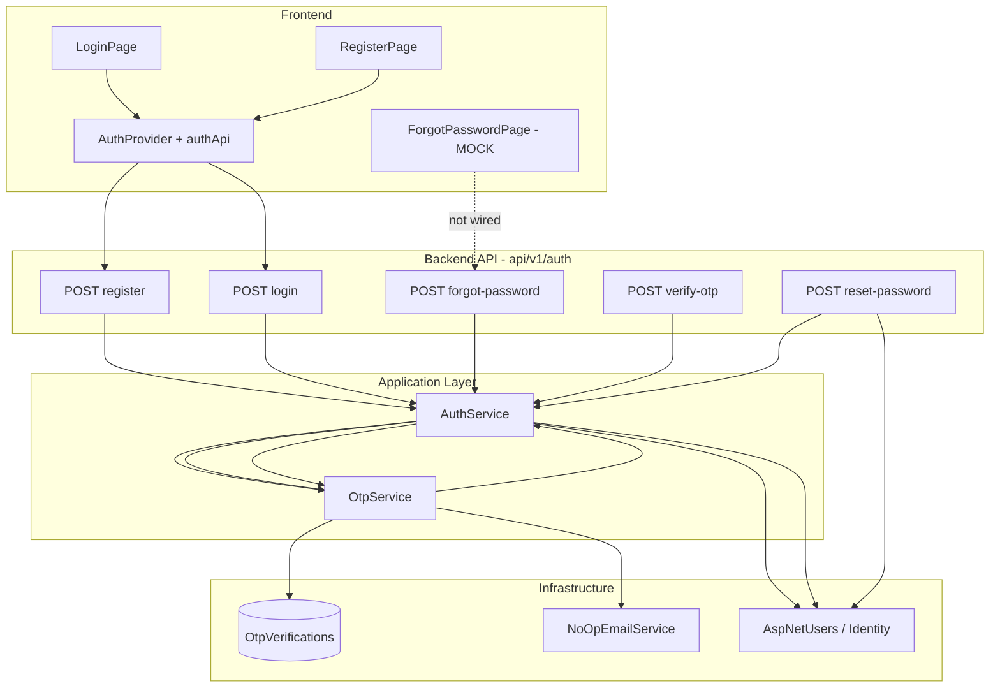

# SEHub — Authentication & Notification Audit

> **Date:** 2026-06-06  
> **Method:** CodeGraph index + symbol/call-chain queries + source verification  
> **Scope:** Email verification, OTP, email/SMS delivery, password reset  
> **Constraint:** Read-only audit — no code changes

---

## Executive Summary

SEHub has a **backend-first forgot-password OTP pipeline** (generate → store → verify → reset) wired through `AuthController`, but **notification delivery is not production-ready**. Email sending is a no-op stub; SMS does not exist in backend. The frontend forgot-password wizard is **UI-only mock** and is **not connected** to auth API endpoints (unlike login/register, which are wired).

| Capability | Status |
|------------|--------|
| Email verification (signup) | **Partial** |
| OTP generation | **Implemented** (BE) / **Partial** (FE) |
| Email sender | **Partial** |
| SMS sender | **Missing** |
| Password reset (self-service) | **Partial** |

---

## CodeGraph Audit Method

| Step | Command / action | Result |
|------|------------------|--------|
| Index status | `codegraph status` | 448 files, 4,385 nodes, 8,247 edges — up to date |
| OTP service | `codegraph query OtpService` | `OtpService.cs`, `GenerateAndSendAsync`, `VerifyAsync` |
| Email abstraction | `codegraph query IEmailService` | Single method: `SendOtpEmailAsync` |
| Email impl | `codegraph query NoOpEmailService` | Only concrete implementation |
| SMS | `codegraph query Sms` | **No backend symbols** — only FE copy in `AuthBrandPanel.jsx` |
| Email confirm | `codegraph query EmailConfirmed` | **No indexed symbols** (only migration/seed literals) |
| Forgot-password chain | `codegraph callers SendForgotPasswordOtpAsync` | `AuthController.ForgotPassword` |
| OTP → email chain | `codegraph callees OtpService.GenerateAndSendAsync` | → `SendOtpEmailAsync` (via `IEmailService`) |
| Reset chain | `codegraph callees AuthService.ResetPasswordAsync` | → `VerifyAsync`, `UpdatePasswordAsync`, `RevokeAllForUserAsync` |
| FE forgot password | `codegraph query ForgotPasswordPage` | UI handlers only; no `authApi` import |
| FE auth API | `codegraph query authApi` | Used by `AuthProvider.jsx` only (`login`, `register`, `getMe`, `logout`) |

---

## Authentication Flow (Current)



---

## Feature Matrix

### 1. Email Verification

| Layer | Status | Evidence |
|-------|--------|----------|
| **Overall** | **Partial** | Schema + seed flags only; no verification workflow |

**Implemented**
- `AspNetUsers.EmailConfirmed` column (Identity migration)
- Seed/demo users set `EmailConfirmed = true` (`DbSeeder`, `DemoDataSeeder`)

**Partial**
- Field exists but **register/login do not enforce** confirmed email
- `UserRepository.CreateAsync` does not set or verify `EmailConfirmed`
- No `POST /auth/confirm-email`, no verification token, no verification OTP purpose

**Missing**
- Send verification email on register
- Block login for unconfirmed users
- Resend confirmation link
- FE confirm-email screen

**CodeGraph:** `EmailConfirmed` — no application-layer symbols indexed.

---

### 2. OTP Generation

| Layer | Status | Evidence |
|-------|--------|----------|
| **Overall** | **Implemented** (BE) · **Partial** (FE) |

**Implemented (Backend)**
| Component | Path |
|-----------|------|
| `OtpService` | `SEHub.Application/Auth/OtpService.cs` |
| `IOtpService` | `GenerateAndSendAsync`, `VerifyAsync`, `HashCode` |
| Entity | `OtpVerification` → table `OtpVerifications` |
| Purpose enum | `OtpPurpose.ForgotPassword` (only value) |
| Repository | `OtpVerificationRepository` |
| Crypto | 6-digit code via `RandomNumberGenerator`, SHA-256 hash stored |
| Expiry | 10 minutes (`OtpExpiry`) |
| Rate limit | `AttemptCount` max 5 per OTP row |
| Invalidate prior | `InvalidateAllAsync` before new OTP |

**Call chain (CodeGraph `callees OtpService.GenerateAndSendAsync`):**
```
GenerateCode → InvalidateAllAsync → HashCode → AddAsync → SaveChangesAsync → SendOtpEmailAsync
```

**Partial (Frontend)**
- `ForgotPasswordPage.jsx` — multi-step UI (method → contact → OTP → reset)
- `OtpInput.jsx` — 6-digit input component
- Handlers (`handleSendOtp`, `handleVerifyOtp`, `handleResetPassword`) **only update local React state**
- Resend shows toast: `"(Mock)"`
- Supports **phone** method in UI — **no backend counterpart**

**Missing**
- `authApi.forgotPassword`, `verifyOtp`, `resetPassword` functions
- Integration tests for forgot/verify/reset endpoints (grep: **0 matches** in `tests/`)

---

### 3. Email Sender

| Layer | Status | Evidence |
|-------|--------|----------|
| **Overall** | **Partial** |

**Implemented**
| Component | Path |
|-----------|------|
| `IEmailService` | `SendOtpEmailAsync(email, otpCode)` |
| DI registration | `AddScoped<IEmailService, NoOpEmailService>()` in `DependencyInjection.cs` |
| Invocation | `OtpService.GenerateAndSendAsync` → `_emailService.SendOtpEmailAsync` |

**Partial**
- **Only implementation:** `NoOpEmailService` — `Task.CompletedTask` (no SMTP, no SendGrid, no logging)
- No `appsettings` email provider section
- No dev console/logger fallback for OTP code

**Missing**
- Real SMTP / transactional email provider
- Email templates (HTML/text)
- Bounce/error handling
- Email verification messages (separate from OTP)
- Alternative implementations (e.g. `SmtpEmailService`, `SendGridEmailService`)

**CodeGraph:** `NoOpEmailService.SendOtpEmailAsync` — 1 caller via interface; no other email service classes in repo.

---

### 4. SMS Sender

| Layer | Status | Evidence |
|-------|--------|----------|
| **Overall** | **Missing** |

**Implemented**
- None in backend

**Partial**
- FE UI only: `ForgotPasswordPage` method `"phone"`, copy references SMS
- `AuthBrandPanel.jsx` recovery steps mention "Email hoặc SMS"
- `AspNetUsers.PhoneNumber` / `PhoneNumberConfirmed` columns exist (Identity) — **unused for OTP**

**Missing**
- `ISmsService` / `SmsService` (CodeGraph `query Sms` → 0 backend hits)
- Phone-based OTP entity fields (`OtpVerification` is **email-only**)
- SMS provider integration (Twilio, etc.)
- `POST /auth/forgot-password` accepts **email only** (`ForgotPasswordRequest.Email`)

---

### 5. Password Reset

| Layer | Status | Evidence |
|-------|--------|----------|
| **Overall** | **Partial** |

#### 5a. Self-service reset (forgot password flow)

**Implemented (Backend API)**

| Step | Endpoint | Service method |
|------|----------|----------------|
| 1. Request OTP | `POST /api/v1/auth/forgot-password` | `SendForgotPasswordOtpAsync` |
| 2. Verify OTP | `POST /api/v1/auth/verify-otp` | `VerifyOtpAsync` |
| 3. Reset password | `POST /api/v1/auth/reset-password` | `ResetPasswordAsync` |

**Contracts**
- `ForgotPasswordRequest` — `{ email }`
- `VerifyOtpRequest` — `{ email, code }`
- `ResetPasswordRequest` — `{ email, code, newPassword }`
- `ResetPasswordRequestValidator` — email, 6-char code, password ≥ 8

**Business rules**
- Unknown email on forgot-password → **silent return** (no user enumeration leak)
- OTP re-verified on reset (verify endpoint optional for FE but reset validates again)
- On success: `UpdatePasswordAsync` + `RevokeAllForUserAsync` (refresh tokens revoked)
- Identity password rules apply (digit, upper, lower, special — 8+ chars)

**Partial**
- OTP stored and verified in DB, but **user cannot receive code** (NoOp email)
- FE flow completes locally without API — **false success** toast on reset
- No E2E or integration tests for this flow

**Missing (for production)**
- FE ↔ BE wiring for all 3 steps
- Consumed OTP flag (OTP can be reused until expiry — verify increments attempts but does not invalidate on success)
- Phone-based reset path

#### 5b. Admin reset

**Implemented**
- `POST /api/v1/admin/users/{id}/reset-password` — `AdminUserService.ResetPasswordAsync`
- Requires `RequireAdmin` policy
- Separate from OTP flow (admin-initiated)

---

## Frontend vs Backend Wiring

| Flow | FE wired to API? | CodeGraph / source |
|------|------------------|-------------------|
| Login | ✅ Yes | `authApi.login` ← `AuthProvider` |
| Register | ✅ Yes | `authApi.register` |
| Session / me | ✅ Yes | `authApi.getMe`, `logout` |
| Forgot password | ❌ No | `ForgotPasswordPage` — no `authApi` import |
| Verify OTP | ❌ No | Local state only |
| Reset password | ❌ No | Local toast + navigate |
| Email verification | ❌ No | No UI |
| SMS OTP | ❌ No | UI mock only |

---

## Database Objects

| Table | Role | Notification relevance |
|-------|------|------------------------|
| `OtpVerifications` | Stores hashed OTP, expiry, attempts | ✅ Active for forgot-password |
| `AspNetUsers` | `EmailConfirmed`, `PhoneNumber` | Fields present; verification not enforced |
| `RefreshTokens` | Revoked on password reset | ✅ |

### Verification SQL

```sql
-- OTP rows (hashed — plaintext not stored)
SELECT TOP 10 Email, Purpose, ExpiresAt, AttemptCount, CreatedAt
FROM OtpVerifications
ORDER BY CreatedAt DESC;

-- Email confirmed flags
SELECT UserName, Email, EmailConfirmed, PhoneNumber, PhoneNumberConfirmed
FROM AspNetUsers;

-- Count OTP purposes (expect only ForgotPassword = 0)
SELECT Purpose, COUNT(*) AS Cnt
FROM OtpVerifications
GROUP BY Purpose;
```

---

## API Surface (Auth Notification Related)

| Method | Route | Auth | Status |
|--------|-------|------|--------|
| POST | `/api/v1/auth/forgot-password` | Anonymous | ✅ Implemented |
| POST | `/api/v1/auth/verify-otp` | Anonymous | ✅ Implemented |
| POST | `/api/v1/auth/reset-password` | Anonymous | ✅ Implemented |
| POST | `/api/v1/admin/users/{id}/reset-password` | Admin | ✅ Implemented |
| — | `/api/v1/auth/confirm-email` | — | ❌ Missing |
| — | `/api/v1/auth/resend-confirmation` | — | ❌ Missing |
| — | `/api/v1/auth/forgot-password/sms` | — | ❌ Missing |

---

## Risk & Gap Summary

| ID | Gap | Severity |
|----|-----|----------|
| G1 | `NoOpEmailService` — OTP never delivered to user | **High** |
| G2 | FE forgot-password is mock — users think reset succeeded | **High** |
| G3 | No SMS backend despite UI offering phone method | **Medium** (misleading UX) |
| G4 | No signup email verification | **Medium** |
| G5 | OTP not invalidated after successful verify/reset | **Low** |
| G6 | No automated tests for forgot/verify/reset | **Medium** |
| G7 | `EmailConfirmed` not enforced at login | **Low** (by design today) |

---

## Status Legend

| Label | Meaning |
|-------|---------|
| **Implemented** | End-to-end logic exists and is callable (may lack real delivery) |
| **Partial** | Scaffold, stub, schema-only, or single-layer (BE or FE only) |
| **Missing** | No meaningful implementation |

---

## Recommended Completion Order (Informational — Not Implemented)

1. Replace `NoOpEmailService` with dev logger + production SMTP provider  
2. Wire `ForgotPasswordPage` → `forgot-password` / `verify-otp` / `reset-password`  
3. Remove or disable phone/SMS UI until `ISmsService` exists  
4. Add signup email verification (`OtpPurpose.EmailVerification` or Identity tokens)  
5. Add integration tests for OTP lifecycle  

---

## Files Referenced

| Area | Key paths |
|------|-----------|
| OTP | `SEHub.Application/Auth/OtpService.cs` |
| Auth orchestration | `SEHub.Application/Auth/AuthService.cs` |
| API | `SEHub.API/Controllers/AuthController.cs` |
| Email stub | `SEHub.Infrastructure/Email/NoOpEmailService.cs` |
| DI | `SEHub.Infrastructure/DependencyInjection.cs` |
| Domain | `SEHub.Domain/Entities/OtpVerification.cs`, `Enums/OtpPurpose.cs` |
| FE mock | `fe/src/features/auth/ForgotPasswordPage/ForgotPasswordPage.jsx` |
| FE API (partial) | `fe/src/api/authApi.js` |

---

*Generated from CodeGraph audit of SEHub workspace. No source files were modified.*
