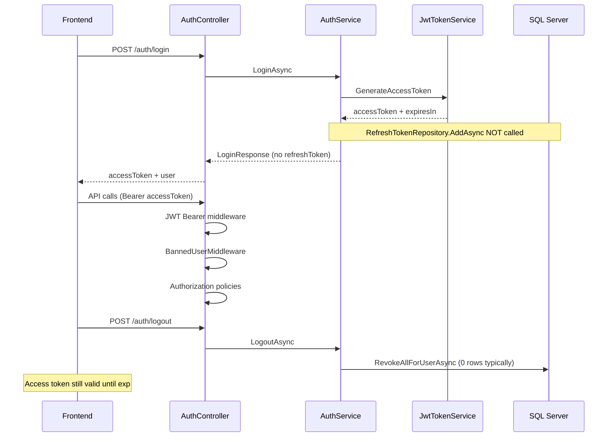

# SEHub — Auth Token Compliance Report

> **Date:** 2026-06-06  
> **Method:** CodeGraph + source audit (no code changes)  
> **Scope:** `AuthController` · `AuthService` · `JwtTokenService` · `RefreshToken` · middleware · policies

---

## Executive Summary

SEHub implements a **functional JWT access-token authentication** flow suitable for MVP demos. The **refresh-token subsystem is scaffolded but not wired**: the `RefreshTokens` table and revocation repository exist, but **no refresh tokens are issued**, **no refresh endpoint exists**, and **logout cannot invalidate active access tokens**.

---

# Authentication Architecture Score

## 58 / 100

### Classification: **Needs Work**

| Band | Range |
|------|-------|
| Production Ready | 90–100 |
| Ready with Minor Fixes | 80–89 |
| Conditional Pass | 70–79 |
| **Needs Work** | **<70** |

---

## Score Breakdown

| Component | Weight | Score | Notes |
|-----------|--------|-------|-------|
| Access token (JWT) | 40% | **90** | Issuer, audience, claims, HMAC-SHA256, middleware validation |
| Refresh token lifecycle | 35% | **15** | Entity + revoke only; never issued; no endpoint |
| Logout / session mgmt | 15% | **45** | Revokes DB refresh rows; no AT blacklist |
| Security hardening | 10% | **40** | No rotation, reuse detection, or multi-device tokens |

**Weighted:** (90×0.40) + (15×0.35) + (45×0.15) + (40×0.10) = **58.25** → **58**

---

## CHECK 1 — Login Response

| Item | Result | Evidence |
|------|--------|----------|
| Access Token returned | **PASS** | `LoginResponse.AccessToken` |
| Refresh Token returned | **FAIL** | Not in DTO; `AddAsync` never called |
| Expiration returned | **PASS** | `ExpiresIn` = `ExpirationMinutes * 60` (3600s default) |

**Actual DTO:** See [ACCESS_TOKEN_AUDIT.md](./ACCESS_TOKEN_AUDIT.md)

---

## CHECK 2 — Access Token

| Item | Result |
|------|--------|
| JWT issuer | **PASS** — `SEHub` |
| JWT audience | **PASS** — `SEHub.Client` |
| Expiration | **PASS** — 60 minutes |
| Claims: sub, email, username | **PASS** |
| Role claim | **PASS** — `ClaimTypes.Role` |
| Premium claim | **PASS** — `"isPremium"` (UI); DB used for authorization |

**Report:** [ACCESS_TOKEN_AUDIT.md](./ACCESS_TOKEN_AUDIT.md)

---

## CHECK 3 — Refresh Token

| Item | Result |
|------|--------|
| Refresh token issued on login | **FAIL** |
| Entity exists | **PASS** — `RefreshToken.cs` |
| Table exists | **PASS** — `RefreshTokens` |
| Stored in database | **FAIL** — `AddAsync` has zero callers |
| Expiration on entity | **PASS** (field exists; unused) |
| Revocation support | **PASS** — `RevokeAsync`, `RevokeAllForUserAsync` |

**Report:** [REFRESH_TOKEN_AUDIT.md](./REFRESH_TOKEN_AUDIT.md)

---

## CHECK 4 — Refresh Endpoint

| Endpoint | Exists? |
|----------|---------|
| `POST /api/v1/auth/refresh` | **FAIL** |
| `POST /api/v1/auth/refresh-token` | **FAIL** |

**Request DTO:** N/A  
**Response DTO:** N/A  

**Result: FAIL**

`AuthController.cs` has no refresh action (lines 20–114 audited).

---

## CHECK 5 — Logout

| Item | Result | Evidence |
|------|--------|----------|
| Refresh token revoked | **PARTIAL** | `RevokeAllForUserAsync` in `LogoutAsync` — but no tokens to revoke |
| Access token blacklisted | **FAIL** | No `JwtBlacklistMiddleware`; AT valid until expiry |
| Database updated | **PASS** | `SaveChangesAsync` after revoke |

```233:241:SEHub.Backend/src/SEHub.Application/Auth/AuthService.cs
    public async Task LogoutAsync(CancellationToken cancellationToken = default)
    {
        // ...
        await _refreshTokenRepository.RevokeAllForUserAsync(userId, cancellationToken);
        await _unitOfWork.SaveChangesAsync(cancellationToken);
    }
```

**Result: PARTIAL / FAIL** (refresh revoke is noop; access token not invalidated)

---

## CHECK 6 — Security

| Control | Classification | Detail |
|---------|----------------|--------|
| Token rotation | **FAIL** | No refresh flow |
| Reuse detection | **FAIL** | No refresh token consumption |
| Multiple device support | **PARTIAL** | Schema allows multiple rows; none issued |
| Expired token handling | **PASS** | `ValidateLifetime=true`, `ClockSkew=1min` |
| Banned user on valid JWT | **PASS** | `BannedUserMiddleware` post-auth 403 |
| Premium auth bypass via JWT | **PASS** | `PremiumAuthorizationHandler` reads DB |
| Symmetric JWT secret in repo config | **PARTIAL** | Dev secret in `appsettings.json` |

---

## CHECK 7 — FE Integration

**Report:** [FE_AUTH_INTEGRATION_GUIDE.md](./FE_AUTH_INTEGRATION_GUIDE.md)

| FE flow | Status |
|---------|--------|
| Login → store access token | ✅ `AuthProvider` + `httpClient` |
| Store refresh token | ❌ N/A |
| Refresh on 401 | ❌ Not implemented |
| Logout → API + clear storage | ✅ |
| Session bootstrap `/me` | ✅ |

---

## CodeGraph Evidence

```
JwtTokenService.GenerateAccessToken
  ← AuthService.BuildLoginResponseAsync
  ← RegisterAsync | LoginAsync | GoogleAuthAsync

RefreshTokenRepository.AddAsync
  ← (no application callers)

RevokeAllForUserAsync
  ← LogoutAsync
  ← ResetPasswordAsync
```

**Index:** 463 files · 4,542 nodes

---

## Architecture Diagram (Actual)



---

## Critical Gaps (Priority Order)

| # | Gap | Impact |
|---|-----|--------|
| 1 | No refresh token issuance | Users must re-login every 60 min; poor UX |
| 2 | No `POST /auth/refresh` | Cannot extend sessions securely |
| 3 | Logout does not invalidate access JWT | Stolen token usable until expiry |
| 4 | `AddAsync` dead code path | Misleading schema suggests feature exists |

---

## What Works Well

1. **JWT access token** — correct issuer/audience/lifetime/claims/signing.
2. **Role-based authorization** — `RequireModerator` / `RequireAdmin` use `ClaimTypes.Role`.
3. **Premium authorization** — DB-backed, not JWT-trusting.
4. **Password reset** — revokes all refresh tokens (ready for when refresh is wired).
5. **FE integration** — aligned with actual `LoginResponse` contract.

---

## Recommendations (audit only)

1. **P0:** Implement refresh token issuance in `BuildLoginResponseAsync` + `POST /auth/refresh` with rotation.
2. **P0:** Add `RefreshToken` to `LoginResponse` (or HttpOnly cookie).
3. **P1:** Access token blacklist or shorten AT lifetime (5–15 min) once refresh works.
4. **P1:** Configure `Jwt:RefreshExpirationDays` in settings.
5. **P2:** Move JWT secret to user-secrets / Key Vault.

---

## Related Reports

| Report | Purpose |
|--------|---------|
| [ACCESS_TOKEN_AUDIT.md](./ACCESS_TOKEN_AUDIT.md) | JWT claims, config, middleware |
| [REFRESH_TOKEN_AUDIT.md](./REFRESH_TOKEN_AUDIT.md) | Entity, DB, revocation gap |
| [FE_AUTH_INTEGRATION_GUIDE.md](./FE_AUTH_INTEGRATION_GUIDE.md) | FE login/logout/refresh guide |

---

_— Auth Token Compliance Audit · Source-verified · No code modified_
