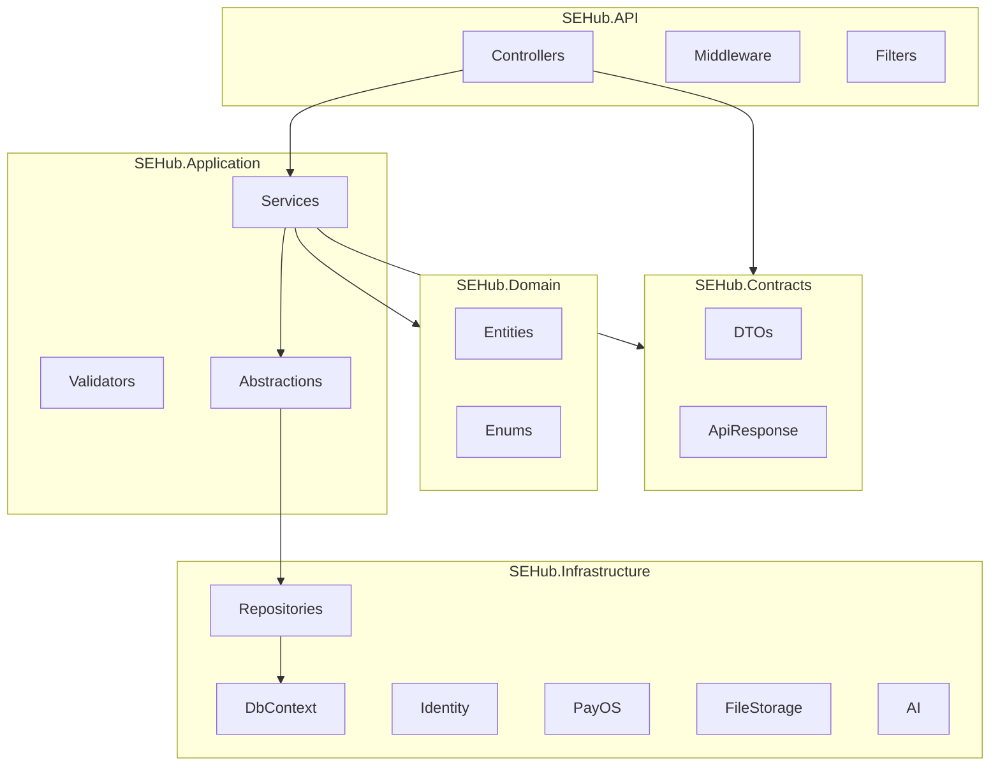
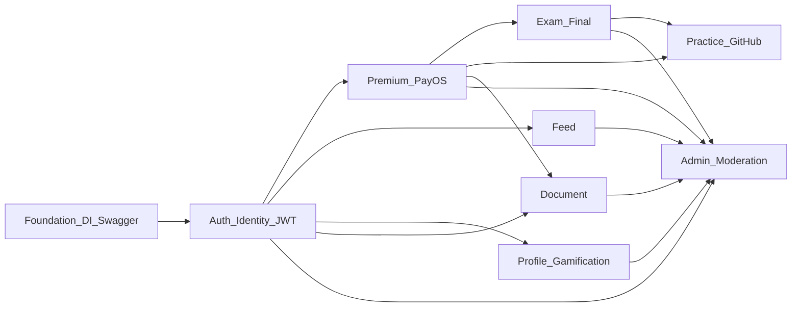
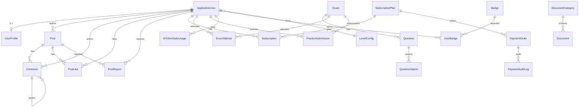
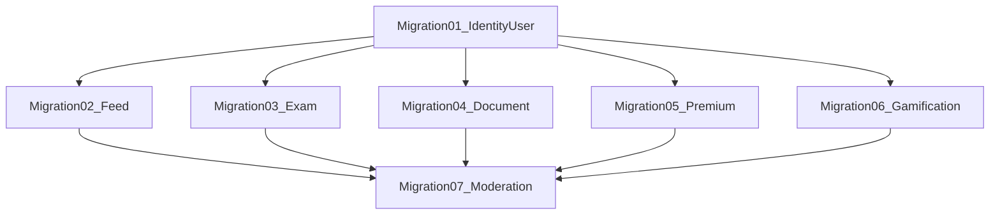
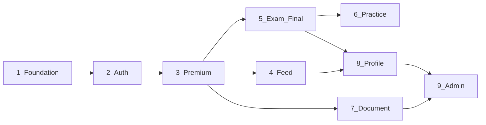
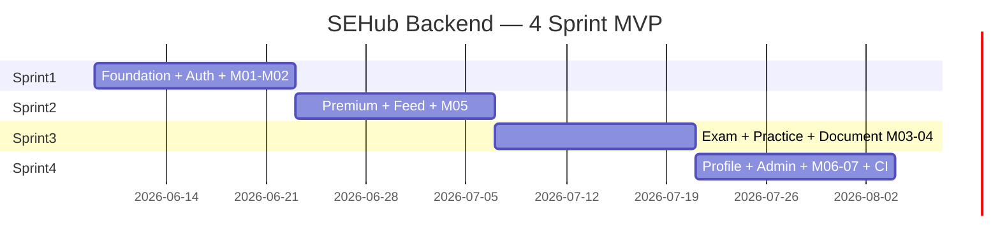

# SEHub Backend Implementation Plan

> **Nguồn:** [ARCHITECTURE-BE.md](ARCHITECTURE-BE.md) v2.0 · **Trạng thái repo:** Chưa có backend (.NET) — build 100% từ đầu  
> **Solution:** `be` — 6 project + 2 test project · **Scope:** Giai đoạn 1 (MVP)

---

# Executive Summary

SEHub Backend là **ASP.NET Core 8 Web API** theo **Clean Architecture** (6 project + 2 test project), phục vụ React SPA (Redux Thunk + Axios + JWT) qua contract `ApiResponse<T>` + `PagedResult<T>`.

**MVP G1** gồm **8 module nghiệp vụ**: Auth, Feed, Exam (Final + Practice GitHub), Document, Premium (PayOS), Profile, Admin — tổng **75 endpoint** (không tính G2: Chat, QuestionComment, Follow, Notifications, Chatbot, Heatmap).

| Hạng mục | Quyết định |
| -------- | ---------- |
| Runtime | .NET 8 · EF Core Code First · PostgreSQL (Supabase) |
| Auth | Identity Roles + JWT + `PremiumAuthorizationHandler` (đọc DB) |
| Premium | Tách khỏi Role — policy `RequirePremium` query `Subscriptions` |
| Soft delete | Global filter: `Post`, `Comment`, `Document` |
| Thanh toán | PayOS webhook idempotent + `PaymentAuditLog` append-only |
| Practice | P0: submit GitHub URL + Mod review thủ công (không auto-grade) |

**Thứ tự triển khai:** Foundation → Auth → Premium → Feed → Exam/Practice → Document → Profile → Admin → Hardening/CI (4 sprint).



---

# Dependency Graph

## Project references (bắt buộc)

| Project | References |
| ------- | ---------- |
| `SEHub.API` | Application, Contracts, Infrastructure |
| `SEHub.Application` | Domain, Contracts, Shared |
| `SEHub.Infrastructure` | Application, Domain, Shared |
| `SEHub.Contracts` | Shared |
| `SEHub.Domain` | — |
| `SEHub.Shared` | — |

**Cấm:** `SEHub.API` → `SEHub.Domain` (map Entity → DTO trong Application qua AutoMapper).

## Module dependency (nghiệp vụ)



## Luồng request

```
FE axiosInstance (Bearer JWT)
  → Middleware (ExceptionHandling, Correlation-Id)
  → Routing → JWT Auth → Policy [RequirePremium/Mod/Admin]
  → ApiResponseWrapperFilter
  → Controller (thin)
  → Application Service
  → IRepository / DbContext
  → PostgreSQL (Supabase)
  ← Entity → AutoMapper → Contracts DTO
  ← ApiResponse<T> envelope
```

## Infrastructure components

| Component | Location | Trách nhiệm |
| --------- | -------- | ----------- |
| `SEHubDbContext` | Infrastructure/Persistence | EF Core, global soft-delete filter |
| `SoftDeleteInterceptor` | Infrastructure/Persistence/Interceptors | Set `DeletedAt`/`DeletedById` |
| `ApplicationUser` | Infrastructure/Identity | Extends `IdentityUser` |
| Repository implementations | Infrastructure/Persistence/Repositories | Implement `I*Repository` từ Application |
| `LocalFileStorageService` / `AzureBlobStorageService` | Infrastructure/Storage | Upload avatar, document, exam asset |
| `PayOsService` + `PayOsWebhookHandler` | Infrastructure/Payments | Order QR, HMAC verify, idempotent |
| `OpenAiExplanationService` | Infrastructure/Ai | AI explain + lazy token |
| `PremiumAuthorizationHandler` | Infrastructure/Identity hoặc API/Extensions | DB subscription check + IMemoryCache |
| `ExceptionHandlingMiddleware` | API/Middleware | Map exception → `ApiResponse` + HTTP status |
| `ApiResponseWrapperFilter` | API/Filters | Bọc response; exclude webhook PayOS |
| `AuthorizationPolicies` | API/Extensions | 5 policies |
| `ICurrentUserService` | Application/Abstractions | `UserId`, `IsPremium`, `IsModeratorOrAdmin` |

---

# Development Roadmap

## Phase 1: Solution Foundation
- Tạo `be/SEHub.sln` + 6 project + 2 test project (§2.6)
- Cấu hình project references (§2.3)
- `Program.cs`: DI extensions, CORS, Serilog, Swagger XML
- `ServiceCollectionExtensions`: đăng ký Application + Infrastructure
- `ExceptionHandlingMiddleware`, `ApiResponseWrapperFilter`
- `AuthorizationPolicies` + stub `PremiumAuthorizationHandler`
- `appsettings.json` skeleton (§7): ConnectionString, Jwt, PayOS, FileStorage, Cors, Ai
- `GET /health`

## Phase 2: Database Foundation (Migration 01)
- `BaseEntity`, `ISoftDeletable` (Domain)
- `ApplicationUser`, `UserProfile`, `RefreshToken`, `OtpVerification`
- Identity tables (`AspNetUsers`, `AspNetRoles`, …)
- `SEHubDbContext` + Fluent configurations
- Seed: roles (`Student`, `Moderator`, `Admin`), Admin user (dev/staging)
- `dotnet ef migrations add Migration01_IdentityUser`

## Phase 3: Authentication Module
- `AuthService`: register, login, google, forgot-password OTP, verify-otp, reset-password, logout, me
- JWT generation (claims: `sub`, `role`, `isPremium` UI-only)
- `UserManager` / `SignInManager`
- Banned user check → 403 `ACCOUNT_BANNED`
- 8 Auth endpoints (§4.1)
- Unit tests: `AuthService`; Integration: login + `/auth/me`

## Phase 4: Premium & PayOS (Migration 05)
- Entities: `SubscriptionPlan`, `Subscription`, `PaymentOrder`, `PaymentAuditLog`
- Seed plans: `1m`, `8m`, `4y`
- `PremiumAuthorizationHandler` đọc DB (cache 2–5 phút)
- `PayOsService`, webhook HMAC, idempotent activate subscription
- 5 Premium endpoints (§4.6)
- Integration test: webhook idempotent + `RequirePremium` reject Free

## Phase 5: Feed Module (Migration 02)
- Entities: `Post`, `Comment`, `PostLike`, `PostReport`
- Global query filter soft delete
- Gamification hooks: +10 post published, +2 like author
- 12 Feed endpoints (§4.2)

## Phase 6: Exam Module — Final (Migration 03)
- Entities: `Exam`, `Question`, `QuestionOption`, `ExamAttempt`
- `ExamQueryService`: mask `CorrectOptionId` cho Guest/Free
- `ExamAttemptService`: 409 `ACTIVE_ATTEMPT_EXISTS`, chấm điểm submit
- `AiExplanationService`: lazy token `AiTokenDailyUsage`
- 11 Final exam endpoints (§4.3)

## Phase 7: Practice Submission (cùng Migration 03)
- Entity: `PracticeSubmission` (`IsLatest` pattern)
- 4 Practice endpoints (§4.4) — `PracticeSubmissionsController`

## Phase 8: Document Module (Migration 04)
- Entities: `DocumentCategory`, `Document`
- Preview: Free ≤3 trang; Premium/Mod/Admin full
- Download: signed URL, Premium/Mod/Admin
- 4 Document endpoints (§4.5)

## Phase 9: Profile & Gamification schema (Migration 06)
- Entities: `LevelConfig`, `Badge`, `UserBadge`, `AiTokenDailyUsage`
- 3 Profile endpoints (§4.7)
- Event-driven points: streak on login

## Phase 10: Admin & Moderation (Migration 07)
- Entity: `UserBan`
- 7 Admin controllers, 27 endpoints (§4.8)
- OCR pipeline + `DUPLICATE_EXAM` 409
- Moderation queue, ban, payments audit

## Phase 11: Hardening & CI
- Integration tests bắt buộc (§8)
- Rate limiting OTP/login/AI
- EF migrations bundle trong CI (§9)
- Swagger contract review với FE

---

# Module Breakdown

## Tổng quan entities & enums (§3)

### Entities (24 — Domain + Infrastructure)

| # | Entity | Layer | Migration |
| - | ------ | ----- | --------- |
| 1 | `ApplicationUser` | Infrastructure/Identity | 01 |
| 2 | `UserProfile` | Domain | 01 |
| 3 | `RefreshToken` | Domain | 01 |
| 4 | `OtpVerification` | Domain | 01 |
| 5 | `Post` | Domain | 02 |
| 6 | `Comment` | Domain | 02 |
| 7 | `PostLike` | Domain | 02 |
| 8 | `PostReport` | Domain | 02 |
| 9 | `Exam` | Domain | 03 |
| 10 | `Question` | Domain | 03 |
| 11 | `QuestionOption` | Domain | 03 |
| 12 | `ExamAttempt` | Domain | 03 |
| 13 | `PracticeSubmission` | Domain | 03 |
| 14 | `DocumentCategory` | Domain | 04 |
| 15 | `Document` | Domain | 04 |
| 16 | `SubscriptionPlan` | Domain | 05 |
| 17 | `Subscription` | Domain | 05 |
| 18 | `PaymentOrder` | Domain | 05 |
| 19 | `PaymentAuditLog` | Domain | 05 |
| 20 | `LevelConfig` | Domain | 06 |
| 21 | `Badge` | Domain | 06 |
| 22 | `UserBadge` | Domain | 06 |
| 23 | `AiTokenDailyUsage` | Domain | 06 |
| 24 | `UserBan` | Domain | 07 |

> **G2 (không triển khai G1):** `QuestionComment` — entity tham chiếu §4.9.

### Enums (10 — Domain/Enums)

| Enum | Giá trị | Ghi chú |
| ---- | ------- | ------- |
| `PostStatus` | Draft, Pending, Published, Rejected | §3.5 |
| `ReportStatus` | Pending, Approved, Rejected | PostReport |
| `ExamType` | Final = 0, Practice = 1 | §3.5 |
| `ExamStatus` | Draft, PendingApproval, Published, Archived | §3.5 |
| `ExamAttemptStatus` | InProgress, Submitted, Expired | §3.5 |
| `PracticeSubmissionStatus` | Submitted, Reviewed, Passed, Failed | §3.5 |
| `PaymentOrderStatus` | Pending, Paid, Failed, Cancelled | §3.5 |
| `AccessTier` | FreePreview, PremiumFull | Document |
| `BanType` | Warning, Temp, Permanent | UserBan |
| `OtpPurpose` | ForgotPassword | OtpVerification |

> **Vai trò hệ thống:** string constants `RoleNames` — `Student`, `Moderator`, `Admin` (khớp AspNetRoles, §1.7). **Premium không phải enum** — kiểm tra `Subscription` active.

---

## Auth

**Mô tả:** Đăng ký, đăng nhập JWT, Google OAuth, quên mật khẩu OTP, logout, hydrate `authSlice`.

**Domain:** Không có entity Domain — `ApplicationUser` ở Infrastructure.

**Contracts — Request DTO:**
- `RegisterRequest` — `Email`, `Username`, `Password`, `DisplayName?`
- `LoginRequest` — `EmailOrUsername`, `Password`
- `GoogleAuthRequest` — `IdToken`
- `ForgotPasswordRequest` — `Email`
- `VerifyOtpRequest` — `Email`, `Code`
- `ResetPasswordRequest` — `Email`, `Code`, `NewPassword`

**Contracts — Response DTO:**
- `LoginResponse` — `AccessToken`, `ExpiresIn`, `User` (AuthUserDto)
- `AuthUserDto` — `Id`, `Username`, `Email`, `DisplayName`, `Role`, `IsPremium`, `AvatarUrl`, `Points`, `LevelName`
- `MeResponse` — alias/wrap `AuthUserDto`
- `MessageResponse` — OTP sent, reset success

**Application:** `IAuthService`, `IJwtTokenService`, `IOtpService` + validators + `IRefreshTokenRepository`, `IOtpVerificationRepository`

**API:** `AuthController` — 8 endpoints §4.1

**Test:** Unit (validation, banned); Integration (login → `/auth/me`)

---

## Feed

**Mô tả:** Cộng đồng bài viết Markdown, like/comment/report, ghim Moderator, soft delete.

**Domain entities:** `Post`, `Comment`, `PostLike`, `PostReport`  
**Enums:** `PostStatus`, `ReportStatus`

**Contracts — Request DTO:**
- `CreatePostRequest` — `Title`, `Content` (≤10.000 ký tự), `Tags?`
- `UpdatePostRequest` — `Title`, `Content`, `Tags?`
- `CreateCommentRequest` — `Content`, `ParentCommentId?`
- `ReportPostRequest` — `Reason`
- `FeaturePostRequest` — `IsFeatured`
- `PostQueryParams` — `Page`, `PageSize`, `Semester?`, `Major?`, `Tag?`, `Search?`, `SortBy?`, `SortDir?`

**Contracts — Response DTO:**
- `PostListItemDto` — `Id`, `Title`, `Excerpt`, `Author`, `Tags`, `LikeCount`, `CommentCount`, `CreatedAt`, `IsFeatured`
- `PostDetailDto` — full post + author + stats
- `CommentDto` — `Id`, `Content`, `Author`, `ParentCommentId?`, `CreatedAt`, `Replies?`
- `FeaturedPostDto` — sidebar item
- `AuthorSummaryDto` — `Id`, `Username`, `DisplayName`, `AvatarUrl`
- `LikeStatusDto` — `IsLiked`, `LikeCount`

**Application:** `IPostService`, `ICommentService`, `IPostLikeService`, `IPostReportService`, `IGamificationService`

**API:** `PostsController` — 12 endpoints §4.2

---

## Exam (Final)

**Mô tả:** Đề trắc nghiệm cuối kỳ, mask đáp án Free/Guest, làm bài Premium, AI giải thích lazy token.

**Domain entities:** `Exam`, `Question`, `QuestionOption`, `ExamAttempt`, `AiTokenDailyUsage`  
**Enums:** `ExamType`, `ExamStatus`, `ExamAttemptStatus`

**Contracts — Request DTO:**
- `ExamQueryParams` — `Type?`, `Semester?`, `Major?`, `Page`, `PageSize`
- `CreateExamAttemptRequest` — (empty body — examId từ route)
- `SaveAnswersRequest` — `Answers` (dict questionId → optionId)
- `AiExplainRequest` — `QuestionId`, `Context?`

**Contracts — Response DTO:**
- `ExamListItemDto` — `Id`, `Code`, `Title`, `ExamType`, `Semester`, `Major`, `QuestionCount`, `Status`
- `ExamDetailDto` — metadata, `Description`, `AssetUrl?`
- `QuestionPublicDto` — `Id`, `OrderIndex`, `Content`, `Options` (không `CorrectOptionId`)
- `QuestionAnswerDto` — extends public + `CorrectOptionId`
- `QuestionOptionDto` — `Id`, `Label`, `Text`
- `ExamAttemptDto` — `Id`, `ExamId`, `Status`, `StartedAt`, `Answers?`
- `ExamResultDto` — `Score`, `TotalQuestions`, `CorrectCount`, `Answers` (with correct)
- `AiExplainResponse` — `Explanation`, `TokensUsed`, `RemainingTokens`
- `CurrentAttemptDto` — `AttemptId`, `Status`

**Application:** `IExamQueryService`, `IExamAttemptService`, `IExamGradingService`, `IAiExplanationService`

**API:** `ExamsController` — 11 endpoints §4.3

---

## Practice Submission

**Mô tả:** Nộp GitHub URL cho đề thực hành, Mod review thủ công, `IsLatest` pattern.

**Domain entity:** `PracticeSubmission`  
**Enum:** `PracticeSubmissionStatus`

**Contracts — Request DTO:**
- `SubmitPracticeRequest` — `GitHubRepoUrl`
- `ReviewPracticeRequest` — `Status` (Passed/Failed), `ReviewerComment?`
- `PracticeQueryParams` — `Page`, `PageSize`, `Status?`

**Contracts — Response DTO:**
- `PracticeSubmissionDto` — `Id`, `ExamId`, `GitHubRepoUrl`, `Status`, `SubmittedAt`, `ReviewerComment?`, `ReviewedAt?`
- `PracticeSubmissionListItemDto` — + `User` summary cho Mod list

**Application:** `IPracticeSubmissionService`

**API:** `PracticeSubmissionsController` — 4 endpoints §4.4

---

## Document

**Mô tả:** Tài liệu học tập — Guest 401, Free preview ≤3 trang, Premium/Mod/Admin full + download.

**Domain entities:** `DocumentCategory`, `Document`  
**Enum:** `AccessTier`

**Contracts — Request DTO:**
- `DocumentQueryParams` — `CategoryId?`, `Semester?`, `Major?`, `Page`, `PageSize`
- `DocumentPreviewQuery` — `Page` (1-based)

**Contracts — Response DTO:**
- `DocumentListItemDto` — `Id`, `Title`, `Category`, `PageCount`, `AccessTier`
- `DocumentDetailDto` — metadata + `CanDownload`, `PageLimit`
- `DocumentPreviewDto` — `Page`, `TotalPages`, `PageLimit`, `ContentUrl` hoặc base64 chunk

**Application:** `IDocumentService`, `IDocumentPreviewService`

**API:** `DocumentsController` — 4 endpoints §4.5

---

## Premium

**Mô tả:** Gói Premium PayOS, webhook idempotent, kích hoạt `Subscription`.

**Domain entities:** `SubscriptionPlan`, `Subscription`, `PaymentOrder`, `PaymentAuditLog`  
**Enum:** `PaymentOrderStatus`

**Contracts — Request DTO:**
- `CreatePaymentOrderRequest` — `PlanCode` (1m/8m/4y)

**Contracts — Response DTO:**
- `SubscriptionPlanDto` — `Code`, `Name`, `DurationDays`, `PriceVnd`
- `PaymentOrderDto` — `OrderId`, `PayOsOrderCode`, `Amount`, `Status`, `QrUrl?`, `CheckoutUrl?`, `ExpiredAt`
- `SubscriptionStatusDto` — `IsActive`, `ExpiresAt`, `PlanName?`

**Application:** `IPremiumService`, `ISubscriptionService`, `IPayOsService`

**API:** `PremiumController` — 5 endpoints §4.6 (webhook **không** bọc envelope)

---

## Profile

**Mô tả:** Hồ sơ công khai, cập nhật profile, thống kê gamification (P1).

**Domain entities:** `UserProfile`, `LevelConfig`, `Badge`, `UserBadge`

**Contracts — Request DTO:**
- `UpdateProfileRequest` — `DisplayName?`, `Bio?`, `Major?`, `Semester?`, `AvatarUrl?`

**Contracts — Response DTO:**
- `ProfileDto` — `Username`, `DisplayName`, `Bio`, `AvatarUrl`, `Major`, `Semester`, `Points`, `LevelName`, `Badges`
- `ProfileStatsDto` — `Points`, `LevelName`, `StreakCount`, `NextLevelPoints?`, `BadgesCount`
- `BadgeDto` — `Code`, `Name`, `EarnedAt?`

**Application:** `IProfileService`, `IProfileStatsService`

**API:** `ProfilesController` — 3 endpoints §4.7

---

## Admin

**Mô tả:** Dashboard, quản lý user/exam/document, moderation, payments, gamification config.

**Domain entity:** `UserBan`  
**Enum:** `BanType`

**Contracts — Request DTO:**
- `AdminUserPatchRequest` — `BanUntil?`, `BanType?`, `Role?`, `IsBanned?`
- `ResetPasswordAdminRequest` — `NewPassword?` (generate random)
- `CreateExamRequest` — `Code`, `Title`, `ExamType`, `Semester`, `Major`, `Description`, `Questions[]`
- `UpdateExamRequest` — partial exam + questions
- `OcrExamRequest` — `ImageFile` / base64
- `ApproveExamRequest` — `Confirm` (bypass duplicate warning)
- `UploadDocumentRequest` — `Title`, `CategoryId`, `File`, `AccessTier`
- `ResolveReportRequest` — `Status`, `Action?` (delete post/comment)
- `ConfirmPaymentRequest` — `Note?`
- `GrantTokensRequest` — `Amount`
- `UpdateLevelsRequest` — `Levels[]` (Name, MinPoints, VoucherPercent?)
- `AdminQueryParams` — shared pagination/filter

**Contracts — Response DTO:**
- `DashboardStatsDto` — users, posts, exams, revenue counts
- `AdminUserListItemDto`, `AdminUserDetailDto`
- `AdminExamDto`, `OcrExamResultDto` (text, contentHash, duplicateWarning)
- `AdminDocumentDto`
- `ReportDto`, `ReportDetailDto`
- `BannedUserDto`
- `PaymentListItemDto`, `PaymentDetailDto`, `PaymentAuditLogDto`
- `LevelConfigDto`, `BadgeAdminDto`

**Application:** `IAdminDashboardService`, `IAdminUserService`, `IAdminExamService`, `IAdminDocumentService`, `IModerationService`, `IAdminPaymentService`, `IAdminGamificationService`, `IOcrExamService`

**API (7 controllers):** 27 endpoints §4.8

---

## Folder Generation Plan — File-level checklist (~124 files)

> Checkbox `[ ]` — đánh dấu khi tạo xong. Tổng **124** file `.cs` (+ migrations auto-generated).

### Solution root (2)

- [ ] `be/SEHub.sln`
- [ ] `be/.editorconfig`

### SEHub.Shared (6)

- [ ] `src/SEHub.Shared/Constants/RoleNames.cs`
- [ ] `src/SEHub.Shared/Constants/ErrorCodes.cs`
- [ ] `src/SEHub.Shared/Constants/PolicyNames.cs`
- [ ] `src/SEHub.Shared/Constants/AiTokenLimits.cs`
- [ ] `src/SEHub.Shared/Extensions/DateTimeExtensions.cs`
- [ ] `src/SEHub.Shared/Extensions/StringExtensions.cs`

### SEHub.Domain — Entities (22)

- [ ] `src/SEHub.Domain/Common/BaseEntity.cs`
- [ ] `src/SEHub.Domain/Common/ISoftDeletable.cs`
- [ ] `src/SEHub.Domain/Entities/UserProfile.cs`
- [ ] `src/SEHub.Domain/Entities/RefreshToken.cs`
- [ ] `src/SEHub.Domain/Entities/OtpVerification.cs`
- [ ] `src/SEHub.Domain/Entities/Post.cs`
- [ ] `src/SEHub.Domain/Entities/Comment.cs`
- [ ] `src/SEHub.Domain/Entities/PostLike.cs`
- [ ] `src/SEHub.Domain/Entities/PostReport.cs`
- [ ] `src/SEHub.Domain/Entities/Exam.cs`
- [ ] `src/SEHub.Domain/Entities/Question.cs`
- [ ] `src/SEHub.Domain/Entities/QuestionOption.cs`
- [ ] `src/SEHub.Domain/Entities/ExamAttempt.cs`
- [ ] `src/SEHub.Domain/Entities/PracticeSubmission.cs`
- [ ] `src/SEHub.Domain/Entities/DocumentCategory.cs`
- [ ] `src/SEHub.Domain/Entities/Document.cs`
- [ ] `src/SEHub.Domain/Entities/SubscriptionPlan.cs`
- [ ] `src/SEHub.Domain/Entities/Subscription.cs`
- [ ] `src/SEHub.Domain/Entities/PaymentOrder.cs`
- [ ] `src/SEHub.Domain/Entities/PaymentAuditLog.cs`
- [ ] `src/SEHub.Domain/Entities/LevelConfig.cs`
- [ ] `src/SEHub.Domain/Entities/Badge.cs`
- [ ] `src/SEHub.Domain/Entities/UserBadge.cs`
- [ ] `src/SEHub.Domain/Entities/AiTokenDailyUsage.cs`
- [ ] `src/SEHub.Domain/Entities/UserBan.cs`

### SEHub.Domain — Enums (10)

- [ ] `src/SEHub.Domain/Enums/PostStatus.cs`
- [ ] `src/SEHub.Domain/Enums/ReportStatus.cs`
- [ ] `src/SEHub.Domain/Enums/ExamType.cs`
- [ ] `src/SEHub.Domain/Enums/ExamStatus.cs`
- [ ] `src/SEHub.Domain/Enums/ExamAttemptStatus.cs`
- [ ] `src/SEHub.Domain/Enums/PracticeSubmissionStatus.cs`
- [ ] `src/SEHub.Domain/Enums/PaymentOrderStatus.cs`
- [ ] `src/SEHub.Domain/Enums/AccessTier.cs`
- [ ] `src/SEHub.Domain/Enums/BanType.cs`
- [ ] `src/SEHub.Domain/Enums/OtpPurpose.cs`

### SEHub.Domain — Exceptions (4)

- [ ] `src/SEHub.Domain/Exceptions/DomainException.cs`
- [ ] `src/SEHub.Domain/Exceptions/NotFoundException.cs`
- [ ] `src/SEHub.Domain/Exceptions/BusinessRuleException.cs`
- [ ] `src/SEHub.Domain/Exceptions/ConflictException.cs`

### SEHub.Contracts — Common (3)

- [ ] `src/SEHub.Contracts/Common/ApiResponse.cs`
- [ ] `src/SEHub.Contracts/Common/ApiError.cs`
- [ ] `src/SEHub.Contracts/Common/PagedResult.cs`

### SEHub.Contracts — Auth (8)

- [ ] `src/SEHub.Contracts/Auth/RegisterRequest.cs`
- [ ] `src/SEHub.Contracts/Auth/LoginRequest.cs`
- [ ] `src/SEHub.Contracts/Auth/GoogleAuthRequest.cs`
- [ ] `src/SEHub.Contracts/Auth/ForgotPasswordRequest.cs`
- [ ] `src/SEHub.Contracts/Auth/VerifyOtpRequest.cs`
- [ ] `src/SEHub.Contracts/Auth/ResetPasswordRequest.cs`
- [ ] `src/SEHub.Contracts/Auth/LoginResponse.cs`
- [ ] `src/SEHub.Contracts/Auth/AuthUserDto.cs`

### SEHub.Contracts — Feed (11)

- [ ] `src/SEHub.Contracts/Feed/CreatePostRequest.cs`
- [ ] `src/SEHub.Contracts/Feed/UpdatePostRequest.cs`
- [ ] `src/SEHub.Contracts/Feed/CreateCommentRequest.cs`
- [ ] `src/SEHub.Contracts/Feed/ReportPostRequest.cs`
- [ ] `src/SEHub.Contracts/Feed/FeaturePostRequest.cs`
- [ ] `src/SEHub.Contracts/Feed/PostQueryParams.cs`
- [ ] `src/SEHub.Contracts/Feed/PostListItemDto.cs`
- [ ] `src/SEHub.Contracts/Feed/PostDetailDto.cs`
- [ ] `src/SEHub.Contracts/Feed/CommentDto.cs`
- [ ] `src/SEHub.Contracts/Feed/FeaturedPostDto.cs`
- [ ] `src/SEHub.Contracts/Feed/AuthorSummaryDto.cs`

### SEHub.Contracts — Exams (14)

- [ ] `src/SEHub.Contracts/Exams/ExamQueryParams.cs`
- [ ] `src/SEHub.Contracts/Exams/SaveAnswersRequest.cs`
- [ ] `src/SEHub.Contracts/Exams/AiExplainRequest.cs`
- [ ] `src/SEHub.Contracts/Exams/SubmitPracticeRequest.cs`
- [ ] `src/SEHub.Contracts/Exams/ReviewPracticeRequest.cs`
- [ ] `src/SEHub.Contracts/Exams/ExamListItemDto.cs`
- [ ] `src/SEHub.Contracts/Exams/ExamDetailDto.cs`
- [ ] `src/SEHub.Contracts/Exams/QuestionPublicDto.cs`
- [ ] `src/SEHub.Contracts/Exams/QuestionAnswerDto.cs`
- [ ] `src/SEHub.Contracts/Exams/QuestionOptionDto.cs`
- [ ] `src/SEHub.Contracts/Exams/ExamAttemptDto.cs`
- [ ] `src/SEHub.Contracts/Exams/ExamResultDto.cs`
- [ ] `src/SEHub.Contracts/Exams/AiExplainResponse.cs`
- [ ] `src/SEHub.Contracts/Exams/PracticeSubmissionDto.cs`

### SEHub.Contracts — Documents (5)

- [ ] `src/SEHub.Contracts/Documents/DocumentQueryParams.cs`
- [ ] `src/SEHub.Contracts/Documents/DocumentPreviewQuery.cs`
- [ ] `src/SEHub.Contracts/Documents/DocumentListItemDto.cs`
- [ ] `src/SEHub.Contracts/Documents/DocumentDetailDto.cs`
- [ ] `src/SEHub.Contracts/Documents/DocumentPreviewDto.cs`

### SEHub.Contracts — Premium (4)

- [ ] `src/SEHub.Contracts/Premium/CreatePaymentOrderRequest.cs`
- [ ] `src/SEHub.Contracts/Premium/SubscriptionPlanDto.cs`
- [ ] `src/SEHub.Contracts/Premium/PaymentOrderDto.cs`
- [ ] `src/SEHub.Contracts/Premium/SubscriptionStatusDto.cs`

### SEHub.Contracts — Profiles (4)

- [ ] `src/SEHub.Contracts/Profiles/UpdateProfileRequest.cs`
- [ ] `src/SEHub.Contracts/Profiles/ProfileDto.cs`
- [ ] `src/SEHub.Contracts/Profiles/ProfileStatsDto.cs`
- [ ] `src/SEHub.Contracts/Profiles/BadgeDto.cs`

### SEHub.Contracts — Admin (18)

- [ ] `src/SEHub.Contracts/Admin/AdminUserPatchRequest.cs`
- [ ] `src/SEHub.Contracts/Admin/CreateExamRequest.cs`
- [ ] `src/SEHub.Contracts/Admin/UpdateExamRequest.cs`
- [ ] `src/SEHub.Contracts/Admin/OcrExamRequest.cs`
- [ ] `src/SEHub.Contracts/Admin/UploadDocumentRequest.cs`
- [ ] `src/SEHub.Contracts/Admin/ResolveReportRequest.cs`
- [ ] `src/SEHub.Contracts/Admin/ConfirmPaymentRequest.cs`
- [ ] `src/SEHub.Contracts/Admin/GrantTokensRequest.cs`
- [ ] `src/SEHub.Contracts/Admin/UpdateLevelsRequest.cs`
- [ ] `src/SEHub.Contracts/Admin/AdminQueryParams.cs`
- [ ] `src/SEHub.Contracts/Admin/DashboardStatsDto.cs`
- [ ] `src/SEHub.Contracts/Admin/AdminUserListItemDto.cs`
- [ ] `src/SEHub.Contracts/Admin/AdminUserDetailDto.cs`
- [ ] `src/SEHub.Contracts/Admin/AdminExamDto.cs`
- [ ] `src/SEHub.Contracts/Admin/AdminDocumentDto.cs`
- [ ] `src/SEHub.Contracts/Admin/ReportDto.cs`
- [ ] `src/SEHub.Contracts/Admin/PaymentListItemDto.cs`
- [ ] `src/SEHub.Contracts/Admin/LevelConfigDto.cs`

### SEHub.Application — Abstractions (16)

- [ ] `src/SEHub.Application/Abstractions/ICurrentUserService.cs`
- [ ] `src/SEHub.Application/Abstractions/IFileStorageService.cs`
- [ ] `src/SEHub.Application/Abstractions/IPayOsService.cs`
- [ ] `src/SEHub.Application/Abstractions/IAiExplanationService.cs`
- [ ] `src/SEHub.Application/Abstractions/Repositories/IPostRepository.cs`
- [ ] `src/SEHub.Application/Abstractions/Repositories/ICommentRepository.cs`
- [ ] `src/SEHub.Application/Abstractions/Repositories/IExamRepository.cs`
- [ ] `src/SEHub.Application/Abstractions/Repositories/IExamAttemptRepository.cs`
- [ ] `src/SEHub.Application/Abstractions/Repositories/IPracticeSubmissionRepository.cs`
- [ ] `src/SEHub.Application/Abstractions/Repositories/IDocumentRepository.cs`
- [ ] `src/SEHub.Application/Abstractions/Repositories/ISubscriptionRepository.cs`
- [ ] `src/SEHub.Application/Abstractions/Repositories/IPaymentOrderRepository.cs`
- [ ] `src/SEHub.Application/Abstractions/Repositories/IUserProfileRepository.cs`
- [ ] `src/SEHub.Application/Abstractions/Repositories/IRefreshTokenRepository.cs`
- [ ] `src/SEHub.Application/Abstractions/Repositories/IOtpVerificationRepository.cs`
- [ ] `src/SEHub.Application/Abstractions/Repositories/IAiTokenUsageRepository.cs`

### SEHub.Application — Services (24)

- [ ] `src/SEHub.Application/Auth/IAuthService.cs`
- [ ] `src/SEHub.Application/Auth/AuthService.cs`
- [ ] `src/SEHub.Application/Auth/IJwtTokenService.cs`
- [ ] `src/SEHub.Application/Auth/JwtTokenService.cs`
- [ ] `src/SEHub.Application/Auth/IOtpService.cs`
- [ ] `src/SEHub.Application/Auth/OtpService.cs`
- [ ] `src/SEHub.Application/Feed/IPostService.cs`
- [ ] `src/SEHub.Application/Feed/PostService.cs`
- [ ] `src/SEHub.Application/Feed/ICommentService.cs`
- [ ] `src/SEHub.Application/Feed/CommentService.cs`
- [ ] `src/SEHub.Application/Exams/IExamQueryService.cs`
- [ ] `src/SEHub.Application/Exams/ExamQueryService.cs`
- [ ] `src/SEHub.Application/Exams/IExamAttemptService.cs`
- [ ] `src/SEHub.Application/Exams/ExamAttemptService.cs`
- [ ] `src/SEHub.Application/Exams/IPracticeSubmissionService.cs`
- [ ] `src/SEHub.Application/Exams/PracticeSubmissionService.cs`
- [ ] `src/SEHub.Application/Documents/IDocumentService.cs`
- [ ] `src/SEHub.Application/Documents/DocumentService.cs`
- [ ] `src/SEHub.Application/Premium/IPremiumService.cs`
- [ ] `src/SEHub.Application/Premium/PremiumService.cs`
- [ ] `src/SEHub.Application/Profiles/IProfileService.cs`
- [ ] `src/SEHub.Application/Profiles/ProfileService.cs`
- [ ] `src/SEHub.Application/Admin/IAdminDashboardService.cs`
- [ ] `src/SEHub.Application/Admin/AdminDashboardService.cs`

### SEHub.Application — Validators (8)

- [ ] `src/SEHub.Application/Auth/Validators/RegisterRequestValidator.cs`
- [ ] `src/SEHub.Application/Auth/Validators/LoginRequestValidator.cs`
- [ ] `src/SEHub.Application/Feed/Validators/CreatePostRequestValidator.cs`
- [ ] `src/SEHub.Application/Exams/Validators/SaveAnswersRequestValidator.cs`
- [ ] `src/SEHub.Application/Exams/Validators/SubmitPracticeRequestValidator.cs`
- [ ] `src/SEHub.Application/Documents/Validators/DocumentQueryParamsValidator.cs`
- [ ] `src/SEHub.Application/Premium/Validators/CreatePaymentOrderRequestValidator.cs`
- [ ] `src/SEHub.Application/Profiles/Validators/UpdateProfileRequestValidator.cs`

### SEHub.Application — Mapping (8)

- [ ] `src/SEHub.Application/Mapping/AuthMappingProfile.cs`
- [ ] `src/SEHub.Application/Mapping/FeedMappingProfile.cs`
- [ ] `src/SEHub.Application/Mapping/ExamMappingProfile.cs`
- [ ] `src/SEHub.Application/Mapping/DocumentMappingProfile.cs`
- [ ] `src/SEHub.Application/Mapping/PremiumMappingProfile.cs`
- [ ] `src/SEHub.Application/Mapping/ProfileMappingProfile.cs`
- [ ] `src/SEHub.Application/Mapping/AdminMappingProfile.cs`
- [ ] `src/SEHub.Application/DependencyInjection.cs`

### SEHub.Infrastructure — Persistence (28)

- [ ] `src/SEHub.Infrastructure/Persistence/SEHubDbContext.cs`
- [ ] `src/SEHub.Infrastructure/Persistence/Configurations/UserProfileConfiguration.cs`
- [ ] `src/SEHub.Infrastructure/Persistence/Configurations/PostConfiguration.cs`
- [ ] `src/SEHub.Infrastructure/Persistence/Configurations/CommentConfiguration.cs`
- [ ] `src/SEHub.Infrastructure/Persistence/Configurations/ExamConfiguration.cs`
- [ ] `src/SEHub.Infrastructure/Persistence/Configurations/ExamAttemptConfiguration.cs`
- [ ] `src/SEHub.Infrastructure/Persistence/Configurations/PracticeSubmissionConfiguration.cs`
- [ ] `src/SEHub.Infrastructure/Persistence/Configurations/DocumentConfiguration.cs`
- [ ] `src/SEHub.Infrastructure/Persistence/Configurations/SubscriptionConfiguration.cs`
- [ ] `src/SEHub.Infrastructure/Persistence/Configurations/PaymentOrderConfiguration.cs`
- [ ] `src/SEHub.Infrastructure/Persistence/Interceptors/SoftDeleteInterceptor.cs`
- [ ] `src/SEHub.Infrastructure/Persistence/Interceptors/AuditLogInterceptor.cs`
- [ ] `src/SEHub.Infrastructure/Persistence/Repositories/PostRepository.cs`
- [ ] `src/SEHub.Infrastructure/Persistence/Repositories/ExamRepository.cs`
- [ ] `src/SEHub.Infrastructure/Persistence/Repositories/ExamAttemptRepository.cs`
- [ ] `src/SEHub.Infrastructure/Persistence/Repositories/DocumentRepository.cs`
- [ ] `src/SEHub.Infrastructure/Persistence/Repositories/SubscriptionRepository.cs`
- [ ] `src/SEHub.Infrastructure/Persistence/Repositories/PaymentOrderRepository.cs`
- [ ] `src/SEHub.Infrastructure/Persistence/Seed/RoleSeeder.cs`
- [ ] `src/SEHub.Infrastructure/Persistence/Seed/AdminUserSeeder.cs`
- [ ] `src/SEHub.Infrastructure/Persistence/Seed/SubscriptionPlanSeeder.cs`
- [ ] `src/SEHub.Infrastructure/Persistence/Seed/LevelConfigSeeder.cs`
- [ ] `src/SEHub.Infrastructure/Identity/ApplicationUser.cs`
- [ ] `src/SEHub.Infrastructure/Identity/PremiumAuthorizationHandler.cs`
- [ ] `src/SEHub.Infrastructure/Identity/CurrentUserService.cs`
- [ ] `src/SEHub.Infrastructure/Storage/LocalFileStorageService.cs`
- [ ] `src/SEHub.Infrastructure/Payments/PayOsService.cs`
- [ ] `src/SEHub.Infrastructure/Payments/PayOsWebhookHandler.cs`
- [ ] `src/SEHub.Infrastructure/Ai/OpenAiExplanationService.cs`
- [ ] `src/SEHub.Infrastructure/DependencyInjection.cs`

### SEHub.API (18)

- [ ] `src/SEHub.API/Program.cs`
- [ ] `src/SEHub.API/Controllers/AuthController.cs`
- [ ] `src/SEHub.API/Controllers/PostsController.cs`
- [ ] `src/SEHub.API/Controllers/ExamsController.cs`
- [ ] `src/SEHub.API/Controllers/PracticeSubmissionsController.cs`
- [ ] `src/SEHub.API/Controllers/DocumentsController.cs`
- [ ] `src/SEHub.API/Controllers/ProfilesController.cs`
- [ ] `src/SEHub.API/Controllers/PremiumController.cs`
- [ ] `src/SEHub.API/Controllers/HealthController.cs`
- [ ] `src/SEHub.API/Controllers/Admin/DashboardController.cs`
- [ ] `src/SEHub.API/Controllers/Admin/UsersController.cs`
- [ ] `src/SEHub.API/Controllers/Admin/ExamsController.cs`
- [ ] `src/SEHub.API/Controllers/Admin/DocumentsController.cs`
- [ ] `src/SEHub.API/Controllers/Admin/ModerationController.cs`
- [ ] `src/SEHub.API/Controllers/Admin/GamificationController.cs`
- [ ] `src/SEHub.API/Controllers/Admin/PaymentsController.cs`
- [ ] `src/SEHub.API/Middleware/ExceptionHandlingMiddleware.cs`
- [ ] `src/SEHub.API/Filters/ApiResponseWrapperFilter.cs`
- [ ] `src/SEHub.API/Extensions/ServiceCollectionExtensions.cs`
- [ ] `src/SEHub.API/Extensions/AuthorizationPolicies.cs`

### Tests (12)

- [ ] `tests/SEHub.Application.UnitTests/Auth/AuthServiceTests.cs`
- [ ] `tests/SEHub.Application.UnitTests/Exams/ExamGradingServiceTests.cs`
- [ ] `tests/SEHub.Application.UnitTests/Exams/MaskAnswersTests.cs`
- [ ] `tests/SEHub.Application.UnitTests/Exams/ActiveAttemptTests.cs`
- [ ] `tests/SEHub.Application.UnitTests/Premium/SubscriptionActivationTests.cs`
- [ ] `tests/SEHub.Application.UnitTests/Documents/PreviewPageLimitTests.cs`
- [ ] `tests/SEHub.Application.UnitTests/Feed/SoftDeleteTests.cs`
- [ ] `tests/SEHub.API.IntegrationTests/Auth/LoginIntegrationTests.cs`
- [ ] `tests/SEHub.API.IntegrationTests/Premium/PayOsWebhookTests.cs`
- [ ] `tests/SEHub.API.IntegrationTests/Premium/RequirePremiumTests.cs`
- [ ] `tests/SEHub.API.IntegrationTests/Feed/PostsIntegrationTests.cs`
- [ ] `tests/SEHub.API.IntegrationTests/Documents/GuestUnauthorizedTests.cs`

**Tổng file `.cs` checklist:** ~**124** (+ 7 migration folders auto-generated bởi EF).

---

# Database Plan

## ERD Giai đoạn 1



## Migration order & dependencies



| Migration | Tables | Phụ thuộc | Giải thích chi tiết |
| --------- | ------ | --------- | ------------------- |
| **01 — Identity & User** | `AspNetUsers`, `AspNetRoles`, `AspNetUserRoles`, `AspNetUserClaims`, `AspNetRoleClaims`, `AspNetUserLogins`, `AspNetUserTokens`, `UserProfiles`, `RefreshTokens`, `OtpVerifications` | — | **Nền tảng bắt buộc.** Mọi FK `UserId`, `AuthorId`, `ReviewerId`, `ActorId` trỏ về `ApplicationUser`. Seed roles + Admin dev. `LevelId` nullable — gán sau M06. |
| **02 — Feed** | `Posts`, `Comments`, `PostLikes`, `PostReports` | 01 | `AuthorId`, `ReporterId`, `ResolvedById` → Users. Global soft-delete filter Post/Comment. Index `CreatedAt DESC`, `IsFeatured`. |
| **03 — Exam** | `Exams`, `Questions`, `QuestionOptions`, `ExamAttempts`, `PracticeSubmissions` | 01 | `UserId` attempts/submissions; `ReviewedById` → Users. Unique filtered index `(UserId, ExamId)` WHERE InProgress. Index `(ExamId, UserId, IsLatest)`. |
| **04 — Document** | `DocumentCategories`, `Documents` | 01 | `UploadedById?` → Users. Soft delete Document. `AccessTier` enum. |
| **05 — Premium** | `SubscriptionPlans`, `Subscriptions`, `PaymentOrders`, `PaymentAuditLogs` | 01 | `UserId`, `PlanId` FK. UNIQUE `PayOsOrderCode`. Seed plans 1m/8m/4y. Audit append-only. |
| **06 — Gamification** | `LevelConfigs`, `Badges`, `UserBadges`, `AiTokenDailyUsages` | 01 | `LevelId` FK trên User (ALTER/add). UNIQUE `(UserId, UsageDate)`. Seed Bronze→Platinum. |
| **07 — Moderation** | `UserBans` | 01, 02 | `BannedUserId`, `ActorId` → Users. Liên kết logic với `PostReports` (không FK cứng). |

## Seed data

| Migration | Seed | Môi trường |
| --------- | ---- | ---------- |
| M01 | Roles `Student`, `Moderator`, `Admin`; Admin account | Dev/Staging |
| M05 | `SubscriptionPlans`: 1m, 8m, 4y + giá VND | All |
| M06 | `LevelConfigs`: Bronze/Silver/Gold/Platinum; badges mặc định | All |

## Indexes bắt buộc (§3.6)

| Bảng | Index | Migration |
| ---- | ----- | --------- |
| Posts | `(CreatedAt DESC)` + filter `IsDeleted` | 02 |
| Posts | `IsFeatured` WHERE Published | 02 |
| Exams | `(Semester, Major, ExamType)` | 03 |
| ExamAttempts | `(UserId, ExamId)` filtered InProgress | 03 |
| PracticeSubmissions | `(ExamId, UserId, IsLatest)` | 03 |
| PaymentOrders | `PayOsOrderCode` UNIQUE | 05 |
| AiTokenDailyUsage | `(UserId, UsageDate)` UNIQUE | 06 |

## Business rules (tóm tắt)

- **Soft delete:** `DELETE` API → `IsDeleted=true` — không `Remove()` (trừ Admin hard-delete Document có confirm).
- **ExamAttempt:** Tối đa 1 `InProgress` per `(UserId, ExamId)` → 409 `ACTIVE_ATTEMPT_EXISTS`.
- **PracticeSubmission:** Resubmit → bản mới `IsLatest=true`, bản cũ `false`.
- **PaymentAuditLog:** INSERT only — không UPDATE/DELETE qua EF.
- **Premium:** `PremiumAuthorizationHandler` query `Subscriptions` — không chỉ JWT claim.

# API Plan

> **Base path:** `/api/v1` · **Envelope:** `ApiResponse<T>` (trừ PayOS webhook, `/health`) · **Pagination:** `PagedResult<T>`, `pageSize` max 50

## Thứ tự implement tối ưu



1. **Foundation** — health, envelope, exception middleware
2. **Auth** — JWT, policies, banned check, `ICurrentUserService`
3. **Premium** — `RequirePremium` handler + plans (Anonymous read)
4. **Feed** — ít cross-module; demo community sớm
5. **Exam Final** — phụ thuộc Premium cho attempts
6. **Practice** — phụ thuộc Exam + Mod role
7. **Document** — Auth required; download cần Premium
8. **Profile** — đọc Points/Level tích lũy
9. **Admin** — CRUD trên tất cả entities

## Endpoint inventory

| Module | Số lượng | Controller |
| ------ | -------- | ---------- |
| Health | 1 | `HealthController` |
| Auth | 8 | `AuthController` |
| Feed | 12 | `PostsController` |
| Exam Final | 11 | `ExamsController` |
| Exam Practice | 4 | `ExamsController`, `PracticeSubmissionsController` |
| Document | 4 | `DocumentsController` |
| Premium | 5 | `PremiumController` |
| Profile | 3 | `ProfilesController` |
| Admin | 27 | `Admin/*Controller` |
| **Tổng** | **75** | — |

---

### 4.1 Auth (8 endpoints)

| Method | Endpoint | Policy | FE tương ứng | Mô tả |
| ------ | -------- | ------ | ------------ | ----- |
| POST | `/api/v1/auth/register` | Anonymous | `/register` | Email, username, password |
| POST | `/api/v1/auth/login` | Anonymous | `/login` | Trả JWT + user profile |
| POST | `/api/v1/auth/google` | Anonymous | OAuth button | Verify `id_token`, upsert user |
| POST | `/api/v1/auth/forgot-password` | Anonymous | `/forgot-password` | Gửi OTP email |
| POST | `/api/v1/auth/verify-otp` | Anonymous | — | Xác minh OTP |
| POST | `/api/v1/auth/reset-password` | Anonymous | — | Đặt mật khẩu mới |
| POST | `/api/v1/auth/logout` | Authenticated | logout thunk | Revoke refresh token (nếu có) |
| GET | `/api/v1/auth/me` | Authenticated | hydrate `authSlice` | User + role + `isPremium` |

---

### 4.2 Feed — Posts (12 endpoints)

| Method | Endpoint | Policy | FE route | Mô tả |
| ------ | -------- | ------ | -------- | ----- |
| GET | `/api/v1/posts` | Anonymous | `/` Feed | Phân trang, `?semester&major&tag&search` |
| GET | `/api/v1/posts/featured` | Anonymous | `CommunitySidebar` | Bài ghim Moderator |
| GET | `/api/v1/posts/{id}` | Anonymous | `/posts/:id` | + comments metadata |
| POST | `/api/v1/posts` | Authenticated | `/posts/create` | Markdown ≤ 10.000 ký tự |
| PUT | `/api/v1/posts/{id}` | Author \| Mod | edit / resubmit | Rejected → Pending |
| PATCH | `/api/v1/posts/{id}/feature` | Mod \| Admin | Admin/Mod | `{ "isFeatured": true }` |
| DELETE | `/api/v1/posts/{id}` | Author \| Mod \| Admin | delete | **Soft delete** |
| POST | `/api/v1/posts/{id}/like` | Authenticated | PostCard | Like idempotent; +2 điểm author |
| DELETE | `/api/v1/posts/{id}/like` | Authenticated | — | Unlike |
| GET | `/api/v1/posts/{id}/comments` | Anonymous | — | Phân trang comments |
| POST | `/api/v1/posts/{id}/comments` | Authenticated | — | Comment hoặc `parentCommentId` |
| DELETE | `/api/v1/posts/{id}/comments/{commentId}` | Author \| Mod | — | **Soft delete** |
| POST | `/api/v1/posts/{id}/report` | Authenticated | — | Tạo `PostReport` |

---

### 4.3 Exams — Cuối kỳ / Trắc nghiệm (11 endpoints)

| Method | Endpoint | Policy | FE route | Mô tả |
| ------ | -------- | ------ | -------- | ----- |
| GET | `/api/v1/exams` | Anonymous | `/exams` | `?type=Final&semester&major` |
| GET | `/api/v1/exams/{id}` | Anonymous | `/exams/:id` | Metadata, **không** lộ đáp án |
| GET | `/api/v1/exams/{id}/questions` | Anonymous | `ExamDetailPage` | **Mask** đáp án Guest/Free |
| GET | `/api/v1/exams/{id}/questions/{questionId}` | Premium | `ExamDetailPage` | Trả đáp án đúng |
| POST | `/api/v1/exams/questions/{questionId}/ai-explain` | Authenticated | `ExamDetailPage` | AI token lazy-reset |
| POST | `/api/v1/exams/{id}/attempts` | **RequirePremium** | `/exams/:id/do` | Tạo InProgress; **409** nếu đã có |
| GET | `/api/v1/exams/{id}/attempts/{attemptId}` | Premium | — | Tiến độ làm bài |
| PUT | `/api/v1/exams/{id}/attempts/{attemptId}/answers` | Premium | autosave | Lưu `AnswersJson` |
| POST | `/api/v1/exams/{id}/attempts/{attemptId}/submit` | Premium | nộp bài | Chấm điểm, `Submitted` |
| GET | `/api/v1/exams/{id}/attempts/{attemptId}/result` | Premium | `/exams/:id/result` | Kết quả sau submit |
| GET | `/api/v1/exams/{id}/attempts/current` | Premium | `ExamDoPage` | Resume InProgress sau F5 |

---

### 4.4 Exams — Thực hành GitHub (4 endpoints)

| Method | Endpoint | Policy | FE | Mô tả |
| ------ | -------- | ------ | -- | ----- |
| GET | `/api/v1/exams` | Anonymous | `/exams?type=Practice` | Lọc `ExamType=Practice` *(dùng chung §4.3)* |
| GET | `/api/v1/exams/{id}` | Anonymous | `/exams/:id` | Mô tả đề + `AssetUrl` *(dùng chung §4.3)* |
| POST | `/api/v1/exams/{examId}/practice-submissions` | **RequirePremium** | `ExamDetailPage` | `{ "githubRepoUrl": "..." }` |
| GET | `/api/v1/exams/{examId}/practice-submissions/me` | Premium | `ExamDetailPage` | Trạng thái + `reviewerComment` |
| GET | `/api/v1/exams/{examId}/practice-submissions` | Mod \| Admin | Admin/Mod tool | Danh sách nộp bài |
| PATCH | `/api/v1/exams/{examId}/practice-submissions/{submissionId}` | Mod \| Admin | Admin/Mod | Đánh giá thủ công |

> **Đếm endpoint riêng Practice:** 4 (POST submit, GET me, GET list, PATCH review). Hai GET `/exams` dùng chung Final.

---

### 4.5 Documents (4 endpoints)

| Method | Endpoint | Policy | FE route | Mô tả |
| ------ | -------- | ------ | -------- | ----- |
| GET | `/api/v1/documents` | **Authenticated** | `/documents` | Guest **401** |
| GET | `/api/v1/documents/{id}` | Authenticated | `/documents/:id` | Metadata |
| GET | `/api/v1/documents/{id}/preview` | Authenticated | viewer | Free: `page` ≤ 3; Premium/Mod/Admin: full |
| GET | `/api/v1/documents/{id}/download` | Premium \| Mod \| Admin | `DocumentDetailPage` | Signed URL |
| DELETE | `/api/v1/documents/{id}` | Admin | admin | **Soft delete** |

---

### 4.6 Premium & PayOS (5 endpoints)

| Method | Endpoint | Policy | FE route | Mô tả |
| ------ | -------- | ------ | -------- | ----- |
| GET | `/api/v1/premium/plans` | Anonymous | `/pricing` | 1m / 8m / 4y |
| POST | `/api/v1/premium/orders` | Authenticated | `/checkout` | Tạo `PaymentOrder` + QR PayOS |
| GET | `/api/v1/premium/orders/{orderId}` | Authenticated | — | Poll trạng thái thanh toán |
| GET | `/api/v1/premium/subscription` | Authenticated | — | `isActive`, `expiresAt` |
| POST | `/api/v1/premium/webhooks/payos` | **Anonymous + HMAC** | — | Verify signature → idempotent update |

**Webhook xử lý:** Verify checksum → tìm `PayOsOrderCode` → nếu đã Paid → 200 OK → else activate `Subscription` + `PaymentAuditLog` INSERT.

---

### 4.7 Profile (3 endpoints)

| Method | Endpoint | Policy | FE |
| ------ | -------- | ------ | -- |
| GET | `/api/v1/profiles/{username}` | Authenticated | `/profile/:username` |
| PUT | `/api/v1/profiles/me` | Authenticated | — |
| GET | `/api/v1/profiles/me/stats` | Authenticated | level, points, streak |

---

### 4.8 Admin (27 endpoints)

| Method | Endpoint | Policy | FE route |
| ------ | -------- | ------ | -------- |
| GET | `/api/v1/admin/dashboard` | Admin | `/admin` |
| GET | `/api/v1/admin/users` | Admin | `/admin/users` |
| GET | `/api/v1/admin/users/{id}` | Admin | `/admin/users/:id` |
| PATCH | `/api/v1/admin/users/{id}` | Admin *(ban: Mod \| Admin)* | `UserDetailPage` |
| POST | `/api/v1/admin/users/{id}/reset-password` | Admin | reset MK |
| GET | `/api/v1/admin/exams` | Admin \| Mod | `/admin/exams` |
| POST | `/api/v1/admin/exams` | Admin \| Mod | `/admin/exams/create` |
| GET | `/api/v1/admin/exams/{id}` | Admin \| Mod | `/admin/exams/:id` |
| PUT | `/api/v1/admin/exams/{id}` | Admin | `/admin/exams/:id` |
| POST | `/api/v1/admin/exams/{id}/approve` | Admin | `AdminExamDetailPage` |
| POST | `/api/v1/admin/exams/ocr` | Admin | `AdminExamCreatePage` |
| GET | `/api/v1/admin/documents` | Admin | `/admin/documents` |
| POST | `/api/v1/admin/documents` | Admin | `/admin/documents/upload` |
| GET | `/api/v1/admin/documents/{id}` | Admin | `/admin/documents/:id` |
| DELETE | `/api/v1/admin/documents/{id}` | Admin | `AdminDocumentDetailPage` |
| GET | `/api/v1/admin/moderation/reports` | Mod \| Admin | `/admin/moderation` |
| GET | `/api/v1/admin/moderation/reports/{id}` | Mod \| Admin | `/admin/moderation/:id` |
| PATCH | `/api/v1/admin/moderation/reports/{id}` | Mod \| Admin | `ReportDetailPage` |
| GET | `/api/v1/admin/moderation/banned` | Mod \| Admin | `/admin/moderation/banned` |
| GET | `/api/v1/admin/gamification/levels` | Admin | `/admin/gamification/levels` |
| PUT | `/api/v1/admin/gamification/levels` | Admin | `LevelsConfigPage` |
| GET | `/api/v1/admin/gamification/badges` | Admin | `/admin/gamification/badges` |
| GET | `/api/v1/admin/payments` | Admin | `/admin/payments` |
| GET | `/api/v1/admin/payments/audit` | Admin | `/admin/payments/audit` |
| GET | `/api/v1/admin/payments/{id}` | Admin | `/admin/payments/:id` |
| POST | `/api/v1/admin/payments/{orderId}/confirm` | Admin | PaymentDetail |
| POST | `/api/v1/admin/users/{id}/grant-tokens` | Admin | UserDetail |

**Không G1:** `/admin/gamification/vouchers`, `/admin/settings/*` (P2).

---

### Health (1 endpoint)

| Method | Endpoint | Policy | Mô tả |
| ------ | -------- | ------ | ----- |
| GET | `/health` | Anonymous | Health check deploy — **không** envelope |

---

## Authorization policies

| Policy | Kiểm tra | Ví dụ endpoint |
| ------ | -------- | -------------- |
| Anonymous | Không JWT | `GET /posts`, `GET /exams`, `GET /premium/plans` |
| Authenticated | JWT valid, not banned | `POST /posts`, `GET /documents` |
| RequirePremium | `Subscription` active (DB) | `POST .../attempts`, practice submit, download |
| RequireModerator | Role Mod/Admin | PATCH practice review, moderation |
| RequireAdmin | Role Admin | OCR, payment confirm, grant tokens |

## Mã lỗi nghiệp vụ (§5.9)

| Mã | HTTP | Khi nào |
| -- | ---- | ------- |
| `VALIDATION_FAILED` | 400 | FluentValidation |
| `UNAUTHORIZED` | 401 | Không token / hết hạn |
| `ACCOUNT_BANNED` | 403 | User bị khóa |
| `PREMIUM_REQUIRED` | 403 | Thiếu subscription |
| `FORBIDDEN` | 403 | Không đủ quyền role |
| `NOT_FOUND` | 404 | Id không tồn tại / soft-deleted |
| `DUPLICATE_EXAM` | 409 | Trùng `ContentHash` OCR |
| `ACTIVE_ATTEMPT_EXISTS` | 409 | Đã có attempt InProgress |
| `TOKEN_LIMIT_EXCEEDED` | 429 | AI quota |

---

# Sprint Plan



## Sprint 1 — Foundation + Auth + DB (01–02)

| Hạng mục | Chi tiết |
| -------- | -------- |
| **Deliverables** | Solution scaffold, Migration 01–02, Auth 8 APIs, health, Swagger, Serilog |
| **APIs** | `/health` (1), `/auth/*` (8), envelope filter |
| **Database** | Identity, UserProfile, RefreshToken, OtpVerification, Feed tables |
| **Phụ thuộc** | Không |
| **Rủi ro** | JWT misconfiguration → integration test login ngay cuối sprint |

## Sprint 2 — Premium + Feed

| Hạng mục | Chi tiết |
| -------- | -------- |
| **Deliverables** | Migration 05, Premium module, Feed 12 APIs, gamification points cơ bản |
| **APIs** | `/premium/*` (5), `/posts/*` (12) |
| **Database** | SubscriptionPlans (seed), Subscriptions, PaymentOrders, PaymentAuditLogs |
| **Phụ thuộc** | Sprint 1 Auth |
| **Rủi ro** | PayOS sandbox → mock `IPayOsService`; webhook test ngrok staging |

## Sprint 3 — Exam + Practice + Document

| Hạng mục | Chi tiết |
| -------- | -------- |
| **Deliverables** | Migration 03–04, Exam 15 APIs (11+4), Document 4 APIs, AI lazy token |
| **APIs** | `/exams/*` (11 Final + 4 Practice), `/documents/*` (4) |
| **Database** | Exam ecosystem, DocumentCategory/Document |
| **Phụ thuộc** | Sprint 1 Auth, Sprint 2 Premium (`RequirePremium`) |
| **Rủi ro** | OCR → stub sprint 3; AI cost → mock configurable |

## Sprint 4 — Profile + Admin + Gamification + Hardening

| Hạng mục | Chi tiết |
| -------- | -------- |
| **Deliverables** | Migration 06–07, Profile 3 APIs, Admin 27 APIs, integration tests, CI |
| **APIs** | `/profiles/*` (3), `/admin/*` (27) |
| **Database** | Gamification, UserBan |
| **Phụ thuộc** | Tất cả sprint trước |
| **Rủi ro** | Admin scope lớn → ưu tiên users/moderation/payments trước gamification P1 |

---

# Risks & Mitigation

| Rủi ro | Tác động | Giảm thiểu |
| ------ | -------- | ---------- |
| PayOS webhook không test local | Premium không activate | Mock service + ngrok staging; admin `POST .../confirm` |
| `RequirePremium` chỉ đọc JWT | Free bypass premium | Bắt buộc `PremiumAuthorizationHandler` DB + integration test |
| Exam + Practice scope lớn S3 | Delay MVP | Exam attempts P0 trước; Practice review đầu S4 nếu cần |
| OCR external dependency | Block admin exam create | Stub OCR trả text; hash duplicate test unit-level |
| Admin 27 endpoints S4 | Overload | Parallel: Users/Moderation vs Exams/Documents/Payments |
| FE chưa có axios/Redux | BE không consumer | Contract-first Swagger; FE sprint song song Appendix E |
| Soft delete leak | Nội dung đã xóa hiện | Global query filter + integration test |
| Concurrent exam attempts | Data corruption | Filtered unique index + transaction + 409 |
| AI token cost | Chi phí vượt budget | Mock `IAiExplanationService` dev; rate limit 429 |
| Identity role drift | Lệch FE `authSlice.role` | Seed roles cố định; claim `role` = AspNetRoles name |

---

# Definition Of Done

Cho **mỗi module**, đánh dấu ✅ khi đạt tất cả tiêu chí:

| Tiêu chí | Mô tả |
| -------- | ----- |
| Domain | Entities + enums + business rules trong code |
| Migration | EF migration applied; indexes + FK đúng §3.6 |
| Service | Application service + repository; unit tests ≥ core paths |
| Validation | FluentValidation cho tất cả Request DTO |
| API | Controller endpoints khớp §4; Swagger XML comments |
| Swagger | Schema `ApiResponse<T>` đúng; examples login/errors |
| Unit Test | Happy path + error codes chính (`PREMIUM_REQUIRED`, `ACTIVE_ATTEMPT_EXISTS`, …) |
| Integration Test | ≥1 E2E flow qua `WebApplicationFactory` |

### Module-specific bắt buộc

| Module | Tiêu chí bổ sung |
| ------ | ---------------- |
| Premium | Webhook idempotent test (Paid 2 lần → 200, không duplicate subscription) |
| Exam | Mask answers test Free vs Premium; 409 active attempt |
| Document | Guest 401; Free preview ≤3 trang |
| Practice | `IsLatest` flip on resubmit; Mod PATCH review |
| Admin | Role separation Mod vs Admin (Mod không confirm payment) |
| Auth | Banned user → 403 `ACCOUNT_BANNED` |

---

# Final Checklist

## Solution & Infrastructure
- [ ] `be` solution 6 project + 2 test project
- [ ] Project references đúng §2.3 (API không reference Domain)
- [ ] 5 authorization policies registered
- [ ] `PremiumAuthorizationHandler` DB-backed (cache 2–5 phút)
- [ ] `ApiResponse<T>` envelope (trừ PayOS webhook, `/health`)
- [ ] `ExceptionHandlingMiddleware` + `ApiResponseWrapperFilter`
- [ ] Serilog + `X-Correlation-Id`
- [ ] CORS whitelist Vite `http://localhost:5173`

## Database (7 migrations)
- [ ] Migration 01 — Identity & User + seed roles/Admin
- [ ] Migration 02 — Feed (soft delete filter)
- [ ] Migration 03 — Exam + PracticeSubmission
- [ ] Migration 04 — Document
- [ ] Migration 05 — Premium + seed plans
- [ ] Migration 06 — Gamification + seed levels
- [ ] Migration 07 — Moderation (UserBan)

## API Endpoints (75 total)
- [ ] Health: 1 (`GET /health`)
- [ ] Auth: 8
- [ ] Feed: 12
- [ ] Exam Final: 11
- [ ] Exam Practice: 4
- [ ] Document: 4
- [ ] Premium: 5 (webhook HMAC + idempotent)
- [ ] Profile: 3
- [ ] Admin: 27

## Business Rules
- [ ] Soft delete: Post, Comment, Document
- [ ] `PaymentAuditLog` append-only
- [ ] Practice GitHub submit + Mod PATCH review
- [ ] Exam attempt: max 1 InProgress → 409
- [ ] Document preview: Free ≤3 trang
- [ ] Error codes §5.9 trong `SEHub.Shared`
- [ ] AI lazy token (không cron 00:00)

## Testing & CI
- [ ] Unit tests: Auth, grading, mask answers, soft delete
- [ ] Integration: login, PayOS webhook, RequirePremium, Guest 401 documents
- [ ] CI: build + test + migration review
- [ ] Swagger export cho FE contract review

## Không triển khai G1
- [ ] Chat SignalR `/hubs/chat`
- [ ] `QuestionComment` entity & API
- [ ] Follow, Notifications hub
- [ ] Chatbot `/admin/settings/chatbot`
- [ ] Heatmap 6 tháng
- [ ] Admin vouchers API (`/admin/gamification/vouchers`)
- [ ] Admin settings P2 (`/admin/settings/*`)

---

_— SEHub Backend Implementation Plan · Nguồn: ARCHITECTURE-BE.md v2.0 · ASP.NET Core 8 · PostgreSQL (Supabase) · EF Core Code First_
