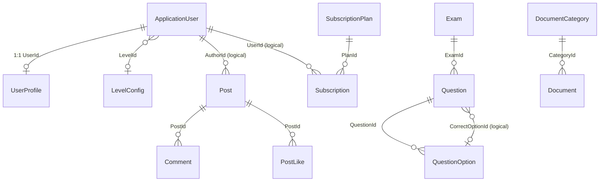

# SEHub — Demo Data Model Report

> **Ngày phân tích:** 2026-06-06  
> **Công cụ:** [CodeGraph](.codegraph/codegraph.db) — property/class nodes + đối chiếu EF `IEntityTypeConfiguration`, `SEHubDbContextModelSnapshot`  
> **Phạm vi:** Entities phục vụ demo Guest + Student — User, Post, Exam, Question, Option, Document, Subscription  
> **Nguyên tắc:** Chỉ phân tích — không sửa code, không sinh code

---

# Executive Summary

| Entity | Table | DbSet | Seeder | Repository |
|--------|-------|-------|--------|------------|
| **ApplicationUser** (User) | `AspNetUsers` | Identity base *(không DbSet riêng)* | ✅ Admin only | `IUserRepository` |
| **UserProfile** | `UserProfiles` | ✅ | ✅ *(kèm Admin)* | `IUserProfileRepository` |
| **Post** | `Posts` | ✅ | ❌ | `IPostRepository` |
| **Exam** | `Exams` | ✅ | ❌ | `IExamRepository` |
| **Question** | `Questions` | ✅ | ❌ | *(qua `IExamRepository`)* |
| **QuestionOption** (Option) | `QuestionOptions` | ✅ | ❌ | *(qua `IExamRepository`)* |
| **Document** | `Documents` | ✅ | ❌ | `IDocumentRepository` |
| **Subscription** | `Subscriptions` | ✅ | ❌ | `ISubscriptionRepository` |

**Entity liên quan bắt buộc khi seed demo** *(không nằm trong danh sách yêu cầu nhưng có FK)*:

| Entity | Table | Seeder |
|--------|-------|--------|
| `LevelConfig` | `LevelConfigs` | ✅ 4 levels |
| `SubscriptionPlan` | `SubscriptionPlans` | ✅ 3 plans (`1m`, `8m`, `4y`) |
| `DocumentCategory` | `DocumentCategories` | ❌ |

---

# CodeGraph Analysis Notes

Nguồn: `.codegraph/codegraph.db` (302 files indexed — tham chiếu `DEPENDENCY_GRAPH_AUDIT.md`).

CodeGraph đã index các **property nodes** sau cho từng entity file:

| Entity file | Properties indexed (CodeGraph `kind=property`) |
|-------------|-----------------------------------------------|
| `ApplicationUser.cs` | `DisplayName`, `Points`, `LevelId`, `StreakCount`, `LastActivityDate`, `IsBanned`, `BanUntil`, `BanReason`, `Level`, `Profile` |
| `Post.cs` | `AuthorId`, `Title`, `Content`, `Tags`, `Status`, `ViewCount`, `IsFeatured`, `IsDeleted`, `DeletedAt`, `DeletedById`, `Comments`, `Likes`, `Reports` |
| `Exam.cs` | `Code`, `Title`, `ExamType`, `Semester`, `Major`, `QuestionCount`, `Status`, `ContentHash`, `Description`, `AssetUrl`, `Questions`, `Attempts`, `PracticeSubmissions` |
| `Question.cs` | `ExamId`, `OrderIndex`, `Content`, `CorrectOptionId`, `Exam`, `Options` |
| `QuestionOption.cs` | `QuestionId`, `Label`, `Text`, `Question` |
| `Document.cs` | `CategoryId`, `Title`, `FilePath`, `MimeType`, `PageCount`, `AccessTier`, `IsDeleted`, `DeletedAt`, `DeletedById`, `Category` |
| `Subscription.cs` | `UserId`, `PlanId`, `StartAt`, `EndAt`, `IsActive`, `Plan` |

---

# Entity Details

## 1. ApplicationUser (User)

| | |
|---|---|
| **Class** | `SEHub.Infrastructure.Identity.ApplicationUser` |
| **Base** | `IdentityUser<Guid>` |
| **Table** | `AspNetUsers` |
| **Configuration** | `ApplicationUserConfiguration.cs` |

### Required fields

| Field | Type | Max length / constraint |
|-------|------|-------------------------|
| `Id` | `Guid` | PK, auto-generated |
| `DisplayName` | `string` | max 100, required |
| Identity: `UserName` | `string` | max 256 *(Identity)* |
| Identity: `PasswordHash` | `string` | *(qua `UserManager`)* |

### Nullable fields

| Field | Type | Ghi chú |
|-------|------|---------|
| `LevelId` | `Guid?` | FK → `LevelConfigs` |
| `LastActivityDate` | `DateTime?` | Streak tracking |
| `BanUntil` | `DateTime?` | Ban tạm |
| `BanReason` | `string?` | max 500 |
| `Email` | `string?` | max 256 *(Identity)* |
| `PhoneNumber` | `string?` | *(Identity)* |
| `LockoutEnd` | `DateTimeOffset?` | *(Identity)* |
| `ConcurrencyStamp`, `SecurityStamp`, `NormalizedEmail`, `NormalizedUserName` | `string?` | *(Identity internals)* |

### Default / non-nullable scalar (không required bởi EF nhưng có default)

| Field | Type | Default |
|-------|------|---------|
| `Points` | `int` | 0 |
| `StreakCount` | `int` | 0 |
| `IsBanned` | `bool` | false |
| `EmailConfirmed`, `LockoutEnabled`, `TwoFactorEnabled`, `PhoneNumberConfirmed` | `bool` | false |
| `AccessFailedCount` | `int` | 0 |

### Navigation properties

| Property | Type | Relationship |
|----------|------|--------------|
| `Level` | `LevelConfig?` | N-1 optional |
| `Profile` | `UserProfile?` | 1-1 |

### Relationships

```
ApplicationUser ──1:1──► UserProfile (UserId, Cascade delete)
ApplicationUser ──N:1──► LevelConfig (LevelId, SetNull on delete)
ApplicationUser ◄──N:1── AspNetUserRoles (Identity)
```

### Foreign keys

| FK column | References | On delete |
|-----------|------------|-----------|
| `LevelId` | `LevelConfigs.Id` | `SetNull` |
| `UserProfiles.UserId` | `AspNetUsers.Id` | `Cascade` |

### Unique constraints

| Index | Column(s) | Filter |
|-------|-----------|--------|
| PK | `Id` | — |
| Unique | `Email` | `[Email] IS NOT NULL` |
| Unique | `UserName` | `[UserName] IS NOT NULL` |
| Unique | `NormalizedUserName` | `[NormalizedUserName] IS NOT NULL` |

### Business constraints

| Rule | Nguồn |
|------|-------|
| Role qua **ASP.NET Identity** — `Student` / `Moderator` / `Admin` | `ARCHITECTURE-BE.md` §1.7 |
| Premium **không** lưu trên User — kiểm tra `Subscriptions.IsActive` | `PremiumStatusService`, `SubscriptionRepository` |
| Register: email unique, username unique, password ≥ 8 | `RegisterRequestValidator` |
| Banned user → middleware chặn request | `BannedUserMiddleware` |
| Login cập nhật streak | `UserRepository.UpdateStreakOnLoginAsync` |
| Gamification: `Points` tích lũy (+10 post, +2 like received) | `GamificationService` |
| Seeder chỉ tạo **Admin** — không seed Student | `DbSeeder.SeedAdminUserAsync` |

---

## 1b. UserProfile *(satellite của User)*

| | |
|---|---|
| **Class** | `SEHub.Domain.Entities.UserProfile` |
| **Table** | `UserProfiles` |
| **Configuration** | `UserProfileConfiguration.cs` |

### Required fields

| Field | Type |
|-------|------|
| `Id` | `Guid` |
| `CreatedAt` | `DateTime` |
| `UserId` | `Guid` |

### Nullable fields

| Field | Type | Max length |
|-------|------|------------|
| `UpdatedAt` | `DateTime?` | — |
| `AvatarUrl` | `string?` | 500 |
| `Bio` | `string?` | 1000 |
| `Major` | `string?` | 100 |
| `Semester` | `int?` | — |

### Navigation properties

*(Không có — FK owned by `UserId`)*

### Relationships

```
UserProfile ──1:1──► ApplicationUser (UserId, required, Cascade)
```

### Foreign keys

| FK | References | On delete |
|----|------------|-----------|
| `UserId` | `AspNetUsers.Id` | `Cascade` |

### Unique constraints

| Index | Column |
|-------|--------|
| PK | `Id` |
| **Unique** | `UserId` |

### Business constraints

| Rule | Nguồn |
|------|-------|
| Tự tạo khi Register / seed Admin | `AuthService.RegisterAsync`, `DbSeeder` |
| Cập nhật qua `PUT /api/v1/profiles/me` | `ProfileService` |

---

## 2. Post

| | |
|---|---|
| **Class** | `SEHub.Domain.Entities.Post` |
| **Base** | `BaseEntity`, `ISoftDeletable` |
| **Table** | `Posts` |
| **Configuration** | `PostConfiguration.cs` |
| **Global filter** | `!IsDeleted` (`SEHubDbContext.OnModelCreating`) |

### Required fields

| Field | Type | Max length |
|-------|------|------------|
| `Id` | `Guid` | PK |
| `CreatedAt` | `DateTime` | — |
| `AuthorId` | `Guid` | *(logical FK → User)* |
| `Title` | `string` | 200 |
| `Content` | `string` | 10000 |
| `Tags` | `string` | 2000 *(JSON string, comma-separated G1)* |
| `Status` | `PostStatus` | enum int |
| `ViewCount` | `int` | default 0 |
| `IsFeatured` | `bool` | default false |
| `IsDeleted` | `bool` | default false |

### Nullable fields

| Field | Type |
|-------|------|
| `UpdatedAt` | `DateTime?` |
| `DeletedAt` | `DateTime?` |
| `DeletedById` | `Guid?` |

### Navigation properties

| Property | Type | Relationship |
|----------|------|--------------|
| `Comments` | `ICollection<Comment>` | 1-N |
| `Likes` | `ICollection<PostLike>` | 1-N |
| `Reports` | `ICollection<PostReport>` | 1-N |

### Relationships

```
Post ──N:1──► ApplicationUser (AuthorId)     [logical only — NO EF FK]
Post ──1:N──► Comment   (PostId, Cascade)
Post ──1:N──► PostLike  (PostId, Cascade)
Post ──1:N──► PostReport (PostId, Cascade)
```

### Foreign keys

| FK (outgoing from children) | References | On delete |
|-----------------------------|------------|-----------|
| `Comments.PostId` | `Posts.Id` | `Cascade` |
| `PostLikes.PostId` | `Posts.Id` | `Cascade` |
| `PostReports.PostId` | `Posts.Id` | `Cascade` |

> `AuthorId` **không có** EF foreign key constraint tới `AspNetUsers`.

### Unique constraints

| Index | Column(s) |
|-------|-----------|
| PK | `Id` |
| Index | `CreatedAt` |
| Index | `(Status, IsFeatured)` |

### Business constraints

| Rule | Nguồn |
|------|-------|
| `PostStatus`: Draft, Pending, **Published**, Rejected | `PostStatus` enum |
| Create → status **Published** ngay | `PostService.CreateAsync` |
| Soft delete: `IsDeleted=true`, global query filter | `ISoftDeletable`, `SEHubDbContext` |
| Author +10 points khi publish | `GamificationService.PointsPerPost = 10` |
| Like author +2 points | `GamificationService.PointsPerLike = 2` |
| Guest/Anonymous có thể **đọc** feed | `PostsController` `[AllowAnonymous]` |
| Create/Like/Comment cần auth | `RequireAuthenticated` |
| Feature post: Moderator only | `RequireModerator` |

---

## 3. Exam

| | |
|---|---|
| **Class** | `SEHub.Domain.Entities.Exam` |
| **Base** | `BaseEntity` |
| **Table** | `Exams` |
| **Configuration** | `ExamConfiguration.cs` |

### Required fields

| Field | Type | Max length |
|-------|------|------------|
| `Id` | `Guid` | PK |
| `CreatedAt` | `DateTime` | — |
| `Code` | `string` | 50, **unique** |
| `Title` | `string` | 200 |
| `ExamType` | `ExamType` | `Final=0`, `Practice=1` |
| `Semester` | `int` | — |
| `Major` | `string` | 100 |
| `QuestionCount` | `int` | — |
| `Status` | `ExamStatus` | enum int |
| `ContentHash` | `string` | 64 *(SHA-256)* |
| `Description` | `string` | 4000 |

### Nullable fields

| Field | Type | Max length |
|-------|------|------------|
| `UpdatedAt` | `DateTime?` | — |
| `AssetUrl` | `string?` | 500 *(Practice exam)* |

### Navigation properties

| Property | Type | Relationship |
|----------|------|--------------|
| `Questions` | `ICollection<Question>` | 1-N |
| `Attempts` | `ICollection<ExamAttempt>` | 1-N |
| `PracticeSubmissions` | `ICollection<PracticeSubmission>` | 1-N |

### Relationships

```
Exam ──1:N──► Question            (ExamId, Cascade)
Exam ──1:N──► ExamAttempt         (ExamId, Cascade)
Exam ──1:N──► PracticeSubmission  (ExamId, Cascade)
```

### Foreign keys

| FK (from children) | References | On delete |
|--------------------|------------|-----------|
| `Questions.ExamId` | `Exams.Id` | `Cascade` |
| `ExamAttempts.ExamId` | `Exams.Id` | `Cascade` |
| `PracticeSubmissions.ExamId` | `Exams.Id` | `Cascade` |

### Unique constraints

| Index | Column(s) |
|-------|-----------|
| PK | `Id` |
| **Unique** | `Code` |
| Index | `(Semester, Major, ExamType)` |

### Business constraints

| Rule | Nguồn |
|------|-------|
| `ExamStatus`: Draft, PendingApproval, **Published**, Archived | `ExamStatus` enum |
| Guest chỉ thấy `Status = Published` | `ExamQueryService.GetByIdAsync` |
| `ExamType.Final` → exam attempts; `Practice` → GitHub submissions | `ExamAttemptService`, `PracticeSubmissionService` |
| Duplicate exam code bị chặn (unique index) | `ExamConfiguration` |
| Questions mask đáp án cho Guest/Free | `ExamQueryService.ShouldMaskAnswers` |
| Attempt chỉ cho **Premium** + Final | `RequirePremium`, `ExamAttemptService` |

---

## 4. Question

| | |
|---|---|
| **Class** | `SEHub.Domain.Entities.Question` |
| **Base** | `BaseEntity` |
| **Table** | `Questions` |
| **Configuration** | `QuestionConfiguration.cs` |

### Required fields

| Field | Type | Max length |
|-------|------|------------|
| `Id` | `Guid` | PK |
| `CreatedAt` | `DateTime` | — |
| `ExamId` | `Guid` | FK → Exams |
| `OrderIndex` | `int` | — |
| `Content` | `string` | 4000 |

### Nullable fields

| Field | Type | Ghi chú |
|-------|------|---------|
| `UpdatedAt` | `DateTime?` | — |
| `CorrectOptionId` | `Guid?` | **Logical ref** → `QuestionOption.Id` — **không có EF FK** |

### Navigation properties

| Property | Type | Relationship |
|----------|------|--------------|
| `Exam` | `Exam` | N-1 required |
| `Options` | `ICollection<QuestionOption>` | 1-N |

### Relationships

```
Question ──N:1──► Exam            (ExamId, required, Cascade)
Question ──1:N──► QuestionOption  (QuestionId, Cascade)
Question.CorrectOptionId ──► QuestionOption.Id  [logical only]
```

### Foreign keys

| FK | References | On delete |
|----|------------|-----------|
| `ExamId` | `Exams.Id` | `Cascade` |
| `QuestionOptions.QuestionId` | `Questions.Id` | `Cascade` |

### Unique constraints

| Index | Column(s) |
|-------|-----------|
| PK | `Id` |
| Index | `(ExamId, OrderIndex)` |

### Business constraints

| Rule | Nguồn |
|------|-------|
| `CorrectOptionId` không expose qua public API cho Guest/Free | `ExamQueryService` mask |
| Premium: `GET .../questions/{questionId}` trả đáp án | `RequirePremium` |
| Chấm điểm dùng `CorrectOptionId` vs `AnswersJson` | `ExamGradingService` |

---

## 5. QuestionOption (Option)

| | |
|---|---|
| **Class** | `SEHub.Domain.Entities.QuestionOption` |
| **Base** | `BaseEntity` |
| **Table** | `QuestionOptions` |
| **Configuration** | `QuestionOptionConfiguration.cs` |

### Required fields

| Field | Type | Max length |
|-------|------|------------|
| `Id` | `Guid` | PK |
| `CreatedAt` | `DateTime` | — |
| `QuestionId` | `Guid` | FK → Questions |
| `Label` | `string` | 5 *(A/B/C/D)* |
| `Text` | `string` | 2000 |

### Nullable fields

| Field | Type |
|-------|------|
| `UpdatedAt` | `DateTime?` |

### Navigation properties

| Property | Type | Relationship |
|----------|------|--------------|
| `Question` | `Question` | N-1 required |

### Relationships

```
QuestionOption ──N:1──► Question (QuestionId, required, Cascade)
```

### Foreign keys

| FK | References | On delete |
|----|------------|-----------|
| `QuestionId` | `Questions.Id` | `Cascade` |

### Unique constraints

| Index | Column(s) |
|-------|-----------|
| PK | `Id` |
| Index | `QuestionId` |

### Business constraints

| Rule | Nguồn |
|------|-------|
| Mỗi question thường có 2–4 options (A/B/C/D) | Domain convention |
| `Label` + `Text` expose trong public question DTO | `QuestionPublicDto` |
| Option `Id` dùng làm value trong `SaveAnswersRequest.Answers` | `ExamAttemptService` |

---

## 6. Document

| | |
|---|---|
| **Class** | `SEHub.Domain.Entities.Document` |
| **Base** | `BaseEntity`, `ISoftDeletable` |
| **Table** | `Documents` |
| **Configuration** | `DocumentConfiguration.cs` |
| **Global filter** | `!IsDeleted` |

### Required fields

| Field | Type | Max length |
|-------|------|------------|
| `Id` | `Guid` | PK |
| `CreatedAt` | `DateTime` | — |
| `CategoryId` | `Guid` | FK → DocumentCategories |
| `Title` | `string` | 200 |
| `FilePath` | `string` | 500 |
| `MimeType` | `string` | 100 |
| `PageCount` | `int` | — |
| `AccessTier` | `AccessTier` | `FreePreview=0`, `PremiumFull=1` |
| `IsDeleted` | `bool` | default false |

### Nullable fields

| Field | Type |
|-------|------|
| `UpdatedAt` | `DateTime?` |
| `DeletedAt` | `DateTime?` |
| `DeletedById` | `Guid?` |

### Navigation properties

| Property | Type | Relationship |
|----------|------|--------------|
| `Category` | `DocumentCategory` | N-1 required |

### Relationships

```
Document ──N:1──► DocumentCategory (CategoryId, required, Restrict)
```

### Foreign keys

| FK | References | On delete |
|----|------------|-----------|
| `CategoryId` | `DocumentCategories.Id` | `Restrict` |

### Unique constraints

| Index | Column(s) |
|-------|-----------|
| PK | `Id` |
| Index | `CategoryId` |

### Business constraints

| Rule | Nguồn |
|------|-------|
| **Authenticated only** — Guest → 401 | `DocumentService.EnsureAuthenticated` |
| Free user: preview tối đa **3 trang** | `DocumentService.FreePreviewPageLimit = 3` |
| Premium/Mod/Admin: full preview + download | `DocumentService.HasFullAccess` |
| Soft delete global filter | `ISoftDeletable` |
| Delete API: Admin only | `Admin/DocumentsController` |
| `FilePath` trỏ local storage `wwwroot/uploads` | `LocalFileStorageService` |

### DocumentCategory *(parent — cần khi seed Document)*

| Required | `Name` (200), `Semester` (int), `Major` (100) |
| Index | `(Semester, Major)` |
| Navigation | `Documents` 1-N |

---

## 7. Subscription

| | |
|---|---|
| **Class** | `SEHub.Domain.Entities.Subscription` |
| **Base** | `BaseEntity` |
| **Table** | `Subscriptions` |
| **Configuration** | `SubscriptionConfiguration.cs` |

### Required fields

| Field | Type |
|-------|------|
| `Id` | `Guid` |
| `CreatedAt` | `DateTime` |
| `UserId` | `Guid` | *(logical FK → User)* |
| `PlanId` | `Guid` | FK → SubscriptionPlans |
| `StartAt` | `DateTime` |
| `EndAt` | `DateTime` |
| `IsActive` | `bool` |

### Nullable fields

| Field | Type |
|-------|------|
| `UpdatedAt` | `DateTime?` |

### Navigation properties

| Property | Type | Relationship |
|----------|------|--------------|
| `Plan` | `SubscriptionPlan` | N-1 required |

### Relationships

```
Subscription ──N:1──► SubscriptionPlan (PlanId, required, Restrict)
Subscription.UserId ──► ApplicationUser.Id  [logical only — NO EF FK]
```

### Foreign keys

| FK | References | On delete |
|----|------------|-----------|
| `PlanId` | `SubscriptionPlans.Id` | `Restrict` |

### Unique constraints

| Index | Column(s) |
|-------|-----------|
| PK | `Id` |
| Index | `PlanId` |
| Index | `(UserId, IsActive)` |

### Business constraints

| Rule | Nguồn |
|------|-------|
| Premium = `IsActive=true` AND `EndAt > UtcNow` | `SubscriptionService.GetStatusAsync` |
| Kích hoạt mới → deactivate tất cả subscription cũ của user | `SubscriptionService.ActivateSubscriptionAsync` |
| `EndAt = StartAt + Plan.DurationDays` | `SubscriptionService` |
| Premium authorization đọc DB (không tin JWT `isPremium`) | `PremiumStatusService`, `PremiumAuthorizationHandler` |
| Cache invalidate sau webhook/activate | `IPremiumStatusService.InvalidateCache` |
| Kích hoạt qua PayOS webhook idempotent | `PayOsWebhookHandler` |
| Seeder **không** tạo subscription | `DbSeeder` |

### SubscriptionPlan *(parent — đã seed sẵn)*

| Field | Required | Unique |
|-------|----------|--------|
| `Code` | ✅ max 20 | **Unique** (`1m`, `8m`, `4y`) |
| `Name` | ✅ max 100 | — |
| `DurationDays` | ✅ int | — |
| `PriceVnd` | ✅ decimal(18,2) | — |
| Navigation | `Subscriptions`, `PaymentOrders` | — |
| Seeder | ✅ 3 plans | `DbSeeder.SeedSubscriptionPlansAsync` |

---

# Relationship Diagram (Demo Entities)



---

# DbContext Registrations

**Class:** `SEHub.Infrastructure.Persistence.SEHubDbContext`  
**Base:** `IdentityDbContext<ApplicationUser, IdentityRole<Guid>, Guid>`

## Identity (User — không DbSet riêng)

| Mechanism | Entity |
|-----------|--------|
| `IdentityDbContext<ApplicationUser, ...>` | `ApplicationUser` → `AspNetUsers` |
| Identity built-in | `IdentityRole<Guid>` → `AspNetRoles` |
| Identity built-in | `IdentityUserRole`, `IdentityUserClaim`, `IdentityUserLogin`, `IdentityUserToken` |

## DbSet registrations (domain entities)

| DbSet property | Entity type | Table | Liên quan demo |
|----------------|-------------|-------|----------------|
| `UserProfiles` | `UserProfile` | `UserProfiles` | ✅ User |
| `Posts` | `Post` | `Posts` | ✅ |
| `Exams` | `Exam` | `Exams` | ✅ |
| `Questions` | `Question` | `Questions` | ✅ |
| `QuestionOptions` | `QuestionOption` | `QuestionOptions` | ✅ Option |
| `Documents` | `Document` | `Documents` | ✅ |
| `DocumentCategories` | `DocumentCategory` | `DocumentCategories` | ✅ *(parent)* |
| `Subscriptions` | `Subscription` | `Subscriptions` | ✅ |
| `SubscriptionPlans` | `SubscriptionPlan` | `SubscriptionPlans` | ✅ *(parent)* |
| `LevelConfigs` | `LevelConfig` | `LevelConfigs` | ✅ *(User FK)* |

## Global query filters

| Entity | Filter |
|--------|--------|
| `Post` | `!IsDeleted` |
| `Comment` | `!IsDeleted` |
| `Document` | `!IsDeleted` |

## Configurations applied

`builder.ApplyConfigurationsFromAssembly(typeof(SEHubDbContext).Assembly)` — 24 `IEntityTypeConfiguration<T>` files trong `Persistence/Configurations/`.

---

# Existing Seeders

## 1. Production — `DbSeeder` (`Infrastructure/Persistence/DbSeeder.cs`)

Gọi từ `Program.cs` khi **không** environment `Testing`.

| Method | Điều kiện | Dữ liệu seed | Liên quan demo entity |
|--------|-----------|--------------|----------------------|
| `SeedAsync` | Luôn chạy `MigrateAsync` | — | Schema |
| `SeedRolesAsync` | Nếu role chưa tồn tại | Student, Moderator, Admin | User roles |
| `SeedLevelConfigsAsync` | Nếu `LevelConfigs` rỗng | Bronze, Silver, Gold, Platinum | User.LevelId |
| `SeedSubscriptionPlansAsync` | Nếu `SubscriptionPlans` rỗng | `1m`, `8m`, `4y` | Subscription.PlanId |
| `SeedAdminUserAsync` | Nếu admin email chưa tồn tại | `admin@sehub.local` + UserProfile | User *(Admin only)* |

**Không seed:** Post, Exam, Question, QuestionOption, Document, DocumentCategory, Subscription, Student user.

## 2. Integration tests — `CustomWebApplicationFactory.SeedTestDataAsync`

| Entity | Test seed |
|--------|-----------|
| User (Free) | `free@test.local` / `FreeUserPassword` |
| Post | 1 published post |
| Exam | 1 published final exam *(no questions)* |
| SubscriptionPlan | 1 plan (`1m`) |
| PaymentOrder | 1 pending order |

> Chỉ dùng InMemory DB trong test — **không** ảnh hưởng `SEHubDb` production.

---

# Existing Repositories

## User

| Interface | Implementation | Table / mechanism |
|-----------|----------------|-------------------|
| `IUserRepository` | `UserRepository` | `AspNetUsers` via `UserManager<ApplicationUser>` |
| `IUserProfileRepository` | `UserProfileRepository` | `UserProfiles` |

`IUserRepository` không map 1:1 DbSet — wrap Identity + gamification/ban operations.

## Post

| Interface | Implementation |
|-----------|----------------|
| `IPostRepository` | `PostRepository` |
| `IPostLikeRepository` | `PostLikeRepository` |
| `IPostReportRepository` | `PostReportRepository` |
| `ICommentRepository` | `CommentRepository` |

## Exam / Question / Option

| Interface | Implementation | Ghi chú |
|-----------|----------------|---------|
| `IExamRepository` | `ExamRepository` | Load exam + questions + options |
| `IExamAttemptRepository` | `ExamAttemptRepository` | Attempts |
| `IPracticeSubmissionRepository` | `PracticeSubmissionRepository` | Practice |

> Không có `IQuestionRepository` / `IQuestionOptionRepository` riêng — thao tác qua `IExamRepository`.

## Document

| Interface | Implementation |
|-----------|----------------|
| `IDocumentRepository` | `DocumentRepository` |
| `IDocumentCategoryRepository` | `DocumentCategoryRepository` |

## Subscription

| Interface | Implementation |
|-----------|----------------|
| `ISubscriptionRepository` | `SubscriptionRepository` |
| `ISubscriptionPlanRepository` | `SubscriptionPlanRepository` |

### Repository methods quan trọng cho demo

| Repository | Method | Dùng khi |
|------------|--------|----------|
| `IUserRepository` | `CreateAsync`, `GetByEmailOrUsernameAsync` | Register/Login demo |
| `ISubscriptionRepository` | `GetActiveByUserIdAsync` | Check Premium |
| `IPostRepository` | `GetPagedAsync`, `AddAsync` | Feed demo |
| `IExamRepository` | `GetByIdAsync(includeQuestions: true)` | Exam + questions |
| `IExamAttemptRepository` | `GetActiveAsync` | 409 ACTIVE_ATTEMPT_EXISTS |
| `IDocumentRepository` | `GetPagedAsync`, `GetByIdAsync` | Documents demo |

---

# Demo Seed Implications

| Entity | Có thể tạo qua Student API? | Cần seed/SQL? |
|--------|----------------------------|---------------|
| User (Student) | ✅ `POST /auth/register` | Hoặc SQL |
| UserProfile | ✅ Tự tạo khi register | — |
| Post | ✅ `POST /posts` | Hoặc SQL cho ≥5 bài |
| Exam + Question + Option | ❌ Admin/Mod API only | **SQL hoặc Admin API** |
| Document + Category | ❌ Admin API only | **SQL hoặc Admin API** |
| Subscription | ❌ Trực tiếp — qua PayOS webhook hoặc SQL | **Webhook hoặc SQL** |
| SubscriptionPlan | ✅ Đã seed sẵn | — |
| LevelConfig | ✅ Đã seed sẵn | — |

---

# Tài liệu tham chiếu

| File | Vai trò |
|------|---------|
| `.codegraph/codegraph.db` | CodeGraph index — property/class nodes |
| `SEHub.Backend/src/SEHub.Domain/Entities/*.cs` | Domain entity definitions |
| `SEHub.Backend/src/SEHub.Infrastructure/Identity/ApplicationUser.cs` | User entity |
| `SEHub.Backend/src/SEHub.Infrastructure/Persistence/Configurations/*.cs` | EF constraints |
| `SEHub.Backend/src/SEHub.Infrastructure/Persistence/Migrations/SEHubDbContextModelSnapshot.cs` | DB schema truth |
| `SEHub.Backend/src/SEHub.Infrastructure/Persistence/SEHubDbContext.cs` | DbSet + filters |
| `SEHub.Backend/src/SEHub.Infrastructure/Persistence/DbSeeder.cs` | Production seeder |
| `DEMO_DATA_CHECKLIST.md` | Hướng dẫn seed cho demo |
| `BACKEND_DEMO_GUEST_AUTH.md` | Kịch bản demo Swagger |
