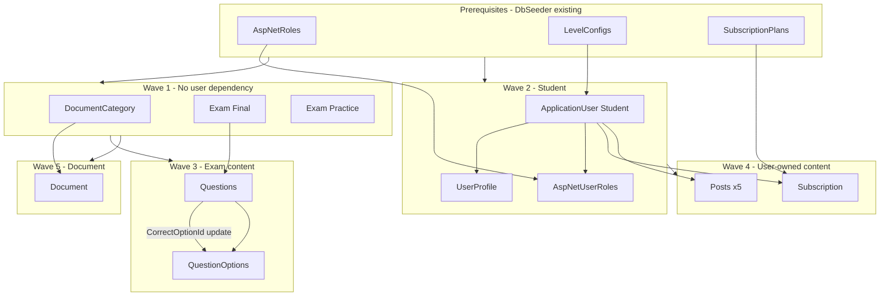

# SEHub — Demo Data Seed Design

> **Ngày:** 2026-06-06  
> **Nguồn:** Review [DEMO_DATA_MODEL_REPORT.md](DEMO_DATA_MODEL_REPORT.md)  
> **Mục tiêu:** Thiết kế thứ tự tạo dữ liệu demo (Guest + Student) — **chưa implement seeder**  
> **Nguyên tắc:** Không sửa code · Không sinh seeder code

---

# Executive Summary

Demo data cần **11 bước** trên nền `DbSeeder` hiện có (Roles, LevelConfigs, SubscriptionPlans, Admin).  
Thứ tự quan trọng nhất: **prerequisites → Student → Exam tree → Subscription → Post → Document**.

| Entity | Phụ thuộc trực tiếp | Có thể tạo qua Student API? |
|--------|---------------------|----------------------------|
| Student | `LevelConfig`, Role `Student` | ✅ Register |
| Post | `AuthorId` → Student | ✅ `POST /posts` |
| Exam | — | ❌ Admin/Mod hoặc SQL |
| Question | `ExamId` | ❌ *(kèm Exam)* |
| Option | `QuestionId` | ❌ *(kèm Exam)* |
| Document | `DocumentCategoryId` | ❌ Admin hoặc SQL |
| Subscription | `UserId`, `PlanId` | ❌ Webhook hoặc SQL |

---

# Required Fields — Tạo từng entity

## 0. Prerequisites *(đã có từ `DbSeeder` — không tạo lại)*

| Entity | Table | Điều kiện tồn tại |
|--------|-------|-------------------|
| `IdentityRole` | `AspNetRoles` | `Student`, `Moderator`, `Admin` |
| `LevelConfig` | `LevelConfigs` | ≥ 1 *(Bronze `MinPoints=0`)* |
| `SubscriptionPlan` | `SubscriptionPlans` | ≥ 1 *(khuyến nghị `Code='1m'`)* |

---

## 1. Student (`ApplicationUser` + `UserProfile` + `AspNetUserRoles`)

### Bảng chạm

| Table | Bắt buộc |
|-------|----------|
| `AspNetUsers` | ✅ |
| `UserProfiles` | ✅ *(1 row / user)* |
| `AspNetUserRoles` | ✅ *(role `Student`)* |

### Required — `AspNetUsers` / `ApplicationUser`

| Field | Giá trị demo đề xuất | Ghi chú |
|-------|----------------------|---------|
| `Id` | `Guid` cố định *(ghi vào script)* | PK |
| `UserName` | `demo_student` | Unique, `[a-zA-Z0-9_]+`, 3–50 ký tự |
| `Email` | `demo.student@sehub.local` | Unique, valid email |
| `DisplayName` | `Demo Student` | Required, max 100 |
| `PasswordHash` | — | **Chỉ qua `UserManager.CreateAsync`** — raw SQL cần hash Identity |
| `LevelId` | GUID của Bronze `LevelConfig` | FK thật → `LevelConfigs` |
| `EmailConfirmed` | `true` | Khuyến nghị cho demo login |
| `NormalizedUserName`, `NormalizedEmail` | Upper invariant | Identity tự sinh nếu dùng `UserManager` |

### Required — defaults (scalar)

| Field | Giá trị seed |
|-------|--------------|
| `Points` | `0` |
| `StreakCount` | `0` |
| `IsBanned` | `false` |
| `CreatedAt` | implicit / N/A trên Identity user |

### Required — `UserProfiles`

| Field | Giá trị demo |
|-------|--------------|
| `Id` | `Guid` mới |
| `UserId` | = Student `Id` |
| `CreatedAt` | `GETUTCDATE()` |
| `Major` | `SE` *(optional nhưng hữu ích demo profile)* |
| `Semester` | `1` *(optional)* |

### Required — `AspNetUserRoles`

| Field | Nguồn |
|-------|-------|
| `UserId` | Student `Id` |
| `RoleId` | `SELECT Id FROM AspNetRoles WHERE Name='Student'` |

### Nullable (có thể bỏ qua khi seed)

`BanUntil`, `BanReason`, `LastActivityDate`, `AvatarUrl`, `Bio`, `PhoneNumber`, …

### Validation (nếu tạo qua API)

| Rule | Nguồn |
|------|-------|
| Password ≥ 8 ký tự | `RegisterRequestValidator` |
| Username pattern `^[a-zA-Z0-9_]+$` | `RegisterRequestValidator` |
| Email + Username unique | `AuthService` |

---

## 2. Post

### Required

| Field | Giá trị demo | Ghi chú |
|-------|--------------|---------|
| `Id` | `Guid` *(có thể cố định 5 bài)* | PK |
| `CreatedAt` | `GETUTCDATE()` | — |
| `AuthorId` | Student `Id` | **Logical FK** — không enforce DB |
| `Title` | Chuỗi ≤ 200 | — |
| `Content` | Chuỗi ≤ 10000 | — |
| `Tags` | `demo,sehub` hoặc `""` | Required column, có thể rỗng |
| `Status` | `2` = `Published` | **Bắt buộc** để Guest thấy feed |
| `ViewCount` | `0` | — |
| `IsFeatured` | `false` *(1 bài có thể `true`)* | — |
| `IsDeleted` | `false` | Filter global `!IsDeleted` |

### Nullable

`UpdatedAt`, `DeletedAt`, `DeletedById`

### Demo target

≥ **5** rows `Status=Published`, `IsDeleted=0`, cùng hoặc khác `AuthorId`.

---

## 3. Exam

### Required

| Field | Giá trị demo Final | Giá trị demo Practice |
|-------|---------------------|------------------------|
| `Id` | GUID cố định | GUID cố định riêng |
| `CreatedAt` | `GETUTCDATE()` | — |
| `Code` | `SE301-FINAL-01` | `SE301-LAB-01` |
| `Title` | `Đề cuối kỳ SE301` | `Bài thực hành Lab 01` |
| `ExamType` | `0` (Final) | `1` (Practice) |
| `Semester` | `1` | `1` |
| `Major` | `SE` | `SE` |
| `QuestionCount` | `2` *(khớp số câu thực tế)* | `0` |
| `Status` | `2` (Published) | `2` (Published) |
| `ContentHash` | Chuỗi 64 ký tự *(SHA-256 placeholder OK)* | tương tự |
| `Description` | Mô tả ngắn ≤ 4000 | Mô tả + hướng dẫn nộp GitHub |

### Nullable

| Field | Practice only |
|-------|---------------|
| `AssetUrl` | Khuyến nghị URL GitHub template |
| `UpdatedAt` | — |

### Unique

`Code` — **không trùng** exam đã có.

---

## 4. Question

### Required

| Field | Ghi chú |
|-------|---------|
| `Id` | GUID cố định per question |
| `CreatedAt` | `GETUTCDATE()` |
| `ExamId` | FK → Exam Final `Id` |
| `OrderIndex` | `1`, `2`, … unique per exam *(index, không unique DB)* |
| `Content` | Nội dung câu hỏi ≤ 4000 |

### Nullable (nhưng cần cho grading)

| Field | Khi nào set |
|-------|-------------|
| `CorrectOptionId` | **Sau khi** insert tất cả `QuestionOption` — logical FK |

### Demo target

≥ **2** questions / Final exam, mỗi câu ≥ **2** options.

---

## 5. Option (`QuestionOption`)

### Required

| Field | Ví dụ |
|-------|-------|
| `Id` | GUID cố định *(dùng làm `CorrectOptionId`)* |
| `CreatedAt` | `GETUTCDATE()` |
| `QuestionId` | FK → Question `Id` |
| `Label` | `A`, `B`, `C`, `D` |
| `Text` | Nội dung đáp án ≤ 2000 |

### Nullable

`UpdatedAt`

### Two-phase insert (bắt buộc)

```
1. INSERT Question (CorrectOptionId = NULL)
2. INSERT QuestionOption(s) với Id đã định sẵn
3. UPDATE Question SET CorrectOptionId = <Id của đáp án đúng>
```

---

## 6. Document

### Required — `DocumentCategory` *(parent — tạo trước)*

| Field | Giá trị demo |
|-------|--------------|
| `Id` | GUID cố định |
| `CreatedAt` | `GETUTCDATE()` |
| `Name` | `SE301 - Software Engineering` |
| `Semester` | `1` |
| `Major` | `SE` |

### Required — `Document`

| Field | Giá trị demo |
|-------|--------------|
| `Id` | GUID cố định |
| `CreatedAt` | `GETUTCDATE()` |
| `CategoryId` | FK → category ở trên |
| `Title` | `Slide SE301 - Chương 1` |
| `FilePath` | `uploads/demo/se301-ch1.pdf` |
| `MimeType` | `application/pdf` |
| `PageCount` | `10` |
| `AccessTier` | `0` (FreePreview) |
| `IsDeleted` | `false` |

### Nullable

`UpdatedAt`, `DeletedAt`, `DeletedById`

### File hệ thống (ngoài DB)

Đặt file thật tại `SEHub.API/wwwroot/uploads/demo/se301-ch1.pdf` nếu demo preview.

---

## 7. Subscription

### Required

| Field | Giá trị demo | Ghi chú |
|-------|--------------|---------|
| `Id` | GUID mới | PK |
| `CreatedAt` | `GETUTCDATE()` | — |
| `UserId` | Student `Id` | **Logical FK** |
| `PlanId` | `SELECT Id FROM SubscriptionPlans WHERE Code='1m'` | FK thật |
| `StartAt` | `GETUTCDATE()` | UTC |
| `EndAt` | `StartAt + DurationDays` của plan | Phải **> UtcNow** |
| `IsActive` | `true` | — |

### Nullable

`UpdatedAt`

### Business rule khi seed

| Rule | Hành vi |
|------|---------|
| Chỉ 1 active subscription / user | Nên deactivate subscription cũ trước khi insert *(app làm qua `DeactivateAllForUserAsync`)* |
| Premium check | `IsActive=true` **AND** `EndAt > UtcNow` |

---

# Foreign Key Dependencies

## EF Foreign Keys (enforce DB)

| Child | FK Column | Parent | On Delete |
|-------|-----------|--------|-----------|
| `UserProfiles` | `UserId` | `AspNetUsers` | Cascade |
| `AspNetUserRoles` | `UserId` | `AspNetUsers` | Cascade |
| `AspNetUserRoles` | `RoleId` | `AspNetRoles` | Cascade |
| `ApplicationUser` | `LevelId` | `LevelConfigs` | SetNull |
| `Questions` | `ExamId` | `Exams` | Cascade |
| `QuestionOptions` | `QuestionId` | `Questions` | Cascade |
| `Documents` | `CategoryId` | `DocumentCategories` | **Restrict** |
| `Subscriptions` | `PlanId` | `SubscriptionPlans` | **Restrict** |

## Logical References (không enforce DB — rủi ro orphan)

| Column | Phải trỏ tới | Rủi ro nếu sai |
|--------|--------------|----------------|
| `Posts.AuthorId` | `AspNetUsers.Id` tồn tại | Feed hiển thị author lỗi / null |
| `Subscriptions.UserId` | `AspNetUsers.Id` tồn tại | Premium không áp dụng |
| `Questions.CorrectOptionId` | `QuestionOptions.Id` **cùng question** | Chấm điểm sai / luôn 0% |
| `Exams.QuestionCount` | Số `Questions` thực tế | UI metadata lệch *(không block API)* |

## Dependency Graph



### ASCII dependency (creation order)

```
LevelConfigs ──┐
AspNetRoles ───┼──► Student (User + Profile + UserRole)
               │
SubscriptionPlans ──► Subscription ◄── Student
               │
DocumentCategory ──► Document

Exam ──► Question ──► Option ──► UPDATE Question.CorrectOptionId

Student ──► Post (x5)
```

---

# Creation Order

| Step | Action | Entity / Table | Depends on |
|------|--------|----------------|------------|
| **0** | Verify prerequisites | `AspNetRoles`, `LevelConfigs`, `SubscriptionPlans` | `DbSeeder` đã chạy |
| **1** | Create category | `DocumentCategories` | — |
| **2** | Create student | `AspNetUsers` + `UserProfiles` + `AspNetUserRoles` | Step 0: `LevelConfigs`, `Student` role |
| **3** | Create final exam | `Exams` (Final, Published) | — |
| **4** | Create questions | `Questions` | Step 3: `ExamId` |
| **5** | Create options | `QuestionOptions` | Step 4: `QuestionId` |
| **6** | Wire correct answers | `UPDATE Questions.CorrectOptionId` | Step 5: Option `Id` |
| **7** | Create practice exam | `Exams` (Practice, Published) | — |
| **8** | Activate premium | `Subscriptions` | Step 0: `PlanId`; Step 2: `UserId` |
| **9** | Create posts | `Posts` × ≥5 | Step 2: `AuthorId` |
| **10** | Create document | `Documents` | Step 1: `CategoryId` |
| **11** | Deploy PDF file | `wwwroot/uploads/...` | Step 10: `FilePath` *(filesystem)* |

### Song song được (sau Step 0)

| Nhánh A | Nhánh B |
|---------|---------|
| Steps 1 → 10 (Document) | Steps 2 → 8 (Student + Subscription) |
| Steps 3 → 6 (Exam tree) | Steps 9 (Posts) sau Step 2 |

### Không đảo thứ tự

| Sai thứ tự | Hậu quả |
|------------|---------|
| Document trước Category | FK violation (`Restrict`) |
| Option trước Question | FK violation |
| `CorrectOptionId` trước Option insert | Orphan / NULL → grading fail |
| Subscription trước Student | `UserId` không tồn tại *(logical)* |
| Post trước Student | `AuthorId` orphan |
| Question trước Exam | FK violation |

---

# Seeder Risks

## R1 — Identity / Password (Student)

| Risk | Mô tả | Mitigation |
|------|-------|------------|
| **Raw SQL password** | `PasswordHash` phải đúng format Identity — insert tay dễ login fail | Ưu tiên `UserManager.CreateAsync` hoặc `POST /auth/register` |
| **Normalized fields** | Thiếu `NormalizedUserName` / `NormalizedEmail` → Identity lookup lỗi | Dùng API/UserManager, không INSERT thẳng `AspNetUsers` |
| **RoleId GUID** | `AspNetUserRoles.RoleId` phải lookup từ `AspNetRoles` | `SELECT Id FROM AspNetRoles WHERE Name='Student'` |

## R2 — Idempotency / Duplicate

| Risk | Mô tả | Mitigation |
|------|-------|------------|
| **Unique Email/UserName** | Seed 2 lần → conflict | Check `IF NOT EXISTS` trước insert |
| **Unique Exam.Code** | Trùng `SE301-FINAL-01` | Check code hoặc dùng suffix version |
| **DbSeeder admin** | Không ảnh hưởng — admin email khác | Student dùng email riêng `demo.student@sehub.local` |

## R3 — Logical FK orphans

| Risk | Mô tả | Mitigation |
|------|-------|------------|
| **`AuthorId` invalid** | DB không chặn — post tồn tại nhưng author broken | Luôn lấy `UserId` sau khi tạo Student |
| **`CorrectOptionId` wrong** | Trỏ option của câu khác → chấm sai | UPDATE sau insert; verify bằng grading test |
| **`UserId` subscription** | Premium không hoạt động | Verify `GET /premium/subscription` |

## R4 — Enum / Status values

| Entity | Sai giá trị | Hậu quả |
|--------|-------------|---------|
| `Post.Status` | ≠ `Published (2)` | Guest feed rỗng |
| `Exam.Status` | ≠ `Published (2)` | `GET /exams/{id}` → 404 |
| `Exam.ExamType` | Final vs Practice nhầm | Attempt / Practice submit 403 |
| `Post.IsDeleted` | `true` | Global filter ẩn bài |
| `Document.IsDeleted` | `true` | Global filter ẩn tài liệu |

## R5 — Subscription / Premium

| Risk | Mô tả | Mitigation |
|------|-------|------------|
| **`EndAt` in past** | `IsActive=true` nhưng Premium=false | `EndAt = UtcNow + 30 days` |
| **Multiple active** | Nhiều row `IsActive=1` | Chỉ 1 row active / user |
| **JWT stale `isPremium`** | Token cũ sau seed subscription | OK — app đọc DB; không cần re-login |
| **Cache** | `PremiumStatusService` cache 3 phút | Restart API hoặc đợi TTL sau seed SQL |

## R6 — Exam content integrity

| Risk | Mô tả | Mitigation |
|------|-------|------------|
| **`QuestionCount` drift** | Exam nói 5 câu, DB có 2 | Set `QuestionCount` = COUNT questions |
| **No questions** | Exam Published nhưng 0 câu | Demo attempt/submit vô nghĩa |
| **No correct option** | `CorrectOptionId` NULL | Score luôn 0 |
| **Cascade delete** | Xóa Exam → mất Questions/Options | Không xóa exam đã seed; dùng idempotent upsert |

## R7 — Document / Filesystem

| Risk | Mô tả | Mitigation |
|------|-------|------------|
| **Missing PDF** | `FilePath` có nhưng file không tồn tại | Tạo file placeholder hoặc chấp nhận metadata-only demo |
| **Delete Category** | `Restrict` — không xóa category có documents | Seed category trước, không xóa |

## R8 — Coexistence với `DbSeeder` hiện tại

| Risk | Mô tả | Mitigation |
|------|-------|------------|
| **Không mở rộng `DbSeeder`** *(design choice)* | Demo data tách script/SQL/manual | Tránh merge vào `DbSeeder` trừ khi product hóa |
| **`SeedLevelConfigsAsync` guard** | `if (Any()) return` — OK nếu đã có | Không re-seed levels |
| **`SeedSubscriptionPlansAsync` guard** | Plans đã có → không insert thêm | Lookup `PlanId` by `Code`, không hardcode GUID plan |
| **Migration** | `MigrateAsync` chạy mỗi API start | Schema luôn mới — seed data riêng |

## R9 — Timezone

| Risk | Mitigation |
|------|------------|
| `StartAt`/`EndAt` local vs UTC | Dùng `GETUTCDATE()` / `DateTime.UtcNow` nhất quán |

---

# Recommended Demo Identifiers (stable GUIDs)

Ghi vào script demo — **chỉ dùng nếu DB trống**:

| Entity | Suggested GUID | Key |
|--------|----------------|-----|
| Student | `aaaaaaaa-aaaa-aaaa-aaaa-aaaaaaaaaaaa` | `demo_student` |
| DocumentCategory | `bbbbbbbb-bbbb-bbbb-bbbb-bbbbbbbbbbbb` | `SE301` |
| Document | `cccccccc-cccc-cccc-cccc-cccccccccccc` | slide ch1 |
| Exam Final | `dddddddd-dddd-dddd-dddd-dddddddddddd` | `SE301-FINAL-01` |
| Exam Practice | `eeeeeeee-eeee-eeee-eeee-eeeeeeeeeeee` | `SE301-LAB-01` |
| Question 1 | `11111111-1111-1111-1111-111111111101` | — |
| Question 2 | `11111111-1111-1111-1111-111111111102` | — |
| Option Q1-A *(correct)* | `22222222-2222-2222-2222-222222222201` | — |

> Lookup động (không hardcode): `LevelConfigs.Id` (Bronze), `SubscriptionPlans.Id` (`Code='1m'`), `AspNetRoles.Id` (`Student`).

---

# Verification Checklist

Chạy sau khi seed xong. Đánh dấu ✅ khi pass.

## A. Prerequisites

- [ ] **A1** `SELECT COUNT(*) FROM AspNetRoles WHERE Name IN ('Student','Moderator','Admin')` → **3**
- [ ] **A2** `SELECT COUNT(*) FROM LevelConfigs` → **4**
- [ ] **A3** `SELECT Code FROM SubscriptionPlans` → có `1m`, `8m`, `4y`

## B. Student

- [ ] **B1** `SELECT UserName, Email, DisplayName, LevelId FROM AspNetUsers WHERE UserName='demo_student'` → 1 row
- [ ] **B2** `SELECT r.Name FROM AspNetUserRoles ur JOIN AspNetRoles r ON ur.RoleId=r.Id JOIN AspNetUsers u ON ur.UserId=u.Id WHERE u.UserName='demo_student'` → **Student**
- [ ] **B3** `SELECT UserId FROM UserProfiles WHERE UserId = <studentId>` → 1 row
- [ ] **B4** `POST /api/v1/auth/login` `{ "emailOrUsername": "demo_student", "password": "Demo@12345" }` → 200 + `accessToken`

## C. Posts

- [ ] **C1** `SELECT COUNT(*) FROM Posts WHERE IsDeleted=0 AND Status=2` → **≥ 5**
- [ ] **C2** `GET /api/v1/posts` (no auth) → `totalCount ≥ 5`
- [ ] **C3** `GET /api/v1/posts/{id}` → có `title`, `author`

## D. Exam / Question / Option

- [ ] **D1** `SELECT Code, ExamType, Status FROM Exams WHERE Status=2` → ≥ 1 Final + ≥ 1 Practice
- [ ] **D2** `SELECT COUNT(*) FROM Questions WHERE ExamId=<finalExamId>` → **≥ 2**
- [ ] **D3** `SELECT COUNT(*) FROM QuestionOptions o JOIN Questions q ON o.QuestionId=q.Id WHERE q.ExamId=<finalExamId>` → **≥ 4**
- [ ] **D4** `SELECT Id, CorrectOptionId FROM Questions WHERE ExamId=<finalExamId>` → tất cả `CorrectOptionId NOT NULL`
- [ ] **D5** `GET /api/v1/exams?type=Final` (guest) → có exam trong list
- [ ] **D6** `GET /api/v1/exams/{finalExamId}/questions` → ≥ 2 câu, không lộ đáp án

## E. Document

- [ ] **E1** `SELECT COUNT(*) FROM DocumentCategories` → **≥ 1**
- [ ] **E2** `SELECT Title, FilePath, CategoryId FROM Documents WHERE IsDeleted=0` → **≥ 1**
- [ ] **E3** `GET /api/v1/documents` (auth student) → ≥ 1 item
- [ ] **E4** *(optional)* `GET /api/v1/documents/{id}/preview?page=1` → 200 nếu file PDF tồn tại

## F. Subscription / Premium

- [ ] **F1** `SELECT IsActive, EndAt, PlanId FROM Subscriptions WHERE UserId=<studentId>` → `IsActive=1`, `EndAt > GETUTCDATE()`
- [ ] **F2** `GET /api/v1/premium/subscription` (auth student) → `isActive: true`
- [ ] **F3** `POST /api/v1/exams/{finalExamId}/attempts` (auth student) → **200** *(không 403)*
- [ ] **F4** `POST /api/v1/exams/{practiceExamId}/practice-submissions` (auth student) → **201**

## G. End-to-end smoke (Swagger)

- [ ] **G1** Guest: Health → Register *(skip nếu đã seed student)* → Login
- [ ] **G2** Auth: Create post → Like → Comment
- [ ] **G3** Auth: Exam attempt → save answers → submit → result score > 0
- [ ] **G4** Auth: Practice submit → `GET .../practice-submissions/me`

## H. Regression guards

- [ ] **H1** Admin user `admin@sehub.local` vẫn login được
- [ ] **H2** Không duplicate `Email` / `UserName` / `Exam.Code` sau re-run script *(idempotent)*
- [ ] **H3** `dotnet test` vẫn pass *(không ảnh hưởng test InMemory)*

---

# Seed Strategy Options (chưa chọn implementation)

| Strategy | Ưu điểm | Nhược điểm | Phù hợp |
|----------|---------|------------|---------|
| **A. Swagger live** | Không sửa DB script; Student + Post tự nhiên | Exam/Document/Subscription không tạo được | Buổi demo ngắn, chấp nhận data thiếu |
| **B. SQL script** | Đầy đủ, repeatable, trước buổi demo | Identity password khó; phải cẩn thận GUID | **Khuyến nghị** cho exam/document |
| **C. Register + SQL mix** | Student qua API (password đúng); exam qua SQL | Hai bước | **Khuyến nghị tổng thể** |
| **D. PayOS webhook** | Subscription đúng flow production | Phụ thuộc order trước; phức tạp hơn SQL | Demo Premium flow thật |
| **E. Mở rộng `DbSeeder`** | Tự động mỗi API start | Rủi ro pollution dev DB; chưa implement | Product hóa sau |

### Khuyến nghị cho buổi báo cáo

```
Step 0: DbSeeder (tự động)
Step 2: POST /auth/register  → Student
Steps 1,3–7,9–10: SQL script (idempotent)
Step 8: SQL subscription HOẶC PayOS webhook
Step 11: Copy PDF file
Verify: Checklist A–G
```

---

# Tài liệu liên quan

| File | Vai trò |
|------|---------|
| [DEMO_DATA_MODEL_REPORT.md](DEMO_DATA_MODEL_REPORT.md) | Entity fields, FK, constraints |
| [DEMO_DATA_CHECKLIST.md](DEMO_DATA_CHECKLIST.md) | SQL mẫu từng bước |
| [BACKEND_DEMO_GUEST_AUTH.md](BACKEND_DEMO_GUEST_AUTH.md) | Kịch bản Swagger demo |
| `DbSeeder.cs` | Seeder production hiện tại |
