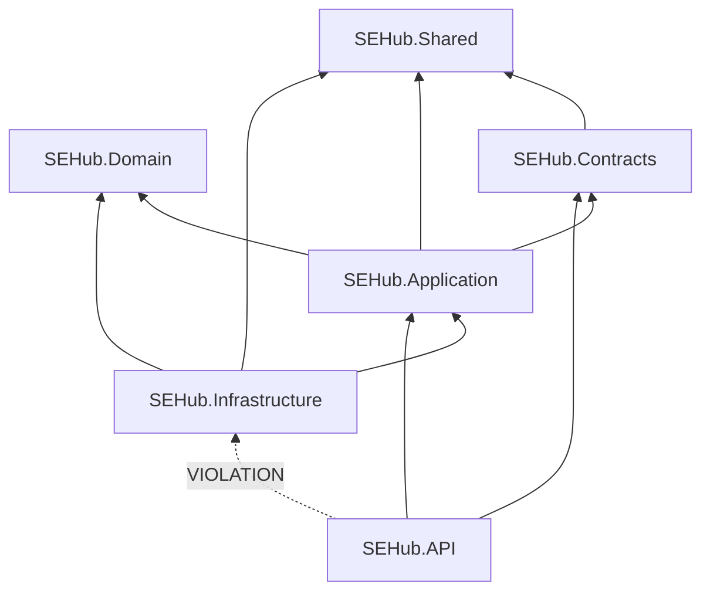
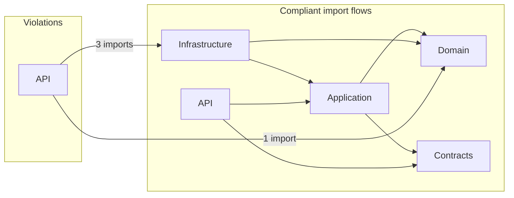

# SEHub Backend — Dependency Graph Audit

> **Ngày audit:** 2026-06-05  
> **Công cụ:** [CodeGraph](.codegraph/codegraph.db) — 302 files, 2.984 nodes, 471 `SEHub.*` import edges  
> **Phạm vi:** `SEHub.Backend/src/` (6 production projects) + test projects (tham chiếu)  
> **Phương pháp:** CodeGraph `imports` edges + đối chiếu `*.csproj` `ProjectReference`

---

# Verdict: **FAIL**

Solution vi phạm **quy tắc tầng API** (reference trực tiếp `Infrastructure` và `Domain`). Các tầng **Domain**, **Application** đạt yêu cầu. **Không có circular dependency** giữa các project.

---

# Audit Rules

| # | Layer | Allowed references | Status |
|---|-------|-------------------|--------|
| 1 | **Domain** | Không được reference Infrastructure, API | **PASS** |
| 2 | **Application** | Không được reference API | **PASS** |
| 3 | **Infrastructure** | Được reference Application, Domain | **PASS** *(có advisory — xem §Advisory)* |
| 4 | **API** | Chỉ được reference Application, Contracts | **FAIL** |

---

# Project Dependency Graph

## Declared (`ProjectReference` trong `.csproj`)



## Matrix (project → project)

| Source ↓ / Target → | Domain | Shared | Contracts | Application | Infrastructure | API |
|---------------------|:------:|:------:|:---------:|:-----------:|:--------------:|:---:|
| **Domain** | — | — | — | — | — | — |
| **Shared** | — | — | — | — | — | — |
| **Contracts** | — | ✓ | — | — | — | — |
| **Application** | ✓ | ✓ | ✓ | — | — | — |
| **Infrastructure** | ✓ | ✓ | — | ✓ | — | — |
| **API** | — | — | ✓ | ✓ | **✗** | — |

**Chú thích:** ✓ = khai báo hợp lệ trong `.csproj` · ✗ = vi phạm rule #4 · — = không reference

### Project references chi tiết

```
SEHub.Domain        → (none)
SEHub.Shared        → (none)
SEHub.Contracts     → Shared
SEHub.Application   → Domain, Contracts, Shared
SEHub.Infrastructure → Application, Domain, Shared
SEHub.API           → Application, Contracts, Infrastructure  ← VIOLATION
```

---

# File Dependency Graph

## Import edges giữa các tầng (CodeGraph `kind=imports`)

| Source → Target | Import count | Rule |
|-----------------|-------------|------|
| Application → Domain | 74 | ✓ |
| Application → Contracts | 85 | ✓ |
| Application → Shared | 4 | ✓ |
| Infrastructure → Domain | 61 | ✓ |
| Infrastructure → Application | 33 | ✓ |
| Infrastructure → Contracts | 3 | Advisory |
| Infrastructure → Shared | 3 | Advisory |
| API → Application | 17 | ✓ |
| API → Contracts | 17 | ✓ |
| API → Shared | 17 | Advisory |
| **API → Infrastructure** | **3** | **✗ Rule #4** |
| **API → Domain** | **1** | **✗ Rule #4** |
| Domain → * | 0 | ✓ |
| Application → API | 0 | ✓ |
| Application → Infrastructure | 0 | ✓ |



---

# Violations (All)

## V-01 — `SEHub.API` → `SEHub.Infrastructure` (ProjectReference)

| | |
|---|---|
| **Rule** | #4 — API chỉ được reference Application, Contracts |
| **Severity** | **HIGH** |
| **File** | `SEHub.Backend/src/SEHub.API/SEHub.API.csproj` L6 |
| **Evidence** | `<ProjectReference Include="..\SEHub.Infrastructure\SEHub.Infrastructure.csproj" />` |
| **Impact** | API layer coupled trực tiếp với persistence, identity, payments — phá Clean Architecture boundary |
| **Fix** | Composition root: đăng ký DI trong `Program.cs` qua extension method từ Infrastructure assembly load bằng reflection, hoặc tách `SEHub.API.Composition` project riêng |

---

## V-02 — `Program.cs` imports Infrastructure

| | |
|---|---|
| **Rule** | #4 |
| **Severity** | **HIGH** |
| **File** | `SEHub.Backend/src/SEHub.API/Program.cs` |
| **Lines** | L4 `using SEHub.Infrastructure;` · L5 `using SEHub.Infrastructure.Persistence;` |
| **Usage** | `AddInfrastructure()`, `DbSeeder.SeedAsync()` |
| **Fix** | Wrap trong `IHostExtensions.AddSeHubInfrastructure()` ở composition project; `Program.cs` chỉ gọi 1 extension không expose namespace Infrastructure |

---

## V-03 — `AuthorizationPolicies.cs` imports Infrastructure.Identity

| | |
|---|---|
| **Rule** | #4 |
| **Severity** | **MEDIUM** |
| **File** | `SEHub.Backend/src/SEHub.API/Extensions/AuthorizationPolicies.cs` |
| **Line** | L2 `using SEHub.Infrastructure.Identity;` |
| **Usage** | `PremiumAuthorizationHandler`, `PremiumRequirement` registration |
| **Fix** | Move handler registration vào `Infrastructure` DI module; API chỉ gọi `services.AddSeHubAuthorization()` từ Application/Contracts abstraction |

---

## V-04 — `ExceptionHandlingMiddleware.cs` imports Domain.Exceptions

| | |
|---|---|
| **Rule** | #4 (API không được reference Domain) |
| **Severity** | **MEDIUM** |
| **File** | `SEHub.Backend/src/SEHub.API/Middleware/ExceptionHandlingMiddleware.cs` |
| **Line** | L5 `using SEHub.Domain.Exceptions;` |
| **Usage** | `catch` / `switch` trên `NotFoundException`, `ForbiddenException`, `ConflictException`, v.v. |
| **Fix** | Định nghĩa exception base trong `SEHub.Contracts` hoặc map exceptions trong Application layer; middleware chỉ xử lý `Contracts` exception types |

---

# Circular Dependencies

**Kết quả: NONE**

Phân tích đồ thị `ProjectReference` (6 production projects):

```
Domain ← Application ← Infrastructure
              ↑              ↑
              └──── API ─────┘ (one-way, no cycle back)
```

Không tồn tại chu trình kiểu `A → B → C → A`. CodeGraph không phát hiện cycle trên import graph.

---

# Per-Rule Results

## Rule 1 — Domain must NOT reference Infrastructure, API

| Check | Result |
|-------|--------|
| `SEHub.Domain.csproj` references | **0** — no project refs |
| CodeGraph `using SEHub.Infrastructure` in Domain | **0** |
| CodeGraph `using SEHub.API` in Domain | **0** |
| **Verdict** | **PASS** |

Domain chỉ import nội bộ `SEHub.Domain.*` (Entities, Enums, Common, Exceptions).

---

## Rule 2 — Application must NOT reference API

| Check | Result |
|-------|--------|
| `SEHub.Application.csproj` → API | **None** |
| CodeGraph `using SEHub.API` in Application | **0** |
| CodeGraph `using SEHub.Infrastructure` in Application | **0** |
| **Verdict** | **PASS** |

> **Lưu ý CodeGraph:** 114 `references/calls` edges Application → Infrastructure class names (vd. `PayOsService` trong XML doc của `IPayOsService`) — **không phải** `using` thực tế; không tính là violation.

---

## Rule 3 — Infrastructure may reference Application, Domain

| Check | Result |
|-------|--------|
| Infrastructure → Application | **33** import edges — **PASS** |
| Infrastructure → Domain | **61** import edges — **PASS** |
| Infrastructure → API | **0** — **PASS** |
| **Verdict** | **PASS** |

---

## Rule 4 — API may reference Application, Contracts only

| Check | Result |
|-------|--------|
| API → Application | 17 imports — **PASS** |
| API → Contracts | 17 imports — **PASS** |
| API → Infrastructure | **3** imports + **csproj** — **FAIL** |
| API → Domain | **1** import — **FAIL** |
| **Verdict** | **FAIL** (4 violations: V-01 → V-04) |

---

# Advisory (ngoài 4 rule chính)

Các reference sau **không vi phạm** 4 rule user định nghĩa nhưng **lệch** strict Clean Architecture thuần:

| Source | Target | Files | Ghi chú |
|--------|--------|-------|---------|
| Infrastructure | Contracts | 3 | `PostRepository`, `ExamRepository`, `DocumentRepository` dùng query DTOs từ Contracts |
| Infrastructure | Shared | 3 | `RoleNames`, constants trong `UserRepository`, `DbSeeder` |
| API | Shared | 17 | `PolicyNames`, `ErrorCodes` trong controllers/middleware |
| Application | Shared | 4 | Constants trong services |

`SEHub.Shared` đóng vai trò shared kernel — chấp nhận được nếu mở rộng rule cho phép mọi tầng reference Shared.

---

# Test Projects (informational)

| Project | References | Ghi chú |
|---------|-----------|---------|
| `SEHub.Application.UnitTests` | Application, Domain | Hợp lý cho unit test |
| `SEHub.API.IntegrationTests` | API (transitive → Infrastructure) | Integration test cần full stack; `CustomWebApplicationFactory` import trực tiếp `SEHub.Infrastructure.Persistence` |

Test projects **không** ảnh hưởng verdict production layers.

---

# Recommended Fixes (Priority)

| P | Action | Resolves |
|---|--------|----------|
| P0 | Tách composition root — API không `ProjectReference` Infrastructure | V-01, V-02 |
| P1 | Move `AddAuthorization` + handler wiring vào Infrastructure DI | V-03 |
| P1 | Exception types → Contracts hoặc Application exception mapper | V-04 |
| P2 | Repositories không import Contracts DTOs — map trong Application | Advisory |
| P2 | Constants → Contracts hoặc giữ Shared với rule chính thức | Advisory |

---

# Summary

| Metric | Value |
|--------|-------|
| Production projects | 6 |
| CodeGraph files indexed | 302 |
| Import violations (rules 1–4) | **4** |
| Circular dependencies | **0** |
| Domain | **PASS** |
| Application | **PASS** |
| Infrastructure | **PASS** |
| API | **FAIL** |
| **Overall** | **FAIL** |
