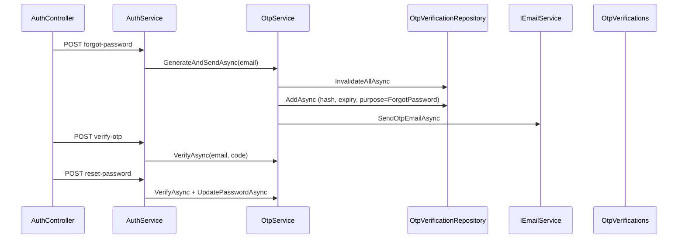

# SEHub — OTP Enhancement Plan

> **Date:** 2026-06-06  
> **Source:** [AUTH_NOTIFICATION_AUDIT.md](AUTH_NOTIFICATION_AUDIT.md)  
> **Method:** CodeGraph call-chain analysis + source review  
> **Principle:** Extend existing `OtpService` / `OtpVerifications` — no parallel OTP system

---

## CodeGraph Findings (Phase 1)

| Query | Result |
|-------|--------|
| `callees OtpService.GenerateAndSendAsync` | `GenerateCode` → `InvalidateAllAsync` → `HashCode` → `AddAsync` → `SaveChangesAsync` → `SendOtpEmailAsync` |
| `callers SendForgotPasswordOtpAsync` | `AuthController.ForgotPassword` |
| `callees AuthService.ResetPasswordAsync` | `VerifyAsync` → `UpdatePasswordAsync` → `RevokeAllForUserAsync` |
| `query OtpVerification` | Entity, repository, EF configuration, migration table |
| `query NoOpEmailService` | Sole `IEmailService` implementation (no-op) |
| `query Sms` | **0 backend symbols** |

---

## Existing OTP Flow (Reuse As-Is)



### Reusable Components (Do Not Replace)

| Component | Path | Reuse |
|-----------|------|-------|
| `IOtpService` / `OtpService` | `SEHub.Application/Auth/` | Extend methods; keep `GenerateAndSendAsync` for forgot-password |
| `OtpVerification` entity | `SEHub.Domain/Entities/` | Add `IsUsed`, `Phone` columns |
| `OtpPurpose` enum | `SEHub.Domain/Enums/` | Add `EmailVerification`, `SmsVerification` |
| `IOtpVerificationRepository` | `Application/Abstractions/Repositories/` | Add phone/rate-limit queries |
| `OtpVerificationRepository` | `Infrastructure/Persistence/Repositories/` | Implement extensions |
| `AuthService` | Orchestration | Add email/SMS verify endpoints; login gate |
| `AuthController` | `api/v1/auth` | New routes; keep existing 3 |
| `IEmailService` | Abstraction | Keep interface; replace `NoOpEmailService` |
| `ForgotPasswordRequest` etc. | `SEHub.Contracts/Auth/` | Unchanged contracts |

---

## Required Changes by Phase

### Phase 2 — Email Delivery

| Change | Detail |
|--------|--------|
| `LoggingEmailService` | Dev: console + `ILogger` `[OTP]` block |
| `SmtpEmailService` | Prod: SMTP from `Email:Smtp` config |
| DI | `Email:Provider` = `Logging` \| `Smtp`; remove `NoOpEmailService` registration |
| Config | `appsettings.json`, `Development`, `Production`; credentials via config/env |

### Phase 3 — Email Verification

| Change | Detail |
|--------|--------|
| `OtpPurpose.EmailVerification` | New enum value |
| `POST /auth/send-email-verification` | `SendEmailVerificationRequest` |
| `POST /auth/verify-email` | `VerifyEmailRequest`; sets `EmailConfirmed=true` |
| `RegisterAsync` | After create: `EmailConfirmed=false`, auto-send verification OTP |
| `IUserRepository.ConfirmEmailAsync` | Identity `EmailConfirmed` update |
| `UserAccount.EmailConfirmed` | Expose for login check |

### Phase 4 — SMS OTP

| Change | Detail |
|--------|--------|
| `ISmsService` | `SendOtpSmsAsync(phone, code)` |
| `MockSmsService` | Console + logger `[SMS OTP]` |
| `OtpVerification.Phone` | Store normalized phone; **no new table** |
| `POST /auth/send-sms-otp` | `SendSmsOtpRequest` |
| `POST /auth/verify-sms-otp` | `VerifySmsOtpRequest` |
| `IUserRepository.GetByPhoneAsync` | Lookup `ApplicationUser.PhoneNumber` |

### Phase 5 — OTP Hardening

| Change | Detail |
|--------|--------|
| `IsUsed` | Set `true` on successful verify-email, verify-sms, reset-password |
| Forgot `verify-otp` | Validate only (no `IsUsed`) so reset-password can follow |
| Resend cooldown | 60s — check latest `CreatedAt` per identifier+purpose |
| Max attempts | 5 — existing `AttemptCount` |
| Max requests/hour | 5 — count rows in last hour per identifier+purpose |
| `OtpSettings` | Config section for limits |
| Repository | `GetLatest*` excludes `IsUsed`; hourly count methods |

### Phase 6 — Login Email Confirmation

| Change | Detail |
|--------|--------|
| `AuthSettings.RequireConfirmedEmail` | `false` Development, `true` Production |
| `LoginAsync` | If enabled and `!EmailConfirmed` → `ForbiddenException(EMAIL_NOT_CONFIRMED)` |
| `ErrorCodes.EmailNotConfirmed` | Map in `ExceptionHandlingMiddleware` |

### Phase 7 — API Contract Doc

| Deliverable | `OTP_API_CONTRACT.md` |

### Phase 8 — Demo Guide

| Deliverable | `OTP_DEMO_GUIDE.md` |

---

## Database Migration

Single migration `AddOtpEnhancements`:

```sql
ALTER TABLE OtpVerifications ADD IsUsed bit NOT NULL DEFAULT 0;
ALTER TABLE OtpVerifications ADD Phone nvarchar(20) NULL;
CREATE INDEX IX_OtpVerifications_Phone_Purpose ON OtpVerifications (Phone, Purpose);
```

Existing rows: `IsUsed = 0`, `Phone = NULL` — forgot-password flow unaffected.

---

## Files to Create

| File | Purpose |
|------|---------|
| `Infrastructure/Email/LoggingEmailService.cs` | Dev OTP logging |
| `Infrastructure/Email/SmtpEmailService.cs` | SMTP delivery |
| `Infrastructure/Email/EmailSettings.cs` | Config model |
| `Infrastructure/Sms/ISmsService.cs` | SMS abstraction |
| `Infrastructure/Sms/MockSmsService.cs` | Dev SMS logging |
| `Application/Auth/OtpSettings.cs` | Rate limits |
| `Application/Auth/AuthSettings.cs` | RequireConfirmedEmail |
| `Contracts/Auth/SendEmailVerificationRequest.cs` | DTO |
| `Contracts/Auth/VerifyEmailRequest.cs` | DTO |
| `Contracts/Auth/SendSmsOtpRequest.cs` | DTO |
| `Contracts/Auth/VerifySmsOtpRequest.cs` | DTO |
| Validators for new requests | FluentValidation |

## Files to Modify

| File | Change |
|------|--------|
| `OtpVerification.cs` | `IsUsed`, `Phone` |
| `OtpPurpose.cs` | New purposes |
| `IOtpService.cs` / `OtpService.cs` | Extended API + limits |
| `IOtpVerificationRepository.cs` / impl | Phone + rate queries |
| `OtpVerificationConfiguration.cs` | Phone index |
| `IAuthService.cs` / `AuthService.cs` | New flows + login gate |
| `AuthController.cs` | 4 new endpoints |
| `IUserRepository.cs` / `UserRepository.cs` | ConfirmEmail, GetByPhone |
| `UserAccount.cs` | `EmailConfirmed` |
| `DependencyInjection.cs` | Email/SMS/Options DI |
| `ExceptionHandlingMiddleware.cs` | `EMAIL_NOT_CONFIRMED`, OTP errors |
| `ErrorCodes.cs` | New codes |
| `appsettings*.json` | Email, Auth, Otp sections |

## Files NOT to Duplicate

- No `SmsOtp` table
- No second OTP service class
- No replacement of `OtpVerifications` table

---

## Risk Mitigation

| Risk | Mitigation |
|------|------------|
| Break forgot-password | Keep `GenerateAndSendAsync` signature; `ForgotPassword` purpose unchanged |
| `verify-otp` + `reset-password` double verify | `verify-otp` does not set `IsUsed`; `reset-password` sets `IsUsed` |
| SMS in `Email` column | Dedicated nullable `Phone` column |
| Production email without SMTP | `Email:Provider=Logging` fallback with warning log |

---

*Plan only — implementation follows in Phases 2–8.*
