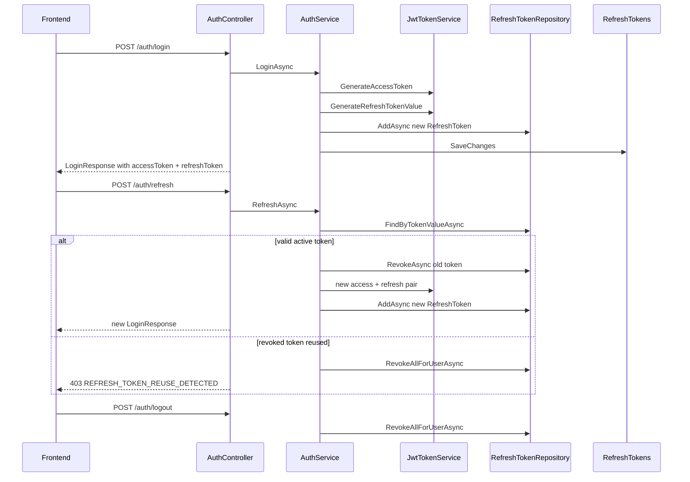

# Refresh Token Implementation Plan

> **Status:** Implemented (2026-06-05)  
> **Scope:** Backend refresh token issuance, rotation, reuse detection, and SPA JSON delivery.

---

## Summary

The existing `RefreshToken` entity, table, and repository were wired into `AuthService` and `AuthController`. Login, register, Google auth, and refresh now issue opaque refresh tokens stored in the database. `POST /api/v1/auth/refresh` rotates tokens and detects reuse of revoked tokens.

---

## Architecture



---

## Design Decisions

| Decision | Choice | Rationale |
|----------|--------|-----------|
| Refresh token format | Opaque random string (not JWT) | Matches existing `RefreshToken.Token` column |
| Delivery | JSON body (`refreshToken`, `refreshExpiresIn`) | Aligns with FE `localStorage` pattern |
| Issuance point | `BuildLoginResponseAsync` | Login, register, Google, and refresh reuse one path |
| Rotation | Revoke old + issue new on every refresh | Limits stolen refresh token window |
| Reuse detection | Lookup including revoked tokens; revoked reuse → `RevokeAllForUserAsync` | Standard theft response |
| DB migration | None | Schema already complete |
| Access token blacklist | Out of scope | 60-min JWT; logout revokes refresh only |

---

## API Changes

### `LoginResponse` (extended)

```json
{
  "accessToken": "eyJ...",
  "expiresIn": 3600,
  "refreshToken": "kR7x...opaque...",
  "refreshExpiresIn": 604800,
  "user": { "id": "...", "role": "Student", "isPremium": false }
}
```

### New endpoint

| Method | Path | Policy | Action |
|--------|------|--------|--------|
| POST | `/api/v1/auth/refresh` | `[AllowAnonymous]` | Exchange refresh token for new pair |

**Request body:** `{ "refreshToken": "..." }`

**Error codes (403):**

- `REFRESH_TOKEN_INVALID` — token not found
- `REFRESH_TOKEN_EXPIRED` — past `ExpiresAt`
- `REFRESH_TOKEN_REUSE_DETECTED` — revoked token presented; all user sessions revoked

---

## Configuration

`appsettings.json` → `Jwt` section:

```json
"Jwt": {
  "Secret": "...",
  "Issuer": "SEHub",
  "Audience": "SEHub.Client",
  "ExpirationMinutes": 60,
  "RefreshExpirationDays": 7
}
```

| Setting | Default | Purpose |
|---------|---------|---------|
| `ExpirationMinutes` | 60 | Short-lived access JWT |
| `RefreshExpirationDays` | 7 | Long-lived refresh token |

---

## Implementation Details

### Token generation

- `JwtTokenService.GenerateRefreshTokenValue()` — 48-byte CSPRNG → Base64Url (~64 chars)

### Issuance (`BuildLoginResponseAsync`)

1. Generate access token
2. Generate refresh token value
3. `AddAsync` with `ExpiresAt = UtcNow + RefreshExpirationDays`
4. `SaveChangesAsync`
5. Return `LoginResponse` with both tokens

### Refresh (`RefreshAsync`)

1. `FindByTokenValueAsync` (includes revoked)
2. Null → `REFRESH_TOKEN_INVALID`
3. Revoked → `RevokeAllForUserAsync` + `REFRESH_TOKEN_REUSE_DETECTED`
4. Expired → `REFRESH_TOKEN_EXPIRED`
5. Load user, ban check
6. `RevokeAsync` old token (rotation)
7. `BuildLoginResponseAsync` (new pair)

### Logout / reset-password

No changes — already call `RevokeAllForUserAsync`.

---

## Files Modified

| Layer | Files |
|-------|-------|
| Shared | `ErrorCodes.cs` |
| Contracts | `LoginResponse.cs`, `RefreshTokenRequest.cs` |
| Application | `JwtSettings.cs`, `IJwtTokenService.cs`, `JwtTokenService.cs`, `IAuthService.cs`, `AuthService.cs`, `IRefreshTokenRepository.cs`, `RefreshTokenRequestValidator.cs`, `DependencyInjection.cs` |
| Infrastructure | `RefreshTokenRepository.cs` |
| API | `AuthController.cs`, `appsettings.json` |
| Tests | `AuthServiceTests.cs`, `AuthEndpointsTests.cs` |

---

## Security Considerations

| Topic | Approach |
|-------|----------|
| Opaque tokens | 48-byte CSPRNG, Base64Url |
| Rotation | Revoke on every refresh |
| Reuse detection | Revoke all sessions on revoked reuse |
| FE storage | `localStorage` (document XSS risk; HttpOnly cookie is P2) |
| Access token on logout | Not invalidated (no blacklist) |
| Token hashing at rest | Plain opaque in DB (P2: hash like OTP) |
| Multi-device | Multiple active refresh rows allowed |
| HTTPS | Required in production |

---

## Requirement Traceability

| # | Requirement | Implementation |
|---|-------------|----------------|
| 1 | Refresh on login | `BuildLoginResponseAsync` via `LoginAsync` |
| 2 | Refresh on register | Same builder via `RegisterAsync` |
| 3 | Store in DB | `AddAsync` + `SaveChanges` in builder |
| 4 | Add to LoginResponse | DTO fields |
| 5 | POST `/auth/refresh` | `AuthController` + `RefreshAsync` |
| 6 | Validate refresh | Expiry, existence, ban checks |
| 7 | Rotate on refresh | Revoke old + new `AddAsync` |
| 8 | Revoke old | `RevokeAsync` before new pair |
| 9 | Logout revoke all | Existing `LogoutAsync` |
| 10 | Reset revoke all | Existing `ResetPasswordAsync` |

---

## Out of Scope

- JWT access-token blacklist
- HttpOnly cookie delivery
- Hashing refresh tokens at rest
- Refresh token rate limiting
- Frontend code changes (documented in `FE_AUTH_INTEGRATION_GUIDE.md`)

---

## Tests

**Unit (`AuthServiceTests`):**

- Login issues access + refresh tokens
- Refresh rotates and returns new pair
- Revoked token reuse revokes all sessions
- Expired token throws `REFRESH_TOKEN_EXPIRED`

**Integration (`AuthEndpointsTests`):**

- Login → refresh → new access token; old refresh rejected (403)
