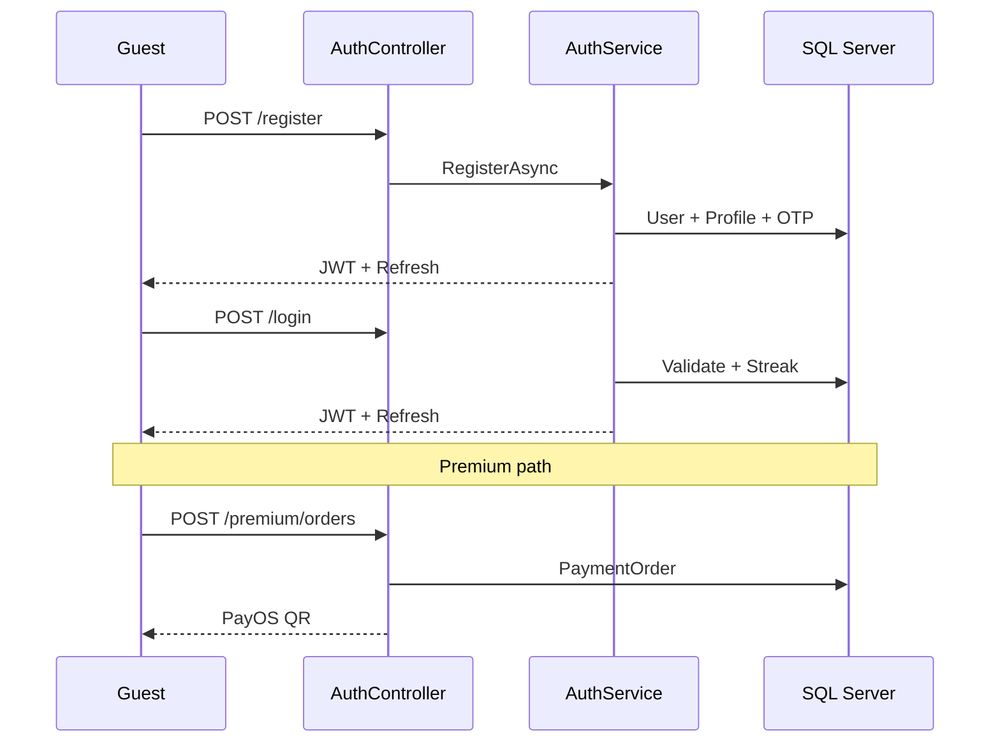

# Workflow Compliance Report

> **Date:** 2026-06-06  
> **Method:** Controller → Service → Repository → Entity trace

---

## Summary

| Result | Count |
|--------|-------|
| **PASS** | 12 |
| **PARTIAL** | 3 |
| **FAIL** | 0 |

---

## 1. Register — PASS

| | |
|-|-|
| **Expected** | Guest submits email/username/password → account created → can authenticate |
| **Actual** | `POST /auth/register` → `AuthService.RegisterAsync` → user + profile + OTP send + JWT |
| **Gap** | JWT issued before email confirmed (`RequireConfirmedEmail=false`) |

---

## 2. Verify Email — PASS

| | |
|-|-|
| **Expected** | Send OTP → verify code → `EmailConfirmed=true` |
| **Actual** | `send-email-verification` / `verify-email` → `OtpService` → `ConfirmEmailAsync` |

---

## 3. Login — PASS

| | |
|-|-|
| **Expected** | Credentials → JWT; banned blocked |
| **Actual** | `LoginAsync` → password check → ban check → streak → tokens |

---

## 4. Create Post — PASS

| | |
|-|-|
| **Expected** | Authenticated student → Markdown post ≤10k → +10 points |
| **Actual** | `PostService.CreateAsync` → `Published` → `AwardPostPublishedAsync` |
| **Gap** | No pre-moderation queue |

---

## 5. Like Post — PASS

| | |
|-|-|
| **Expected** | Idempotent like; +2 points to author on first like |
| **Actual** | `PostLikeService.LikeAsync` → early return if exists → award on new like |

---

## 6. Comment — PASS

| | |
|-|-|
| **Expected** | Authenticated comment/reply on post |
| **Actual** | `CommentService.CreateAsync` with `ParentCommentId` support |

---

## 7. Search Post — PARTIAL

| | |
|-|-|
| **Expected** | Search by keyword, topic, tag |
| **Actual** | `GET /posts?search=` — title/content `Contains` only; tags in JSON string |

---

## 8. Create Exam — PASS

| | |
|-|-|
| **Expected** | Mod creates → `PendingApproval`; Admin approves → `Published` |
| **Actual** | `AdminExamService.CreateExamAsync` → Mod POST; `ApproveExamAsync` Admin only |

---

## 9. Submit Exam — PASS

| | |
|-|-|
| **Expected** | Premium starts attempt → saves answers → submits → score |
| **Actual** | `ExamAttemptService` full lifecycle; 409 on duplicate active attempt |

---

## 10. Practice Exam — PASS

| | |
|-|-|
| **Expected** | Premium submits GitHub URL → Mod reviews → Passed/Failed |
| **Actual** | `PracticeSubmissionService` submit + `ReviewAsync` |

---

## 11. Upload Document — PASS

| | |
|-|-|
| **Expected** | Admin uploads, categorizes, sets access tier |
| **Actual** | `AdminDocumentService` via `Admin/DocumentsController` |

---

## 12. Purchase Premium — PASS

| | |
|-|-|
| **Expected** | Select plan → PayOS order → QR → payment |
| **Actual** | `PremiumService.CreateOrderAsync` → `PayOsService` |

---

## 13. Premium Activation — PASS

| | |
|-|-|
| **Expected** | Webhook or Admin confirm → subscription active |
| **Actual** | `PayOsWebhookHandler` + `SubscriptionService.ActivateSubscriptionAsync`; admin confirm path |

---

## 14. Ban User — PASS

| | |
|-|-|
| **Expected** | Mod temp ban; Admin permanent; blocks login + API |
| **Actual** | `AdminUserService.PatchUserAsync` + `BannedUserMiddleware` |

---

## 15. Reset Password — PASS

| | |
|-|-|
| **Expected** | OTP verify → new password → revoke sessions |
| **Actual** | `ResetPasswordAsync` → OTP used → `RevokeAllForUserAsync` |

---

## Workflow Diagram (Core P0)

