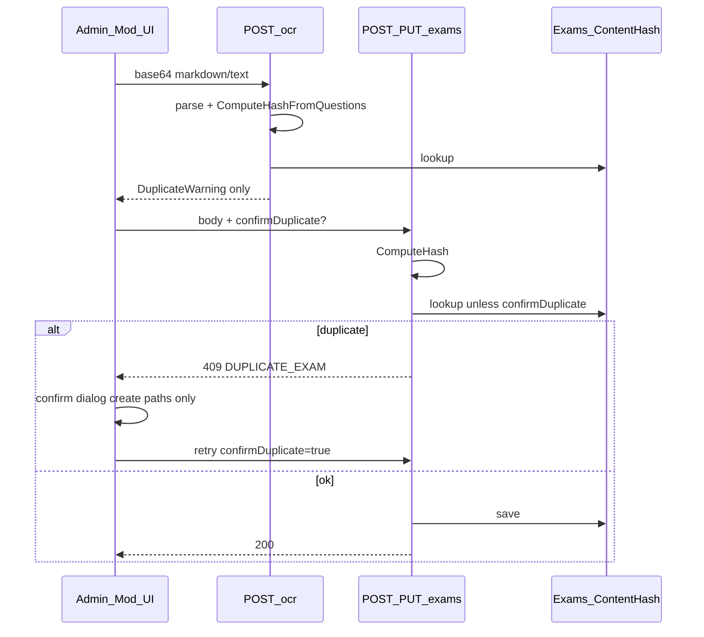

# Báo cáo audit: Chống trùng đề (check trùng đề)

**Ngày audit:** 2026-07-09  
**Phạm vi:** Đối chiếu nghiệp vụ ([SEHUB_PhanTichNghiepVu.md](../../SEHUB_PhanTichNghiepVu.md) §2.5, Phụ lục A; [ARCHITECTURE-BE.md](../../ARCHITECTURE-BE.md) §6.6) với code + test hiện tại.  
**Verdict tổng:** Cơ chế SHA-256 **đạt** cho đề cuối kỳ (create/update/resubmit); OCR vẫn **stub markdown**; practice chỉ hash metadata; FE resubmit **thiếu UX 409**; approve **không tái kiểm**.

---

## 1. Luồng và cơ chế hiện tại

### 1.1 Fingerprint (`ExamContentFingerprint`)

| Thành phần | Chi tiết |
|------------|----------|
| Normalize | trim → lowercase → NFC → collapse whitespace → strip punctuation |
| Final (có câu) | Mỗi câu: `content\|type\|options\|correct:labels\|req:count`; nối `||`; sort `OrderIndex` rồi `Content` |
| Practice (0 câu) | `subjectCode\|paperCode\|description` (normalized) — **không** hash file đính kèm |
| Hash | SHA-256 hex 64 ký tự lowercase |

### 1.2 Điểm gate trùng (BE)

| Endpoint | Kiểm tra | Ghi chú |
|----------|----------|---------|
| `POST /admin/exams` | Có | `EnsureNoDuplicateHashAsync` |
| `PUT /admin/exams/{id}` (questions) | Có | `ReplaceExamQuestionsAsync` |
| `PUT /admin/exams/{id}/resubmit` | Có | Questions hoặc practice metadata |
| `POST /admin/exams/ocr` | Soft warn | `DuplicateWarning` — không 409 |
| `POST .../approve` | **Không** | Publish không tái kiểm hash |
| Revision lineage | Bỏ qua | `IsSameExamLineage` |

**Override:** `?confirmDuplicate=true` bỏ qua check (index `IX_Exams_ContentHash` không unique).

**Lookup:** `GetByContentHashAsync` — mọi status kể cả `Archived`, `FirstOrDefault`.

### 1.3 Luồng end-to-end

### 1.4 FE theo màn hình

| Màn hình | Create 409 + confirm | Resubmit 409 | OCR |
|----------|---------------------|--------------|-----|
| `FinalExamReviewStep` | Có | **Không** | N/A |
| `AddPracticeExamPage` | Có | **Không** | N/A |
| `AdminExamFormPage` | Một phần (OCR soft warn + `forceUniqueSha`) | N/A | API thật khi `VITE_USE_MOCK≠true` |
| `moderatorExamService` resubmit | N/A | **Không** forward `confirmDuplicate` | N/A |

---

## 2. Ma trận đối chiếu nghiệp vụ

| # | Nghiệp vụ | Hiện trạng | Đánh giá |
|---|-----------|------------|----------|
| 1 | OCR ảnh đề | Parse markdown/base64, không vision OCR | **Gap P0** |
| 2 | Normalize NFC + strip punct + SHA-256 | `ExamContentFingerprint` | **Đạt** |
| 3 | Hash gồm options + đáp án | `BuildQuestionSegment` | **Đạt** |
| 4 | Hash đề TH từ file đính kèm | Chỉ metadata | **Gap** |
| 5 | 409 khi create Final | BE + FE wizard | **Đạt** |
| 6 | 409 khi update questions | BE + test | **Đạt** |
| 7 | 409 khi resubmit | BE có; FE thiếu | **Gap P1** |
| 8 | Admin review trước lưu | Admin form `ocrConfirmed` | **Một phần** |
| 9 | OCR cùng fingerprint create | `ComputeHashFromQuestions` | **Đạt** |
| 10 | Tái kiểm khi approve | Không | **Gap P2** (race đã chứng minh) |
| 11 | Fuzzy >90% | Không | **Gap G2** (đã biết) |
| 12 | Chống OCR noise | Chỉ exact hash | **Gap đã biết** |

---

## 3. Kết quả test tự động (2026-07-09)

### Unit — `ExamContentFingerprintTests` (7/7 passed)

- Normalize punctuation + NFC
- Reject empty hash source
- Order-independent by `OrderIndex`
- Detect option / correct-answer change
- Practice metadata excludes asset URL

### Integration — `ExamDuplicateHashIntegrationTests` (7/7 passed)

| Test | Kết quả | Ý nghĩa audit |
|------|---------|---------------|
| Create identical questions → 409 → confirm | Pass | C1 |
| Update to match another → 409 → confirm | Pass | Admin update path |
| Resubmit rejected → 409 → confirm | Pass | C2 (BE); FE vẫn gap |
| Approve 2 pending same hash | Pass — **cả 2 Published** | C6 race confirmed |
| Archived parent + new same content → 409 | Pass | Lookup gồm Archived |
| Practice same desc, khác paper → không trùng | Pass | C5 — hash gồm paper code |
| OCR markdown → canonical hash | Pass | OCR stub dùng cùng fingerprint |

---

## 4. Checklist QA thủ công (C1–C7)

| Case | Kỳ vọng | Kết quả audit | Bằng chứng |
|------|---------|---------------|------------|
| **C1** Mod wizard Final, 2 đề cùng nội dung | 409 → confirm | **Đạt** | Integration `CreateExam_WithIdenticalQuestions` |
| **C2** Mod resubmit rejected, trùng đề khác | 409 + confirm | **BE đạt / FE gap** | Integration resubmit 409; `resubmitFinalExamViaApi` không catch 409 |
| **C3** Admin OCR warn trùng | Soft warn + block | **Đạt** (API mode) | `AdminExamFormPage` + `runOcrExamFromFile` → `adminApi.ocrExam` |
| **C4** Admin tick vẫn lưu dù trùng | `confirmDuplicate=true` | **Đạt** | `forceUniqueSha` → `persist({ confirmDuplicate })` |
| **C5** Practice cùng metadata | 409 metadata | **Một phần** | Chỉ trùng khi cùng `subject+paper+desc`; khác paper → hash khác (test chứng minh) |
| **C6** Approve 2 pending cùng hash | Ghi nhận race | **Gap P2** | Integration: cả 2 `Published`, cùng `ContentHash` |
| **C7** `VITE_USE_MOCK=true` | Mock không phản ánh BE | **Ghi nhận** | `adminExamData.runOcrExamFromFile` mock branch |

---

## 5. Gap ưu tiên fix

| Ưu tiên | Mô tả |
|---------|--------|
| **P0** | OCR thật hoặc đổi copy nghiệp vụ G1 thành "import markdown" |
| **P1** | FE resubmit: catch 409, forward `confirmDuplicate` qua `resubmitExam` |
| **P1** | Admin form save: catch 409 ngoài OCR soft warn |
| **P2** | `ApproveExamAsync`: optional `EnsureNoDuplicateHashAsync` |
| **P2** | Practice: hash file attachment hoặc ghi rõ metadata-only trong docs |
| **G2** | Fuzzy/MinHash theo Phụ lục A |

---

## 6. File tham chiếu

| Layer | Path |
|-------|------|
| Fingerprint | `be/src/SEHub.Application/Admin/ExamContentFingerprint.cs` |
| Gate + lifecycle | `be/src/SEHub.Application/Admin/AdminExamService.cs` |
| OCR stub | `be/src/SEHub.Application/Admin/OcrExamService.cs` |
| API | `be/src/SEHub.API/Controllers/Admin/ExamsController.cs` |
| Unit tests | `be/tests/SEHub.Application.UnitTests/Admin/ExamContentFingerprintTests.cs` |
| Integration tests | `be/tests/SEHub.API.IntegrationTests/Exams/ExamDuplicateHashIntegrationTests.cs` |
| FE wizard | `fe/src/features/moderator/finalExams/steps/FinalExamReviewStep.jsx` |
| FE practice | `fe/src/features/moderator/practiceExams/AddPracticeExamPage/AddPracticeExamPage.jsx` |
| FE admin form | `fe/src/features/admin/exams/AdminExamFormPage.jsx` |
| Phân tích cập nhật | `be/tests/OCR_HASH_ANALYSIS.md` |

---

## Kết luận

Chống trùng đề **đáng tin cho đề cuối kỳ** khi tạo/cập nhật/resubmit qua API (fingerprint canonical, normalize đúng ARCHITECTURE). **Chưa đạt** nghiệp vụ OCR ảnh, **practice không so file**, **FE resubmit không xử lý 409**, và **approve có thể publish trùng** nếu đã bypass lúc create bằng `confirmDuplicate`.
