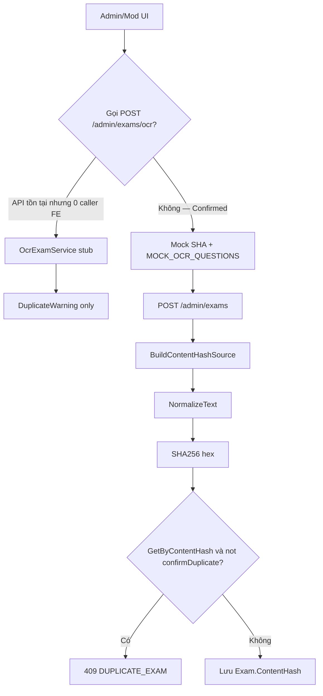

# Phân tích OCR / SHA-256 chống trùng đề

**Ngày:** 2026-07-08  
**Phạm vi:** Xác minh code + probe hash (không sửa production)  
**Verdict tổng:** Cơ chế chống trùng **có** trên `POST /admin/exams`, nhưng OCR **stub**, fingerprint **yếu**, vòng đời sau create **không** tái kiểm — chống trùng đề scan gần như giấy tờ.

---

## 1. Luồng thực tế



### Hash khi create

| Loại đề | Nguồn hash (`BuildContentHashSource`) |
|---------|----------------------------------------|
| Có câu hỏi (Final) | `string.Join('|', Questions.Select(q => q.Content))` — **chỉ stem** |
| Không câu (Practice điển hình) | `{Code}\|{Title}\|{Description}\|{AssetUrl}` |

Normalize ([`OcrExamService.NormalizeText`](../src/SEHub.Application/Admin/OcrExamService.cs)): trim → `ToLowerInvariant` → `\s+` → `" "`.  
**Không** Unicode NFC, **không** strip ký tự đặc biệt (lệch [`ARCHITECTURE-BE.md`](../../ARCHITECTURE-BE.md) §6.6).

DB: `ContentHash` varchar(64), index `IX_Exams_ContentHash` **không unique** ([`ExamConfiguration.cs`](../src/SEHub.Infrastructure/Persistence/Configurations/ExamConfiguration.cs)).

---

## 2. Ma trận rủi ro (Confirmed)

### P0 — Không đạt nghiệp vụ OCR

| # | Rủi ro | Kết quả | Bằng chứng |
|---|--------|---------|------------|
| 1 | OCR chưa thật | **Confirmed** | Comment stub trong `OcrExamService.ProcessAsync`; `Base64Image` coi như plain text |
| 2 | OCR hash ≠ Create hash | **Confirmed** | OCR hash raw payload; create hash join `question.Content`. FE **không** gọi `ocrExam()` (chỉ define ở `adminApi.js`) |
| 3 | FE Admin OCR = mock | **Confirmed** | `AdminExamFormPage.runOcr` → `mockComputeSha256` / `buildMockOcrImportQuestions`; UI trùng dùng `findDuplicateBySha` trên **in-memory store**, không BE |

### P1 — Fingerprint yếu (probe C#)

| # | Case | Kết quả probe | Ý nghĩa |
|---|------|---------------|---------|
| 4 | Đổi options/đáp án, giữ stem | **False negative by design** | Options/CorrectOptionId **không** vào hash |
| 5 | Xáo thứ tự 2 câu cùng stem | `order_sensitive=True` (hash khác) | **Lọt trùng** nếu xáo order |
| 6 | `Hello!!!` vs `Hello` | `punct_sensitive=True` | Thiếu strip punct so với docs |
| 7 | `""` và `"   "` | cùng `e3b0c44298fc1c14…` (SHA256 empty) | **Empty collision** |
| 8 | Practice đổi chỉ `AssetUrl` | `practice_asset_sensitive=True` | Đề “giống” file khác URL → hash khác |
| — | Whitespace / case | `whitespace_ok=True`, `case_ok=True` | Phần normalize hiện có **ổn** |

Probe (cùng logic `NormalizeText` + `ComputeSha256Hash`):

```
order_sensitive=True
empty_equal=True
practice_asset_sensitive=True
punct_sensitive=True
whitespace_ok=True
case_ok=True
```

### P2 — Vòng đời / đồng thời

| # | Rủi ro | Kết quả | Bằng chứng |
|---|--------|---------|------------|
| 9 | Update / replace questions | **Confirmed — không check trùng** | `ReplaceExamQuestionsAsync` gán lại `ContentHash`, **không** gọi `GetByContentHashAsync` |
| 9b | Resubmit practice (0 Q) | **Confirmed — recompute, không check** | `ApplyResubmitContent` |
| 10 | Revision clone | **Confirmed by design** | `CloneExamAsRevision` copy `published.ContentHash` |
| 11 | Race TOCTOU | **Confirmed (thiết kế)** | Check-then-insert + index non-unique; `confirmDuplicate=true` cố ý cho phép trùng |
| 12 | OCR noise / fuzzy | **Confirmed gap** | Docs nghiệp vụ biết; không MinHash/fuzzy trong code |

### P3 — Test

| # | Gap | Kết quả |
|---|-----|---------|
| 13 | Unit normalize/hash | **Confirmed thiếu** |
| 14 | Integration 409 + `confirmDuplicate` | **Confirmed thiếu** (docs yêu cầu) |
| 15 | Pin tests mock hash null | Bypass, không assert duplicate |

---

## 3. Đối chiếu FE paths

| Path | Chống trùng thật? | Ghi chú |
|------|-------------------|---------|
| Mod/Admin wizard Final — [`FinalExamReviewStep.jsx`](../../fe/src/features/moderator/finalExams/steps/FinalExamReviewStep.jsx) | **Có (BE 409)** | Catch 409 → confirm → `send(true)` = `confirmDuplicate` |
| Practice — [`AddPracticeExamPage.jsx`](../../fe/src/features/moderator/practiceExams/AddPracticeExamPage/AddPracticeExamPage.jsx) | **Có (BE 409)** | Cùng pattern |
| Admin classic form — [`AdminExamFormPage.jsx`](../../fe/src/features/admin/exams/AdminExamFormPage.jsx) | **Một phần** | UI mock SHA trùng; save truyền `confirmDuplicate: forceUniqueSha`. OCR **không** gọi API |
| `adminApi.ocrExam` | **Dead from FE** | Không có `ocrExam(` usage ngoài định nghĩa API |

**Edit/resubmit Final** trong `FinalExamReviewStep`: nhánh `isEditMode` gọi `resubmitFinalExamViaApi` — **không** hỏi 409 duplicate (khớp BE không check trên resubmit).

---

## 4. Điểm đã ổn

- Create Final cùng nội dung stem (cùng thứ tự) → 409 `DUPLICATE_EXAM` khi `confirmDuplicate=false` — logic đúng trong `CreateExamAsync`.
- `confirmDuplicate=true` cho phép ghi (index non-unique) — đúng intentional override.
- Normalize whitespace + case giúp hash ổn định với khác biệt format nhẹ.

---

## 5. Đề xuất fix (ưu tiên — chưa implement)

1. **Canonical fingerprint dùng chung** (OCR sau này + create + update): sort theo `OrderIndex`; gồm content + options + correct labels; một helper.
2. **Bổ sung normalize** khớp ARCHITECTURE: NFC; strip punct thận trọng với tiếng Việt.
3. **Gate trùng trên update/resubmit/replace**, loại trừ `exam.Id` hiện tại (+ optionally parent revision).
4. **Wire hoặc gỡ stub**: đừng để Admin OCR mock tạo cảm giác đã chống trùng; khi OCR thật sẵn sàng mới soft-warn với **cùng** fingerprint create.
5. **Test bắt buộc**: golden normalize; create 409; confirmDuplicate insert; order-swap false-negative regression sau khi sort OrderIndex.
6. Race: cân nhắc unique filter / transaction nếu product muốn chặn hard (phải tương thích `confirmDuplicate`).

---

## 6. File tham chiếu

| Layer | Path |
|-------|------|
| OCR stub | `be/src/SEHub.Application/Admin/OcrExamService.cs` |
| Create + hash source | `be/src/SEHub.Application/Admin/AdminExamService.cs` |
| API | `be/src/SEHub.API/Controllers/Admin/ExamsController.cs` |
| Repo lookup | `ExamRepository.GetByContentHashAsync` |
| EF | `ExamConfiguration.cs` |
| FE API | `fe/src/api/adminApi.js` |
| Mock OCR / SHA | `fe/src/features/admin/exams/adminExamData.js`, `AdminExamFormPage.jsx` |
| 409 UX | `FinalExamReviewStep.jsx`, `AddPracticeExamPage.jsx` |
| Docs | `ARCHITECTURE-BE.md` §6.6, `SEHUB_PhanTichNghiepVu.md` §4.2 |

---

## Kết luận một câu

**Chống trùng đề dựa SHA-256 chỉ đáng tin khi tạo đề từ nội dung câu hỏi đã cấu trúc sẵn và cùng thứ tự; OCR scan + đổi đáp án/xáo câu/update sau create đều nằm ngoài hàng rào hiện tại.**
