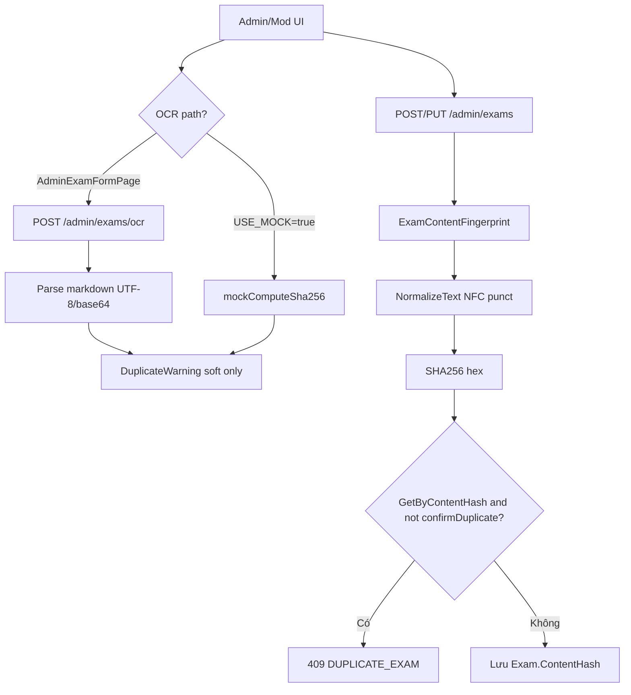

# Phân tích OCR / SHA-256 chống trùng đề

**Ngày cập nhật:** 2026-07-09 (audit hoàn tất)  
**Phạm vi:** Đối chiếu code + test tự động + checklist QA  
**Báo cáo đầy đủ:** [EXAM_DUPLICATE_AUDIT.md](./EXAM_DUPLICATE_AUDIT.md)

> **Lưu ý:** Phiên bản 2026-07-08 của file này **đã lỗi thời** (stem-only hash, không NFC, update/resubmit không check). Phần dưới phản ánh **code hiện tại**.

**Verdict tổng:** Cơ chế SHA-256 **hoạt động** trên create/update/resubmit đề cuối kỳ; OCR vẫn **stub markdown**; practice chỉ hash metadata; FE resubmit thiếu UX 409; approve không tái kiểm (race có thể publish trùng).

---

## 1. Luồng thực tế

### Hash khi create (`ExamContentFingerprint`)

| Loại đề | Nguồn hash |
|---------|------------|
| Có câu hỏi (Final) | Per-question segment: content + type + options + correct labels + required count; join `||`; sort `OrderIndex` |
| Không câu (Practice) | `subjectCode\|paperCode\|description` (normalized) — **không** `AssetUrl` / file |

Normalize: trim → `ToLowerInvariant` → **NFC** → collapse whitespace → **strip punctuation**. Khớp [ARCHITECTURE-BE.md](../../ARCHITECTURE-BE.md) §6.6.

DB: `ContentHash` varchar(64), index `IX_Exams_ContentHash` **không unique**.

---

## 2. Ma trận rủi ro (cập nhật 2026-07-09)

### P0 — OCR

| # | Rủi ro | Kết quả | Bằng chứng |
|---|--------|---------|------------|
| 1 | OCR chưa thật (ảnh scan) | **Confirmed** | `OcrExamService` decode base64 → parse markdown |
| 2 | OCR hash ≠ Create hash | **Resolved** | Cùng `ComputeHashFromQuestions` |
| 3 | FE mock khi `VITE_USE_MOCK=true` | **Confirmed** | `adminExamData.runOcrExamFromFile` mock branch |

### P1 — Fingerprint

| # | Case | Kết quả | Ghi chú |
|---|------|---------|---------|
| 4 | Đổi options/đáp án | **Detected** | Unit test `DetectsOptionTextChange`, `DetectsCorrectAnswerChange` |
| 5 | Xáo thứ tự câu (cùng OrderIndex logic) | **Order-independent** | Unit test `IsOrderIndependent_ByOrderIndex` |
| 6 | Punctuation | **Stripped** | Unit test `StripsPunctuationAndCollapsesWhitespace` |
| 7 | Empty source | **Rejected** | `ComputeHash` throws `DomainException` |
| 8 | Practice file khác, metadata giống | **Không trùng** | Hash gồm `paperCode`; integration test |

### P2 — Vòng đời

| # | Rủi ro | Kết quả | Bằng chứng |
|---|--------|---------|------------|
| 9 | Update questions | **Check trùng** | `ReplaceExamQuestionsAsync` + integration test |
| 9b | Resubmit | **Check trùng (BE)** | Integration `ResubmitRejectedExam_...409` |
| 9c | Resubmit FE | **Gap** | `resubmitFinalExamViaApi` không `confirmDuplicate` / catch 409 |
| 10 | Revision clone | **By design** | `IsSameExamLineage` |
| 11 | Race / approve | **Confirmed** | 2 pending cùng hash → cả 2 Published sau approve |
| 12 | Archived trong lookup | **Confirmed** | Create trùng content khi có bản Archived → 409 |
| 13 | OCR noise / fuzzy | **Gap G2** | Không MinHash/fuzzy |

### P3 — Test

| # | Mục | Kết quả |
|---|-----|---------|
| 14 | Unit `ExamContentFingerprintTests` | **7/7 passed** |
| 15 | Integration duplicate suite | **7/7 passed** |

---

## 3. Đối chiếu FE paths

| Path | Chống trùng | Ghi chú |
|------|-------------|---------|
| `FinalExamReviewStep` create | **BE 409 + confirm** | Đạt |
| `FinalExamReviewStep` edit/resubmit | **Gap** | Không catch 409 |
| `AddPracticeExamPage` create | **BE 409 + confirm** | Đạt (Final-style); practice thực tế hiếm trùng vì hash gồm paper |
| `AddPracticeExamPage` resubmit | **Gap** | Giống Final |
| `AdminExamFormPage` | **Một phần** | OCR API + soft warn; save `confirmDuplicate`; không catch 409 từ API |
| `adminApi.ocrExam` | **Wired** | Qua `runOcrExamFromFile` khi không mock |

---

## 4. Điểm đã ổn (so với phân tích 2026-07-08)

- Canonical fingerprint dùng chung OCR + create + update/resubmit.
- Normalize NFC + strip punctuation.
- Gate trùng trên create, update, resubmit (BE).
- Unit + integration tests cho 409 và `confirmDuplicate`.
- Order-independent hashing theo `OrderIndex`.

---

## 5. Đề xuất fix (ưu tiên)

1. **P0 — OCR:** Tích hợp OCR thật hoặc đổi messaging G1 thành import markdown.
2. **P1 — FE resubmit:** Mirror `FinalExamReviewStep` create — catch 409, `confirmDuplicate` trên `resubmitExam`.
3. **P1 — Admin save:** Catch 409 `DUPLICATE_EXAM` khi OCR không warn trước.
4. **P2 — Approve gate:** `EnsureNoDuplicateHashAsync` trước publish (trừ lineage).
5. **P2 — Practice:** Hash file SHA hoặc document metadata-only.
6. **G2 — Fuzzy:** MinHash/Levenshtein theo Phụ lục A nghiệp vụ.

---

## 6. File tham chiếu

| Layer | Path |
|-------|------|
| Fingerprint | `be/src/SEHub.Application/Admin/ExamContentFingerprint.cs` |
| Create + gate | `be/src/SEHub.Application/Admin/AdminExamService.cs` |
| OCR | `be/src/SEHub.Application/Admin/OcrExamService.cs` |
| API | `be/src/SEHub.API/Controllers/Admin/ExamsController.cs` |
| Tests | `ExamContentFingerprintTests.cs`, `ExamDuplicateHashIntegrationTests.cs` |
| Audit report | `be/tests/EXAM_DUPLICATE_AUDIT.md` |

---

## Kết luận một câu

**Chống trùng SHA-256 đạt cho đề cuối kỳ qua API (create/update/resubmit); OCR ảnh, practice file-content, FE resubmit UX, và approve race vẫn là gap so với nghiệp vụ G1.**
