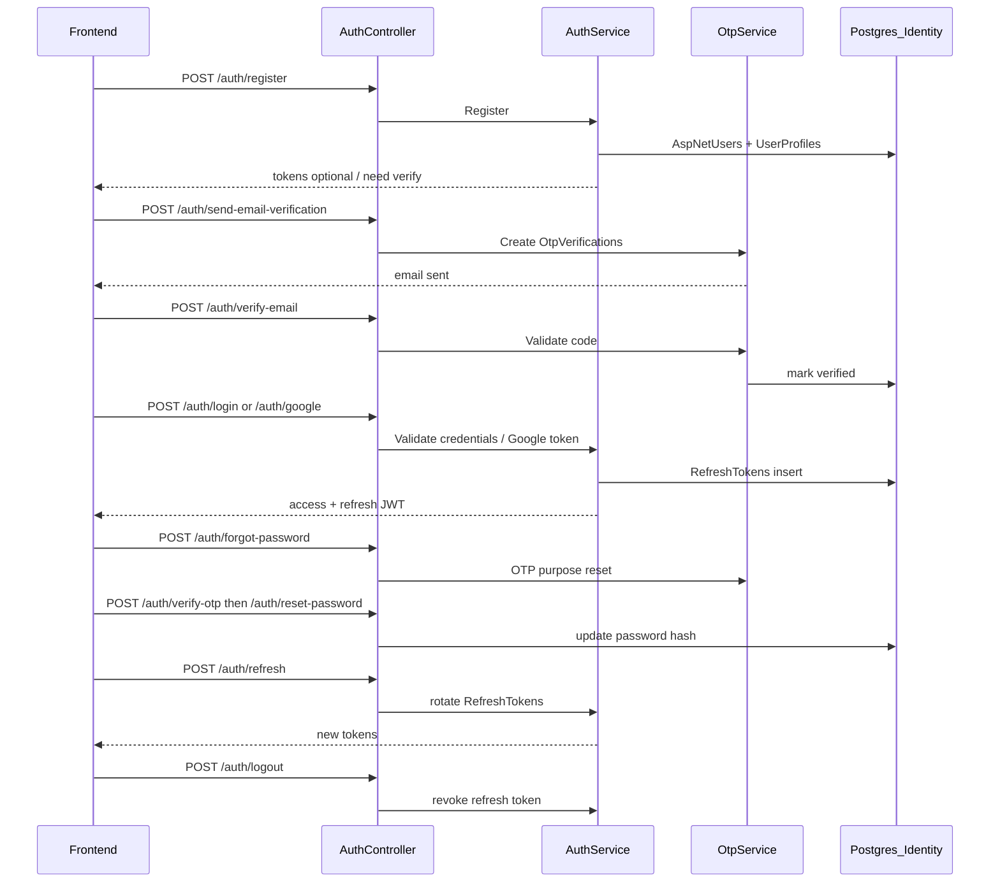
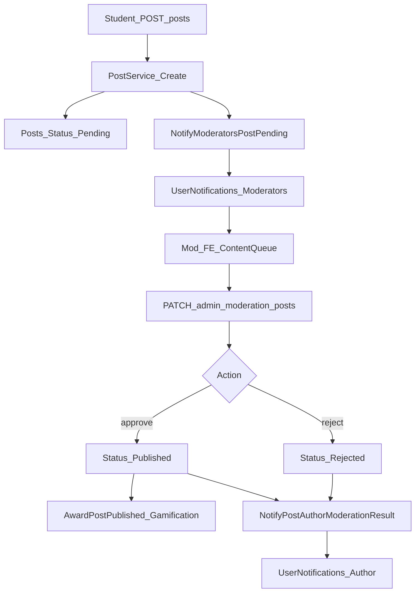
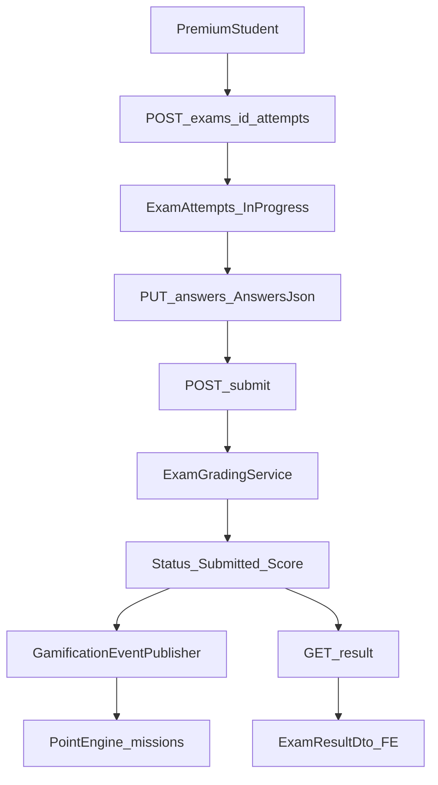
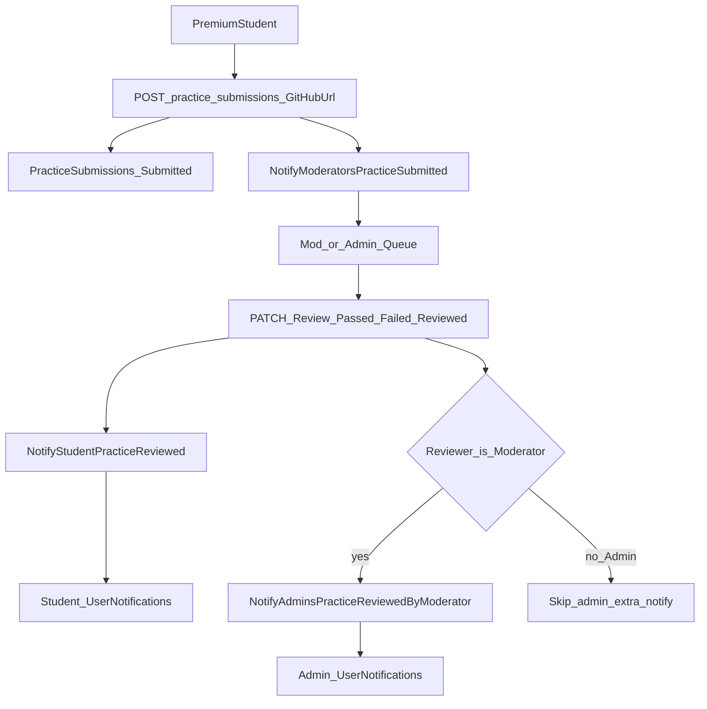
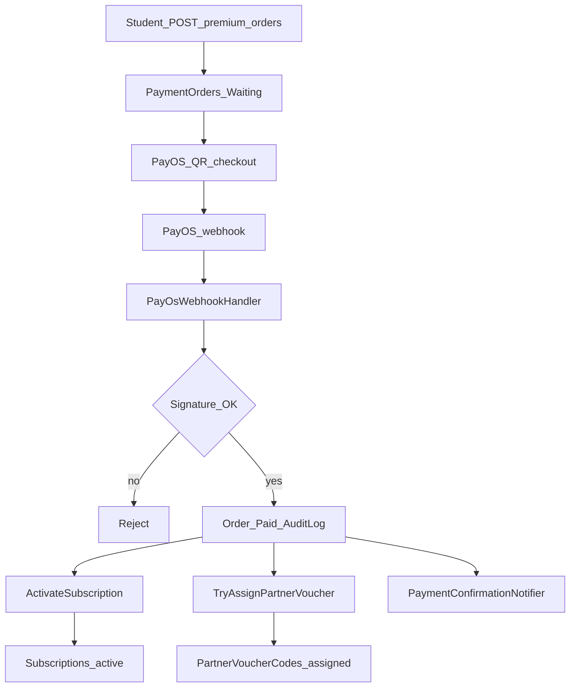
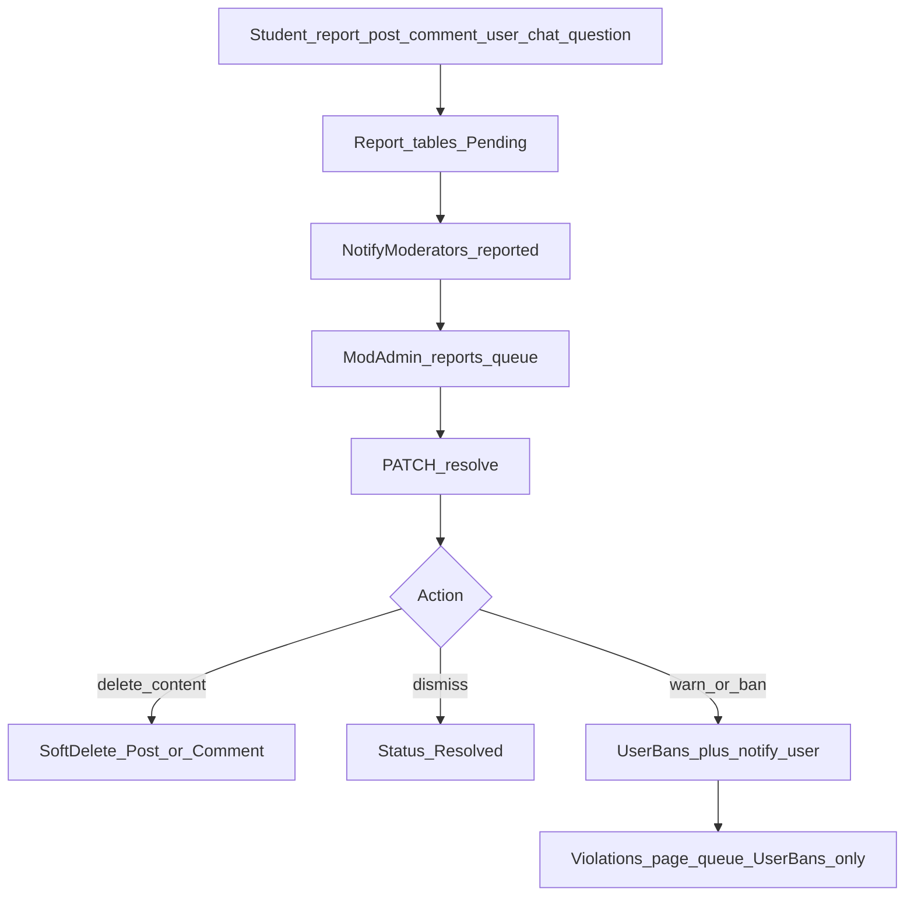
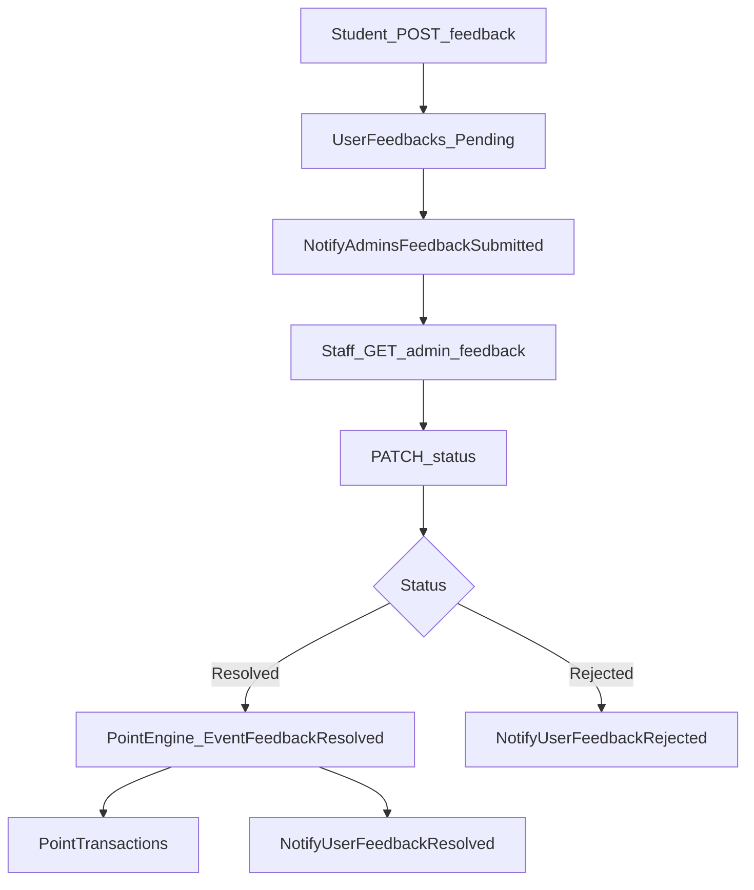
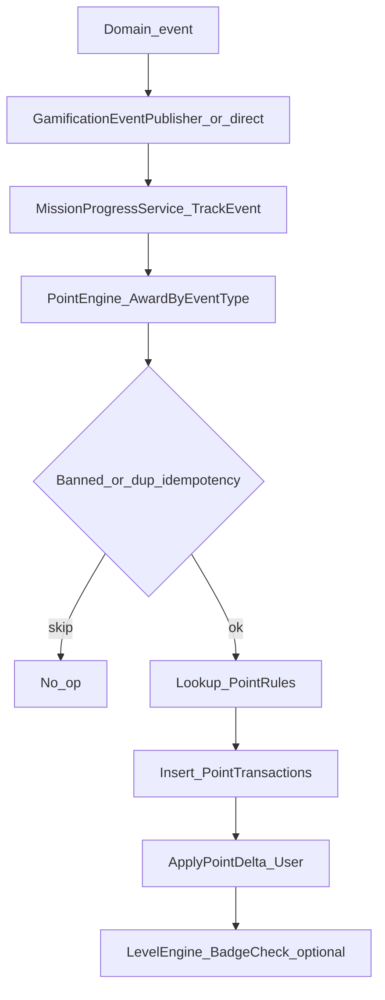
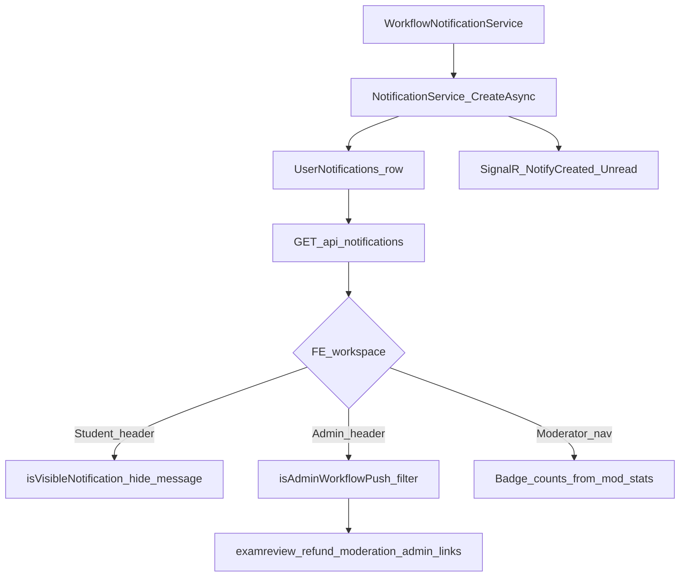

# SEHUB — Báo cáo chức năng và luồng dữ liệu (mục 01–04)

> Tài liệu này mô tả **tổng quan hệ thống**, **chức năng theo actor**, **flow nghiệp vụ**, và **domain / data flow** dựa trên mã nguồn hiện tại (`fe/src/features/*`, `be` Controllers + Application Services + `SEHubDbContext`).
>
> Chi tiết cột database: [SEHUB-DATABASE-COLUMN-CATALOG.md](./SEHUB-DATABASE-COLUMN-CATALOG.md)

---

## Mục lục

1. [01 Tổng quan](#01-tổng-quan)
2. [02 Chức năng theo actor](#02-chức-năng-theo-actor)
3. [03 Flow nghiệp vụ](#03-flow-nghiệp-vụ)
4. [04 Domain và data flow](#04-domain-và-data-flow)

---

## 01 Tổng quan

### 1.1 Sản phẩm

**SEHUB** là nền tảng học tập cho cộng đồng FPT, gồm:

| Mảng | Mô tả ngắn |
|------|------------|
| Cộng đồng (Feed) | Bài viết, bình luận, like, follow/block, báo cáo nội dung |
| Đề thi & thực hành | Đề cuối kỳ / practice, attempt, chấm GitHub, AI giải thích |
| Tài liệu | Catalog môn học, xem/tải tài liệu (Drive/Cloudinary) |
| Premium | Gói đăng ký PayOS, voucher partner, refund |
| Gamification | Điểm, level, badge, nhiệm vụ, leaderboard |
| Kiểm duyệt & vận hành | Hàng chờ post/report/violation, quản trị user/payment |

### 1.2 Actors

| Actor | Vai trò | Ghi chú truy cập |
|-------|---------|------------------|
| **Guest** | Chưa đăng nhập | Auth, xem feed/đề/môn/plan công khai; không thao tác xã hội hay attempt |
| **Student** | Người học đã đăng nhập | Feed, chat, feedback, premium checkout; nhiều API exam/practice yêu cầu **Premium** |
| **Student + Premium** | Student có subscription active | Attempt đề, practice submit GitHub, AI chat/explain (theo policy), tài liệu đầy đủ hơn |
| **Moderator** | Staff kiểm duyệt | Policy `RequireModerator` = role Moderator **hoặc** Admin |
| **Admin** | Quản trị toàn hệ thống | Policy `RequireAdmin`; dashboard, payments, users, exams approve, gamification config |

Workspace FE: Student (`/home`, …), Moderator (`/moderator/*`), Admin (`/admin/*`) — chuyển qua `WorkspaceSwitcher` theo role.

### 1.3 Stack kỹ thuật

| Tầng | Công nghệ |
|------|-----------|
| Frontend | React + Vite (`fe/`), feature-based dưới `fe/src/features/*` |
| Backend | .NET 8 (`be/src/SEHub.API`, Application, Domain, Infrastructure) |
| Persistence | EF Core Code First + PostgreSQL |
| Identity | ASP.NET Core Identity (`ApplicationUser` + roles) |
| Thanh toán | PayOS (`IPayOsService`, webhook `POST /api/v1/premium/webhooks/payos`) |
| Media / file | Cloudinary (ảnh), Google Drive / cloud file storage (tài liệu, attachment) |
| Realtime | SignalR `ChatHub` (chat + push notification unread) |

### 1.4 Schema dữ liệu (tóm tắt)

- **~64 bảng domain** khai báo trong `SEHubDbContext` (`DbSet<>`).
- **~7 bảng Identity** (Users, Roles, UserRoles, UserClaims, RoleClaims, UserLogins, UserTokens).
- Mapping: EF Code First + Fluent configurations trong Infrastructure.

Chi tiết từng cột: **[SEHUB-DATABASE-COLUMN-CATALOG.md](./SEHUB-DATABASE-COLUMN-CATALOG.md)**.

---

## 02 Chức năng theo actor

Mỗi dòng: **chức năng** · mô tả 1 dòng · **domain DB** chính · API / FE liên quan.

### 2.1 Guest

| Chức năng | Mô tả | Domain DB | API / FE |
|-----------|-------|-----------|----------|
| Đăng ký / đăng nhập | Tạo tài khoản, JWT + refresh, Google OAuth | AspNetUsers, RefreshTokens, UserProfiles, OtpVerifications | `AuthController`; `fe/features/auth` |
| Quên mật khẩu / OTP email | Gửi & xác minh OTP, reset password | OtpVerifications, AspNetUsers | `POST /auth/forgot-password`, `verify-otp`, `reset-password` |
| Xác minh email / SMS OTP | Xác thực kênh liên hệ | OtpVerifications | `send-email-verification`, `verify-email`, `send-sms-otp`, `verify-sms-otp` |
| Refresh token | Đổi access token bằng refresh | RefreshTokens | `POST /auth/refresh` |
| Xem landing / giới thiệu | Trang marketing công khai | — | `fe/features/landing`, `home` |
| Xem feed công khai | Danh sách / featured / chi tiết post đã publish | Posts, PostImages, Tags, PostTags, Comments | `GET /posts`, `/featured`, `/{id}`; `fe/features/feed` |
| Xem catalog đề | Liệt kê & chi tiết đề (không làm bài) | Exams, Subjects | `GET /exams`, `GET /exams/{id}`; `fe/features/exams` |
| Xem môn học | Danh sách / theo mã môn | Subjects | `GET /subjects` |
| Xem danh sách tài liệu | Catalog (metadata) | Documents, DocumentCategories | `GET /documents` (AllowAnonymous) |
| Xem gói Premium | Bảng giá subscription | SubscriptionPlans | `GET /premium/plans`; `fe/features/premium` |
| Xem badge / level / BXH | Gamification công khai | Badges, LevelConfigs, PointTransactions (aggregate) | `GET /gamification/badges\|levels\|leaderboard` |
| Health check | Kiểm tra API sống | — | `GET /health` |

### 2.2 Student (đã đăng nhập; một số API cần Premium)

| Chức năng | Mô tả | Domain DB | API / FE |
|-----------|-------|-----------|----------|
| Hồ sơ & avatar | Đọc/sửa profile, upload avatar | UserProfiles, AspNetUsers | `ProfilesController`; `fe/features/profile` |
| Session / me | Lấy user hiện tại, logout | RefreshTokens, AspNetUsers | `GET /auth/me`, `POST /auth/logout` |
| Tạo / sửa bài viết | Bài vào trạng thái Pending chờ duyệt | Posts, PostImages, PostTags, Tags | `POST/PUT /posts`; `fe/features/feed`, `posts` |
| Like / comment / mention | Tương tác xã hội trên post publish | PostLikes, Comments | `PostsController` like/comments |
| Báo cáo post/comment | Gửi report vào hàng chờ mod | PostReports, CommentReports | `POST .../report` |
| Follow / block / report user | Mạng xã hội & an toàn | UserFollows, UserBlocks, UserReports | `UsersController`; `fe/features/social` |
| Tìm kiếm user | Search người dùng | AspNetUsers, UserProfiles | `GET /users/search`; `fe/features/search` |
| Chat 1-1 | Hội thoại, tin nhắn, attachment, báo cáo chat | Conversations, ConversationParticipants, Messages, ConversationReports | `ConversationsController` + `ChatHub`; `fe/features/chat` |
| Thông báo | Đọc / đánh dấu đã đọc | UserNotifications | `NotificationsController`; `fe/features/notifications` |
| Feedback hệ thống | Gửi góp ý + upload ảnh đính kèm | UserFeedbacks | `POST /feedback`; `fe/features/feedback`, `support` |
| Premium checkout | Tạo đơn PayOS, xem subscription, refund | PaymentOrders, Subscriptions, PaymentAuditLogs | `PremiumController`; `fe/features/premium` |
| Partner voucher của tôi | Xem mã voucher đã gán | PartnerVoucherCodes | `GET /me/partner-vouchers` |
| Gamification cá nhân | Điểm, mission, voucher rank | UserProfiles, UserMissionProgress, RankRewardVouchers | `GET /gamification/me`, `daily-missions`, `vouchers` |
| Tài liệu (đăng nhập) | Preview / download / content (có kiểm soát tier) | Documents, DocumentAccessLogs | `DocumentsController` authenticated endpoints |
| Câu hỏi đề (auth) | Xem câu hỏi (chưa premium đủ cho một số API) | Questions, QuestionOptions | `GET /exams/{id}/questions` |
| AI explain (auth) | Giải thích câu hỏi (quota token) | AiTokenDailyUsages | `POST .../ai-explain` |
| Comment / report câu hỏi | Thảo luận & báo lỗi đề | QuestionComments, QuestionReports | ExamsController comments/report |
| Chatbot SEHUB | Hội thoại chatbot kiến thức | ChatbotConversations, ChatbotMessages, ChatbotKnowledgeEntries | `ChatbotController`; `fe/features/chatbot` |
| Phạt / ban status | Xem penalty gần nhất | UserBans | `GET /users/me/penalties/*` |

**Student + Premium** (policy `RequirePremium`):

| Chức năng | Mô tả | Domain DB | API / FE |
|-----------|-------|-----------|----------|
| Làm đề (attempt) | Start / save answers / submit / result | ExamAttempts, Questions, QuestionOptions | `POST/PUT .../attempts/*`; `fe/features/exams` |
| Xem đáp án câu hỏi | Chi tiết kèm answer | Questions, QuestionOptions | `GET .../questions/{qid}` |
| AI chat theo câu hỏi | Thread giải thích hội thoại | AiExamChatThreads, AiExamChatMessages, AiTokenDailyUsages | `.../ai-chat` |
| Nộp practice GitHub | Submit repo URL, xem submission của mình | PracticeSubmissions, Exams | `PracticeSubmissionsController` POST/`me` |
| My learning | Theo dõi lịch sử học / attempt | ExamAttempts | `GET /profiles/me/exam-attempts`; `fe/features/exams/myLearning` |

### 2.3 Moderator

Policy: `RequireModerator` (Moderator hoặc Admin). FE: `fe/features/moderator/*`, `fe/features/moderation/*`.

| Chức năng | Mô tả | Domain DB | API / FE |
|-----------|-------|-----------|----------|
| Duyệt bài viết | Approve/reject post Pending/Rejected | Posts | `PATCH /admin/moderation/posts/{id}`; Content moderation pages |
| Featured / pin post | Đánh dấu nổi bật / ghim | Posts | `PATCH /posts/{id}/feature\|pin`; Featured pages |
| Hàng chờ báo cáo | Post, comment, user, conversation, question reports; warn/ban đủ mức từ Reports | PostReports, CommentReports, UserReports, ConversationReports, QuestionReports, UserBans | `GET/PATCH /admin/moderation/reports*`; warn/ban users |
| Tài khoản vi phạm / ban / warn / unban | Sổ đã kỷ luật: cảnh cáo, khóa tạm (1/7/30) / vĩnh viễn | UserBans, AspNetUsers | `POST .../users/{id}/ban\|warn\|unban`; Reports + Violations pages |
| Chấm practice | Review submission → Reviewed/Passed/Failed | PracticeSubmissions | `PATCH /exams/{examId}/practice-submissions/{id}`; Practice submissions workspace |
| Danh sách practice chờ chấm | Queue toàn hệ thống | PracticeSubmissions | `GET /admin/moderation/practice-submissions` |
| Gửi / sửa / resubmit đề | Tạo đề chờ Admin duyệt, revision | Exams, ExamAttachments, Questions, QuestionOptions | `Admin/ExamsController` (Create, Resubmit, Revision — Mod được phép một phần) |
| Import markdown đề | Parse markdown thành cấu trúc đề | Exams, Questions | `POST /admin/exams/import-markdown` |
| Feedback staff | Xem & cập nhật trạng thái feedback | UserFeedbacks | `GET/PATCH /admin/feedback` (policy Moderator) |
| Stats moderation | Số pending posts/reports/submissions/bans | (aggregate) | `GET /admin/moderation/stats` |
| Patch user (hạn chế) | Một số cập nhật user (endpoint dùng policy Mod) | AspNetUsers, UserProfiles | `PATCH /admin/users/{id}` |

### 2.4 Admin

Policy: `RequireAdmin` (trừ khi endpoint dùng `RequireModerator`). FE: `fe/features/admin/*`.

| Chức năng | Mô tả | Domain DB | API / FE |
|-----------|-------|-----------|----------|
| Dashboard / charts / overview | KPI vận hành | aggregate + PaymentOrders, Posts, … | `Admin/DashboardController`, `OverviewController` |
| Duyệt / từ chối đề Mod | Approve → Published; Reject + lý do | Exams | `POST /admin/exams/{id}/approve\|reject`; AdminExamPendingPage |
| CRUD đề / OCR / attachment | Quản lý kho đề, OCR, xóa | Exams, ExamAttachments, Questions | Admin ExamsController (Update, Delete, OCR, …) |
| Quản lý user | List/detail, reset password, grant AI tokens, activity | AspNetUsers, UserProfiles, AiTokenDailyUsages, RoleChangeAudits | `Admin/UsersController` |
| Payments & refund | Xác nhận thủ công, duyệt/hoàn refund | PaymentOrders, PaymentAuditLogs, Subscriptions | `Admin/PaymentsController` |
| Voucher rank / partner | Grant/revoke voucher; import/assign partner codes | RankRewardVouchers, PartnerVoucherTypes, PartnerVoucherCodes, SubscriptionPlanPartnerRewards | AdminVouchers, AdminPartnerVouchers |
| Gamification config | Levels, badges, point-rules, reconcile | LevelConfigs, Badges, PointRules, PointTransactions | `Admin/GamificationController` |
| Documents admin | CRUD tài liệu, migrate local→Drive | Documents, DocumentCategories | `Admin/DocumentsController` |
| Chatbot admin | Settings, knowledge base, xem hội thoại | ChatbotSettings, ChatbotKnowledgeEntries, ChatbotConversations | `Admin/ChatbotController` |
| Export CSV | Dashboard, users, payments, reports, violations | (read models) | `Admin/ExportController` |
| Audit logs / role audits | Nhật ký hoạt động & đổi role | PaymentAuditLogs, RoleChangeAudits | AuditLogs, RoleAudits controllers |
| Toàn bộ moderation | Cùng API Mod + UI Admin moderation | như mục Moderator | `fe/features/admin/moderation` |

---

## 03 Flow nghiệp vụ

> Mermaid: ID node không có khoảng trắng.

### 3.1 Auth (register / login / OTP / refresh)

### 3.2 Feed: tạo bài → pending → duyệt → published + thông báo

### 3.3 Exam attempt (start / save / submit / result)

### 3.4 Practice: submit GitHub → Mod/Admin chấm → notify

### 3.5 Premium PayOS checkout → webhook → subscription + partner voucher

### 3.6 Report nội dung → hàng chờ → resolve / ban

### 3.7 Feedback submit → staff resolve/reject (+ điểm khi resolve)

### 3.8 Gamification award (event → PointEngine → PointTransactions)

Ví dụ nguồn sự kiện trong code: duyệt post (`AwardPostPublishedAsync`), nộp attempt (`PublishAsync` từ `ExamAttemptService`), resolve feedback (`EventFeedbackResolved`), void khi xóa post (idempotency void).

### 3.9 Notifications routing (Workflow → UserNotifications → FE theo workspace)

- BE ghi `UserNotifications` với `Type`, `LinkUrl`, `ActorUserId`, `ReferenceId`.
- Student FE: ẩn type `message` (`isVisibleNotification`).
- Admin FE: `adminHeaderNotifications.js` lọc push workflow (`examreview`, `refund`, `moderation` + deep-link `/admin/*` hoặc một số `/moderator/*`).
- Moderator: badge hàng chờ từ moderation stats / nav badges (không chỉ raw notification list).

---

## 04 Domain và data flow

### 4.1 Auth

| | |
|--|--|
| **Bảng chính** | AspNetUsers, AspNetRoles, AspNetUserRoles, RefreshTokens, OtpVerifications, UserProfiles |
| **Ai đọc/ghi** | Guest/Student → `AuthController`; middleware `BannedUserMiddleware` đọc ban; Admin → `Admin/UsersController` |
| **FK / quan hệ chính** | |
| | - `RefreshTokens.UserId` → AspNetUsers |
| | - `OtpVerifications` gắn email/phone + purpose |
| | - `UserProfiles.UserId` → AspNetUsers (1–1) |
| **Service / Controller** | `AuthService`, `OtpService`, `JwtTokenService`, `AuthController` |

### 4.2 Feed

| | |
|--|--|
| **Bảng chính** | Posts, PostImages, PostLikes, Comments, Tags, PostTags, PostReports, CommentReports |
| **Ai đọc/ghi** | Guest đọc published; Student tạo/sửa/like/comment/report; Mod/Admin duyệt & feature/pin |
| **FK / quan hệ chính** | |
| | - `Posts.AuthorId`, `ModeratedById` → Users |
| | - `PostImages.PostId` → Posts |
| | - `PostLikes(PostId, UserId)` |
| | - `Comments.PostId`, optional parent comment |
| | - `PostTags` N–N Posts↔Tags |
| | - `PostReports.PostId`, `ReporterId`, `ResolvedById` |
| **Service / Controller** | `PostService`, `PostsController`, `ModerationService` (duyệt) |

### 4.3 Exams

| | |
|--|--|
| **Bảng chính** | Exams, ExamAttachments, Questions, QuestionOptions, QuestionAttachments, ExamAttempts, QuestionComments, QuestionReports, Subjects |
| **Ai đọc/ghi** | Guest/Student đọc catalog; Premium làm attempt; Mod tạo/resubmit/revision; Admin approve/reject/OCR/CRUD |
| **FK / quan hệ chính** | |
| | - `Exams.SubjectCode` ↔ Subjects; `SubmittedById`, `RevisionOfExamId`, `RejectedById` |
| | - `Questions.ExamId` → Exams; `QuestionOptions.QuestionId` |
| | - `ExamAttempts.UserId` + `ExamId` |
| | - `ExamAttachments.ExamId` |
| | - `QuestionReports` / `QuestionComments` → Question (+ Exam) |
| **Service / Controller** | `ExamAttemptService`, `ExamGradingService`, `AdminExamService`, `ExamsController`, `Admin/ExamsController` |

### 4.4 Documents

| | |
|--|--|
| **Bảng chính** | Documents, DocumentCategories, DocumentAccessLogs, Subjects |
| **Ai đọc/ghi** | Guest list metadata; Student preview/download (access policy); Admin CRUD + migrate Drive |
| **FK / quan hệ chính** | |
| | - `Documents.CategoryId` → DocumentCategories |
| | - `DocumentAccessLogs.DocumentId` + UserId |
| | - Soft-delete: `IsDeleted`, `DeletedById` |
| **Service / Controller** | `DocumentService`, `DocumentAccessService`, `DocumentsController`, `Admin/DocumentsController` |

### 4.5 Premium

| | |
|--|--|
| **Bảng chính** | SubscriptionPlans, Subscriptions, PaymentOrders, PaymentAuditLogs, PartnerVoucherTypes, PartnerVoucherCodes, SubscriptionPlanPartnerRewards, RankRewardVouchers |
| **Ai đọc/ghi** | Guest xem plans; Student tạo order/refund/subscription; PayOS webhook anonymous; Admin confirm/refund/voucher inventory |
| **FK / quan hệ chính** | |
| | - `PaymentOrders.UserId`, `PlanId` → Plans |
| | - `Subscriptions.UserId`, `PlanId` |
| | - `PaymentAuditLogs.OrderId` → PaymentOrders |
| | - Partner codes gắn type + optional order/user khi assign |
| | - `SubscriptionPlanPartnerRewards` map plan ↔ voucher type |
| **Service / Controller** | `PremiumService`, `SubscriptionService`, `PayOsWebhookHandler`, `PartnerVoucherService`, `PremiumController`, `Admin/PaymentsController`, Admin voucher controllers |

### 4.6 Gamification

| | |
|--|--|
| **Bảng chính** | PointRules, PointTransactions, GamificationEventInboxes, LevelConfigs, Badges, UserBadges, UserLevelHistories, DailyMissions, WeeklyMissions, UserMissionProgress, RewardRules, RankRewardVouchers, UserDailyActivities |
| **Ai đọc/ghi** | Mọi user đọc badge/level/BXH; Student đọc me/missions; hệ thống ghi điểm qua engines; Admin cấu hình rules/badges/levels |
| **FK / quan hệ chính** | |
| | - `PointTransactions.UserId`, `RuleCode` ↔ PointRules.Code |
| | - `UserBadges.UserId` + `BadgeId` |
| | - `UserMissionProgress` ↔ Daily/Weekly missions |
| | - Điểm tổng trên user (Identity/ApplicationUser.Points) |
| **Service / Controller** | `PointEngine`, `GamificationEventPublisher`, `MissionProgressService`, `GamificationService`, `AdminGamificationService`, `GamificationController`, `Admin/GamificationController` |

### 4.7 AI

| | |
|--|--|
| **Bảng chính** | AiTokenDailyUsages, AiExamChatThreads, AiExamChatMessages, ChatbotSettings, ChatbotKnowledgeEntries, ChatbotConversations, ChatbotMessages |
| **Ai đọc/ghi** | Student: explain (auth), ai-chat (premium), chatbot; Admin: settings/knowledge/conversations; Admin grant tokens qua Users |
| **FK / quan hệ chính** | |
| | - `AiExamChatThreads` theo User + Exam + Question |
| | - `AiExamChatMessages.ThreadId` |
| | - `AiTokenDailyUsages.UserId` + ngày |
| | - Chatbot messages thuộc conversation thuộc user |
| **Service / Controller** | `AiExplanationApplicationService`, `AiExamChatApplicationService`, `AiTokenService`, `ChatbotApplicationService`, `AdminChatbotService`, `ExamsController` (AI endpoints), `ChatbotController`, `Admin/ChatbotController` |

### 4.8 Chat

| | |
|--|--|
| **Bảng chính** | Conversations, ConversationParticipants, Messages, ConversationReports, UserBlocks |
| **Ai đọc/ghi** | Student tham gia chat / report; Mod/Admin xử lý conversation reports; SignalR realtime |
| **FK / quan hệ chính** | |
| | - `ConversationParticipants.ConversationId` + `UserId` |
| | - `Messages.ConversationId`, `SenderId` |
| | - `ConversationReports.ConversationId`, Reporter, ResolvedBy |
| | - Block ngăn mở hội thoại (UserBlocks) |
| **Service / Controller** | Conversation application services, `ConversationsController`, `ChatHub`, `ChatHubNotifier` |

### 4.9 Moderation

| | |
|--|--|
| **Bảng chính** | PostReports, CommentReports, UserReports, QuestionReports, ConversationReports, UserBans, Posts (status moderation), PracticeSubmissions (queue) |
| **Ai đọc/ghi** | Student tạo report; Mod/Admin resolve (warn/ban đủ mức từ Reports), duyệt post, chấm practice; trang Vi phạm = sổ UserBans |
| **FK / quan hệ chính** | |
| | - Mỗi *Report: targetId + ReporterId + ResolvedById + Status |
| | - `UserBans.UserId`, `ActorId` (nguồn list `/moderation/violations`) |
| | - Soft-delete Posts/Comments khi resolve delete_* |
| **Service / Controller** | `ModerationService`, `Admin/ModerationController`, `PracticeSubmissionService` (review) |

### 4.10 Notifications

| | |
|--|--|
| **Bảng chính** | UserNotifications |
| **Ai đọc/ghi** | Mọi authenticated user đọc/mark-read; writers nội bộ: `WorkflowNotificationService` → `NotificationService` |
| **FK / quan hệ chính** | |
| | - `UserNotifications.UserId` (recipient) |
| | - `ActorUserId` (người gây sự kiện, optional) |
| | - `ReferenceId` (post/report/order/…) |
| | - `Type` enum → FE meta/icon/filter |
| **Service / Controller** | `WorkflowNotificationService`, `NotificationService`, `NotificationsController`, FE `notificationTypes` + `adminHeaderNotifications` |

### 4.11 Feedback

| | |
|--|--|
| **Bảng chính** | UserFeedbacks |
| **Ai đọc/ghi** | Student submit + upload attachments; Mod/Admin list & patch status |
| **FK / quan hệ chính** | |
| | - `UserFeedbacks.UserId` (nullable guest-less; thường gắn user đăng nhập) |
| | - `AttachmentUrlsJson` lưu URL Cloudinary |
| | - Status: Pending → Resolved / Rejected |
| | - Resolve kích hoạt `PointEngine` + notify user |
| **Service / Controller** | `FeedbackService`, `FeedbackController`, `Admin/FeedbackController` |

---

## Phụ lục A — Bản đồ Controller (API v1)

| Nhóm | Route gốc | Ghi chú policy |
|------|-----------|----------------|
| Auth | `/api/v1/auth` | Phần lớn AllowAnonymous; me/logout Authenticated |
| Posts | `/api/v1/posts` | GET public; ghi Authenticated; feature/pin Moderator |
| Exams | `/api/v1/exams` | GET list/detail public; attempts/AI-chat Premium |
| Practice | `/api/v1/exams/{examId}/practice-submissions` | Submit Premium; review Moderator |
| Documents | `/api/v1/documents` | List public; file Authenticated |
| Premium | `/api/v1/premium` | Plans/webhook public; orders Authenticated |
| Profiles / Users | `/api/v1/profiles`, `/users` | Authenticated |
| Conversations | `/api/v1/conversations` | Authenticated |
| Notifications | `/api/v1/notifications` | Authenticated |
| Gamification | `/api/v1/gamification` | badges/levels/leaderboard public |
| Feedback | `/api/v1/feedback` | Authenticated |
| Chatbot | `/api/v1/chatbot` | Authenticated |
| Partner vouchers | `/api/v1/me/partner-vouchers` | Authenticated |
| Subjects | `/api/v1/subjects` | AllowAnonymous |
| Admin.* | `/api/v1/admin/*` | Admin và/hoặc Moderator theo từng action |

---

## Phụ lục B — Feature folders FE

| Folder | Actor / mục đích |
|--------|------------------|
| `auth`, `landing`, `home` | Guest / vào app |
| `feed`, `posts`, `social`, `search`, `profile` | Student cộng đồng |
| `exams`, `practice`, `review`, `subjects`, `documents` | Học tập |
| `premium`, `account` | Thanh toán / tài khoản |
| `chat`, `chatbot`, `notifications`, `feedback`, `support` | Tương tác & hỗ trợ |
| `moderator`, `moderation` | Workspace kiểm duyệt |
| `admin` | Workspace quản trị |
| `errors` | 404 / lỗi |

---

*Hết mục 01–04. Catalog cột DB: [SEHUB-DATABASE-COLUMN-CATALOG.md](./SEHUB-DATABASE-COLUMN-CATALOG.md).*
